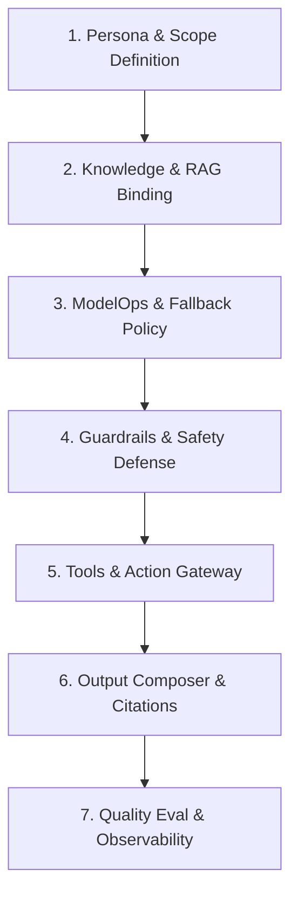

# Quy Trình Chuẩn Tạo Chatbot AI Trên QNU AI Platform

Tài liệu này quy định quy trình 7 bước bắt buộc (Standard Operating Procedure - SOP) khi tạo mới hoặc cấu hình bất kỳ Trợ lý AI (AI Assistant / Chatbot) nào trên nền tảng **QNU AI Platform**.

---

## 7 Bước Vòng Đời Của Một Chatbot AI Chuẩn Doanh Nghiệp

---

### Bước 1: Định Nghĩa Persona, Phạm Vi & Giới Hạn Nghiệp Vụ (Scope)
Mỗi chatbot bắt buộc phải có một hợp đồng nhận dạng rõ ràng:
1. **Code & Tên gọi**: Mã định danh duy nhất (ví dụ: `admissions`, `regulations`, `library`, `drafting`, `question_bank`).
2. **System Prompt Tiêu Chuẩn**:
   - Khẳng định danh tính: *"Bạn là Trợ lý AI chính thức của Trường Đại học Quy Nhơn chuyên trách về..."*
   - Thái độ phục vụ: Lịch sự, ân cần, chuẩn mực sư phạm, xưng hô *"mình - bạn"* hoặc *"Trợ lý - Thầy/Cô/Sinh viên"*.
   - **Phạm vi nghiêm ngặt**: Chỉ giải đáp các câu hỏi trong phạm vi chuyên môn được giao. Nếu câu hỏi nằm ngoài phạm vi, phải lịch sự từ chối và hướng dẫn tới đúng phòng ban chuyên trách.

---

### Bước 2: Ràng Buộc Kho Tri Thức (Knowledge & RAG Binding)
Chatbot không bao giờ hoạt động "chay" bằng kiến thức huấn luyện có sẵn của LLM mà phải liên kết chặt chẽ với kho dữ liệu trường:
1. **Collection Mapping**: Liên kết với `collection_id` tương ứng trong PostgreSQL và Qdrant.
2. **Chiến Lược Chunking & Ingestion**:
   - Văn bản quy định / quyết định pháp quy: Bắt buộc dùng `ClauseBasedChunker` (cắt theo từng **Điều**, đánh nhãn `section`).
   - Sổ tay, cẩm nang giới thiệu: Dùng `SemanticChunker` (250 - 500 tokens, overlap 50 tokens).
   - Biểu phí, điểm chuẩn, chỉ tiêu: Bắt buộc nạp vào **Structured Fact Layer** (`knowledge_facts`) dạng key-value bảng biểu.
3. **Tham Số Retrieval**:
   - `top_k`: 8 chunks ban đầu từ Dense + Sparse.
   - `rerank_top_k`: 5 chunks chất lượng nhất sau khi qua Cross-Encoder.
   - `similarity_threshold`: $\ge 0.65$.

---

### Bước 3: Cấu Hình Mô Hình & Cơ Chế Chịu Lỗi (ModelOps & Fallback Policy)
Không bao giờ phụ thuộc vào duy nhất một nhà cung cấp LLM:
1. **Primary Model**: Mô hình ưu tiên chính (ví dụ: `gpt-4o-mini`, `gemini-1.5-flash`, hoặc `qwen2.5-7b-instruct` chạy on-premise).
2. **Fallback Model**: Mô hình dự phòng tự động kích hoạt khi Primary gặp lỗi HTTP 429 (Rate Limit), HTTP 500, hoặc timeout quá 15 giây.
3. **Tham số sinh chữ (Generation Params)**:
   - Nghiệp vụ quy chế, điểm thi (chính xác tuyệt đối): `temperature: 0.1 - 0.2`, `top_p: 0.9`.
   - Soạn thảo văn bản, trợ giúp ý tưởng: `temperature: 0.5 - 0.7`.
4. **Hạn mức Token (Quota & Cost Cap)**:
   - Giới hạn `max_tokens` mỗi lượt trả lời (mặc định 2,000 tokens).
   - Thiết lập Quota theo tháng cho từng phòng ban để tránh bội chi.

---

### Bước 4: Thiết Lập Hàng Rào Phòng Thủ & Bảo Mật (Guardrails & Safety)
1. **Input Guardrail (Tiếp nhận câu hỏi)**:
   - **Chống Prompt Injection & Jailbreak**: Quét từ khóa và mẫu câu cố tình ghi đè system prompt (*"Ignore previous instructions"*, *"DAN mode"*, *"Act as unrestricted"*). Nếu vi phạm, từ chối ngay ở cổng API.
   - **Mặt nạ hóa PII (PII Masking)**: Tự động che số CCCD, SĐT cá nhân, email của người học trước khi truyền vào LLM.
2. **Output Guardrail (Trước khi trả lời người dùng)**:
   - **Ngăn chặn rò rỉ dữ liệu nhạy cảm**: Kiểm tra câu trả lời không được chứa API keys, token bí mật, hoặc system prompt thô.
   - **No-Answer Policy (Chống bịa đặt)**: Nếu ngữ cảnh tìm được từ RAG có độ tin cậy thấp hoặc không tìm thấy, bot **tuyệt đối không được đoán mò**, mà phải phản hồi lịch sự kèm thông tin liên hệ chính thức của Trường (ví dụ: Hotline Tuyển sinh `0256.3846.156`, Email `tuyensinh@qnu.edu.vn`).

---

### Bước 5: Tích Hợp Bộ Công Cụ Hành Động (Tool Gateway)
Nếu chatbot có nhiệm vụ thực thi hành động:
1. **Định nghĩa Tool Specification**: Viết Function Calling Schema chuẩn OpenAPI (tên hàm, mô tả, tham số bắt buộc).
2. **Phê duyệt con người (Human-in-the-loop)**: Với các hành động thay đổi dữ liệu (tạo kỳ thi, gửi thông báo toàn trường, duyệt quy chế), workflow phải sinh trạng thái `pending_approval` và chờ cán bộ bấm Duyệt.

---

### Bước 6: Định Dạng Trình Bày & Trích Dẫn Nguồn (Output & Citations)
1. **Định dạng tối ưu qua `AnswerFormatPlanner`**:
   - Tra cứu số liệu, so sánh: Trả về **Markdown Table**.
   - Hướng dẫn thủ tục, hồ sơ: Trả về **Checklist** hoặc từng bước (Numbered Steps).
   - Lịch trình, mốc thời gian: Trả về **Timeline**.
2. **Trích dẫn minh bạch (Citations)**:
   - Mọi thông tin cốt lõi phải đính kèm trích dẫn nguồn: Tên văn bản, Điều/Khoản, Số trang, Trích đoạn dẫn chứng để người học tự kiểm chứng.

---

### Bước 7: Đánh Giá Định Kỳ & Giám Sát Chi Phí (Eval & Observability)
1. **Theo dõi vận hành (Observability)**:
   - Mọi lượt tương tác đều được gắn `correlation_id`, ghi log JSON có cấu trúc.
   - `CostTracker` tự động ghi nhận số token Prompt/Completion và chi phí USD phát sinh.
2. **Kiểm định chất lượng (Ragas TM-08)**:
   - Chạy định kỳ bộ 50 câu hỏi vàng (Golden Dataset).
   - Đo lường 3 chỉ số vàng:
     - **Faithfulness**: $\ge 0.90$ (Câu trả lời bám sát 100% tài liệu, không bịa đặt).
     - **Answer Relevance**: $\ge 0.85$ (Trả lời đúng trọng tâm câu hỏi).
     - **Context Precision**: $\ge 0.80$ (Ngữ cảnh truy vấn được chính xác và tinh gọn).
