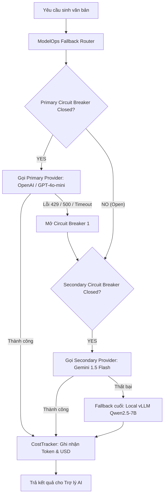

# Hướng Dẫn ModelOps & Cơ Chế Chịu Lỗi Multi-LLM QNU AI Platform

Tài liệu hướng dẫn quản trị mô hình ngôn ngữ lớn (LLM), cơ chế tự phục hồi (Resilience) và giám sát chi phí tại **QNU AI Platform** ([app/modules/modelops/](file:///d:/DuAnPhanMem/DeTaiAI/qnu-ai-platform/backend/app/modules/modelops)).

---

## 1. Kiến Trúc Adapter & Circuit Breaker Router

---

## 2. Các Quy Tắc ModelOps Bắt Buộc

1. **Chuẩn Hóa Giao Tiếp (BaseLLMAdapter)**:
   - Toàn bộ adapters (`OpenAIAdapter`, `GeminiAdapter`, `LocalVLLMAdapter`) phải kế thừa `BaseLLMAdapter`.
   - Cung cấp 2 phương thức chuẩn:
     - `async def generate(self, messages, **kwargs) -> LLMResponse`
     - `async def stream(self, messages, **kwargs) -> AsyncIterator[str]`
2. **Circuit Breaker Policy (Chống sập tầng)**:
   - Nếu một nhà cung cấp gặp lỗi 3 lần liên tiếp trong vòng 60 giây, Circuit Breaker chuyển sang trạng thái **OPEN** (tạm ngưng gửi request trong 30 giây để tránh làm nghẽn thread và tốn timeout vô ích).
   - Tự động chuyển hướng toàn bộ traffic sang nhà cung cấp dự phòng tiếp theo.
3. **Theo Dõi Hạn Ngạch & Chi Phí (CostTracker)**:
   - Tính toán chính xác giá USD/token dựa trên bảng giá định kỳ.
   - Kiểm tra hạn mức tiêu thụ (Quota) của Tenant/Phòng ban trước khi gửi request. Nếu vượt hạn mức tháng, trả về lỗi mã `QUOTA_EXCEEDED` (RFC 7807).
