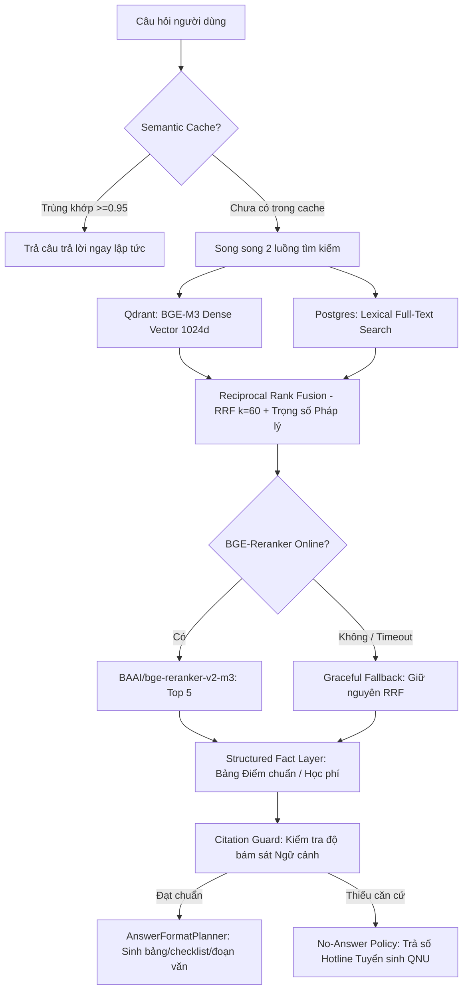

# Hướng Dẫn Vận Hành & Tối Ưu Hybrid RAG Pipeline

Tài liệu hướng dẫn chuyên sâu về "Trái tim" hỏi đáp thông minh của **QNU AI Platform** ([backend/app/modules/rag](backend/app/modules/rag)).

---

## 1. Kiến Trúc Luồng Hybrid Retrieval Đa Tầng

---

## 2. Các Thành Phần & Quy Tắc Tinh Chỉnh

### 1. Vector Indexer ([vector_indexer.py](backend/app/modules/rag/vector_indexer.py))
- **Mô hình Embedding**: `BAAI/bge-m3` (độ dài vector: 1024 chiều).
- **Khoảng cách**: Cosine Distance.
- **Index Batching**: Đẩy từng lô 32 chunks để tối ưu băng thông mạng và RAM của Qdrant.
- **Payload Filter**: Luôn gắn bộ lọc theo `collection_id`, `tenant_id`, `workspace_id`, `document_status == "ready"`, và `is_retrievable == true` để bảo vệ dữ liệu đa người thuê (Multi-tenancy) và tránh bóc tách chunk chưa sẵn sàng.

### 2. Reciprocal Rank Fusion ([fusion.py](backend/app/modules/rag/fusion.py))
- Công thức chuẩn kết hợp Trọng số Pháp lý (Legal Priority Weighting):
  $$RRF(d) = \sum_{m \in \{\text{dense}, \text{sparse}\}} \frac{1}{k + r_m(d)} \times \text{priority\_multiplier}(d)$$
  với $\text{priority\_multiplier} = 1.0 + (\text{priority} - 5) \times 0.02$ (văn bản cấp 10 như Quy chế, Quyết định được ưu tiên $+10\%$).
- Hằng số $k = 60$ theo chuẩn công nghiệp, giúp cân bằng hoàn hảo giữa kết quả tìm kiếm ngữ nghĩa và tìm kiếm từ khóa chính xác.

### 3. Cross-Encoder Reranker ([reranker.py](backend/app/modules/rag/reranker.py))
- Tái xếp hạng Top-K (mặc định lấy 8 chunks ban đầu, rerank chọn ra 5 chunks tốt nhất).
- **Nguyên tắc Chịu Lỗi**: Bắt buộc bọc khối gọi API trong `try/except`. Nếu microservice reranker bị offline hoặc chậm quá 3 giây, tự động fallback lấy top từ danh sách RRF mà không làm gián đoạn câu trả lời của người dùng.

### 4. Structured Fact Layer ([facts.py](backend/app/modules/rag/facts.py))
- Đối với câu hỏi về điểm chuẩn, chỉ tiêu, mã ngành: Ưu tiên tra cứu thẳng vào bảng `knowledge_facts`.
- Dữ liệu dạng sự thật sẽ được render thành **Bảng Markdown** chuẩn, tuyệt đối không để LLM đoán số liệu.

### 5. Citation Guard ([citation_guard.py](backend/app/modules/rag/citation_guard.py))
- Trích dẫn bắt buộc phải có: `title`, `section` (Điều/Khoản), `page_number` và trích đoạn ngắn `quote`.
- **No-Answer Policy**:
  - Tuyển sinh: Cung cấp Hotline Tuyển sinh ĐH Quy Nhơn `0256.3846.156` hoặc Email `tuyensinh@qnu.edu.vn`.
  - Quy chế học vụ: Hướng dẫn liên hệ Phòng Đào tạo (P.108 Nhà A1).

