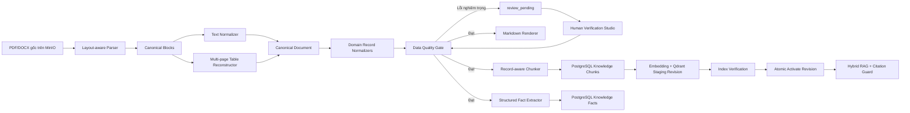

# KẾ HOẠCH CHUẨN HÓA MARKDOWN, QDRANT VÀ CHẤT LƯỢNG TRI THỨC RAG

> **Dự án**: QNU AI Platform  
> **Ngày lập**: 20/09/2026  
> **Phạm vi**: PDF/DOCX → Parsed Blocks → Markdown/Structured Records → Chunk/Facts → PostgreSQL/Qdrant → Hybrid RAG → LLM  
> **Mức ưu tiên**: P0 — ảnh hưởng trực tiếp đến độ đúng của câu trả lời  
> **Tài liệu đối chứng**: Thông tin tuyển sinh đại học 2026 (14 trang) và Kế hoạch triển khai nhiệm vụ 2025–2026 (22 trang)

---

## 1. Mục Tiêu

Mục tiêu của kế hoạch này không phải chỉ tạo ra file Markdown “đẹp mắt”, mà phải tạo ra **nguồn tri thức có cấu trúc, có thể kiểm chứng và không làm LLM hiểu sai quan hệ dữ liệu**.

Sau khi hoàn thành:

1. Nội dung bảng trong PDF chỉ xuất hiện **một lần**, không còn đồng thời tồn tại dưới dạng text thô và bảng Markdown.
2. Bảng kéo dài qua nhiều trang được nối thành một bảng logic, giữ đúng quan hệ hàng–cột và ô gộp.
3. Mỗi ngành tuyển sinh, nhiệm vụ triển khai, bảng quy đổi hoặc kết quả tuyển sinh trở thành một record nghiệp vụ nguyên tử.
4. Số liệu chính xác như mã ngành, chỉ tiêu, điểm chuẩn, thời gian, đơn vị chủ trì được lưu vào Structured Fact Layer; LLM không phải suy đoán từ đoạn văn.
5. Chỉ tài liệu/revision đã vượt qua Quality Gate và được phê duyệt mới có `is_retrievable=true` trong Qdrant.
6. Mọi câu trả lời RAG có thể truy ngược về tài liệu, trang, bảng, hàng và đoạn trích nguồn.
7. Khi nguồn có lỗi hoặc mâu thuẫn, hệ thống đưa vào Human-in-the-loop thay vì tự sửa hoặc tự chọn một giá trị.

### 1.1. Chỉ số thành công

| Nhóm | Chỉ số bắt buộc |
| :--- | :--- |
| Encoding | 0 ký tự thay thế Unicode `U+FFFD`, 0 mojibake, 100% Unicode NFC |
| Trùng lặp | Tỷ lệ nội dung bảng bị index lặp < 1% |
| Bảng | 100% hàng có cùng số cột với schema sau tái dựng |
| Tuyển sinh | Đủ STT 1–53 của bảng ngành, không thiếu hoặc trùng mã hàng |
| Kế hoạch | Mỗi `task_code` duy nhất; nội dung, đơn vị, thời gian, sản phẩm không lệch cột |
| Nguồn gốc | 100% chunk có `document_id`, revision, trang, section/chunk type và content hash |
| Số liệu | Câu hỏi mã ngành/điểm/chỉ tiêu/thời gian ưu tiên Structured Facts |
| Citation | 100% câu trả lời có dữ liệu RAG phải trích dẫn được trang và đoạn nguồn |
| Ragas TM-08 | Faithfulness ≥ 0,90; Answer Relevance ≥ 0,85; Context Precision ≥ 0,80 |

---

## 2. Hiện Trạng Và Nguyên Nhân Gốc

### 2.1. Dữ liệu bảng bị nhân đôi

`PyMuPdfParser` hiện lấy `page.get_text("text")`, trong đó đã chứa chữ bên trong bảng, sau đó tiếp tục nối `table_markdowns`. Vì vậy cùng một bảng được đưa vào `raw_text` hai lần.

Hậu quả:

- Chunk trùng cạnh tranh nhau trong Dense Search và FTS.
- RRF/Reranker có thể trả nhiều biến thể của cùng một bằng chứng, làm giảm Context Precision.
- Một hàng bị vỡ trong text thô có thể mâu thuẫn với hàng Markdown.
- LLM thấy nhiều giá trị giống hoặc gần giống nhau và có thể ghép sai cột.

### 2.2. Cleaner đang xử lý chuỗi, chưa xử lý cấu trúc

`clean_markdown_text()` chỉ có thể sửa khoảng trắng, Unicode và các dòng bảng đã liền nhau. Hàm này không đủ thông tin để:

- Xác định đoạn text nào nằm trong bảng.
- Nối hàng tiếp diễn sang trang sau.
- Phục hồi ô gộp theo tọa độ.
- Phân biệt cell trống thật với cell bị parser làm rơi.
- Phát hiện cột bị dịch chuyển.

### 2.3. Chunker chưa hiểu thực thể nghiệp vụ

`SemanticChunker` cắt theo đoạn và token. Với tài liệu bảng:

- Tên ngành có thể nằm ở chunk trước, tổ hợp ở chunk sau.
- Mã nhiệm vụ có thể tách khỏi đơn vị chủ trì hoặc sản phẩm kết quả.
- Một chunk có thể chứa cuối hàng A và đầu hàng B.

### 2.4. Markdown đang bị dùng như mô hình dữ liệu chính

Markdown phù hợp để xem và hiệu đính, nhưng không đủ mạnh để biểu diễn:

- Ô gộp nhiều hàng.
- Quan hệ giữa bảng nối trang.
- Giá trị nguồn và giá trị đã chuẩn hóa.
- Trạng thái xác minh của từng cell.
- Mâu thuẫn dữ liệu trong cùng tài liệu.

Do đó phải bổ sung **Canonical Document Model** và coi Markdown là một output renderer.

### 2.5. Lỗi nguồn và lỗi parser chưa được phân loại

PDF tuyển sinh gốc có các chuỗi `chi thiết`, `.Thí sinh`, `ngặng 45 kg`; đồng thời mã ngành Trí tuệ nhân tạo xuất hiện `7480107` ở bảng chính nhưng `7480207` ở phụ lục. Cleaner không được tự sửa các giá trị nghiệp vụ này. Hệ thống phải lưu lỗi dưới dạng `DataQualityIssue` và yêu cầu người kiểm duyệt xác nhận.

---

## 3. Kiến Trúc Đích



### 3.1. Nguyên tắc bắt buộc

1. **Parse once, render many**: parser tạo cấu trúc chuẩn; Markdown, chunks và facts đều sinh từ cấu trúc đó.
2. **No double indexing**: text trong vùng bảng không được xuất hiện lần thứ hai trong paragraph stream.
3. **One business record = one atomic retrieval unit**.
4. **Raw value is immutable**: luôn giữ giá trị nguồn; normalized value là lớp riêng.
5. **No silent correction**: mâu thuẫn số liệu phải chặn publish.
6. **Revision-safe indexing**: revision mới chỉ được kích hoạt sau khi kiểm tra đủ point và metadata.

---

## 4. Canonical Document Model

### 4.1. Các model cần bổ sung

Tạo package:

```text
backend/app/modules/knowledge/normalization/
├── __init__.py
├── models.py
├── text_normalizer.py
├── table_reconstructor.py
├── record_normalizer.py
├── quality_gate.py
└── markdown_renderer.py
```

Trong `models.py` định nghĩa model typed, không dùng `dict` tự do cho dữ liệu lõi:

```python
from enum import StrEnum
from pydantic import BaseModel, Field


class BlockType(StrEnum):
    HEADING = "heading"
    PARAGRAPH = "paragraph"
    LIST = "list"
    TABLE = "table"
    HEADER = "header"
    FOOTER = "footer"
    SIGNATURE = "signature"


class SourceSpan(BaseModel):
    page_number: int = Field(ge=1)
    bbox: tuple[float, float, float, float] | None = None


class CanonicalCell(BaseModel):
    raw_value: str
    normalized_value: str | None = None
    row_span: int = 1
    column_span: int = 1
    source_span: SourceSpan
    confidence: float = Field(ge=0, le=1)


class CanonicalRow(BaseModel):
    row_id: str
    cells: list[CanonicalCell]
    source_pages: list[int]
    is_continuation: bool = False


class CanonicalTable(BaseModel):
    table_id: str
    schema_key: str
    headers: list[str]
    rows: list[CanonicalRow]
    source_pages: list[int]


class QualityIssue(BaseModel):
    code: str
    severity: str
    message: str
    page_number: int | None = None
    table_id: str | None = None
    row_id: str | None = None
    raw_values: list[str] = Field(default_factory=list)
```

### 4.2. Mở rộng output parser

`ParsedContent` nên có:

```python
class ParsedContent(BaseModel):
    blocks: list[CanonicalBlock]
    tables: list[CanonicalTable]
    metadata: DocumentMetadata
    issues: list[QualityIssue]
```

`raw_text` có thể giữ để tương thích tạm thời, nhưng không còn là nguồn duy nhất để clean/chunk.

---

## 5. Giai Đoạn P0.1 — Loại Trùng Text Và Table

### 5.1. File cần sửa

- `backend/app/modules/knowledge/parsers/pdf_parser.py`
- `backend/app/modules/knowledge/parsers/blocks.py`
- `backend/tests/test_pdf_parser.py`

### 5.2. Thuật toán

1. Chạy `find_tables()` trước.
2. Lưu bbox của từng bảng.
3. Lấy text blocks/words có tọa độ.
4. Tính tỷ lệ giao nhau với bbox bảng.
5. Nếu tỷ lệ giao ≥ 0,60 hoặc tâm text nằm trong bảng, loại block khỏi paragraph stream.
6. Xuất bảng đúng một lần dưới dạng `CanonicalTable`.

```python
def intersection_ratio(text_box: Rect, table_box: Rect) -> float:
    intersection = text_box & table_box
    if intersection.is_empty or text_box.get_area() <= 0:
        return 0.0
    return intersection.get_area() / text_box.get_area()


def is_table_text(text_box: Rect, table_boxes: list[Rect]) -> bool:
    return any(
        intersection_ratio(text_box, table_box) >= 0.60
        or table_box.contains(text_box.tl + (text_box.br - text_box.tl) / 2)
        for table_box in table_boxes
    )
```

Không dùng điều kiện “block nằm trọn vẹn trong bảng” vì text block có thể tràn nhẹ qua đường viền hoặc chứa nhiều cell.

### 5.3. Acceptance criteria

- Chuỗi tên ngành không xuất hiện đồng thời trong paragraph và table record cùng trang.
- Hai bảng IELTS/VSTEP trên cùng trang được giữ thành hai bảng độc lập.
- Text trước và sau bảng vẫn giữ đúng thứ tự đọc.
- Không giảm page count hoặc làm mất citation metadata.

---

## 6. Giai Đoạn P0.2 — Tái Dựng Bảng Nhiều Trang

### 6.1. File cần tạo/sửa

- `normalization/table_reconstructor.py`
- `normalization/models.py`
- `backend/tests/test_table_reconstructor.py`

### 6.2. Nhận dạng bảng cùng schema

```python
def normalize_header(value: str) -> str:
    return collapse_spaces(normalize_nfc(value)).strip(" :.-").casefold()


def table_schema_key(headers: list[str]) -> str:
    canonical = "|".join(normalize_header(header) for header in headers)
    return sha256(canonical.encode("utf-8")).hexdigest()
```

Hai bảng được nối khi thỏa tất cả điều kiện:

- Cùng hoặc tương thích `schema_key`.
- Bảng trước nằm gần đáy trang, bảng sau nằm gần đầu trang.
- Số cột bằng nhau sau khi xử lý ô gộp.
- Thứ tự trang liên tiếp.
- Không có heading lớn hoặc đoạn văn mới ngăn giữa.

### 6.3. Loại header lặp

Header trang sau chỉ được loại khi toàn bộ cell tương đồng với schema đã biết. Không xóa dòng chỉ vì có từ “Nội dung” hoặc “Sản phẩm”.

### 6.4. Ghép hàng tiếp diễn

Áp dụng theo key column:

- Tuyển sinh: `STT` hoặc `Mã ngành`.
- Kế hoạch: `TT/task_code`.
- Phụ lục xét tuyển thẳng: nhóm môn thi + mã ngành.

Nếu hàng đầu trang mới không có key nhưng có dữ liệu ở các cột nội dung:

- Nếu hàng trước chưa hoàn chỉnh: nối cell tương ứng.
- Nếu đây là ô gộp: forward-fill giá trị nhóm.
- Nếu không đủ bằng chứng: tạo `ORPHAN_TABLE_ROW`, không tự ghép.

```python
def merge_continuation(previous: CanonicalRow, current: CanonicalRow) -> CanonicalRow:
    merged_cells: list[CanonicalCell] = []
    for old_cell, new_cell in zip(previous.cells, current.cells, strict=True):
        if not new_cell.raw_value.strip():
            merged_cells.append(old_cell)
            continue
        if not old_cell.raw_value.strip():
            merged_cells.append(new_cell)
            continue
        merged_cells.append(
            old_cell.model_copy(
                update={
                    "raw_value": f"{old_cell.raw_value} {new_cell.raw_value}".strip(),
                    "confidence": min(old_cell.confidence, new_cell.confidence),
                }
            )
        )
    return previous.model_copy(
        update={
            "cells": merged_cells,
            "source_pages": sorted(set(previous.source_pages + current.source_pages)),
        }
    )
```

### 6.5. Quy tắc cell trống

- Cell trống trong PDF → `normalized_value=None`.
- Không thay bằng `0`, `N/A` hoặc chuỗi dự đoán.
- Không dịch cell sang trái để lấp khoảng trống.
- Chỉ forward-fill cột phân nhóm đã được xác định là merged/group column.

### 6.6. Acceptance criteria

- Bảng ngành trang 2–8 trở thành một bảng logic 53 record.
- Bảng kế hoạch trang 3–22 giữ schema 7 cột.
- Phụ lục trang 13–14 nối đúng hàng `Tiếng Trung`.
- Không còn header lặp hoặc dòng số trang trong table rows.
- Không còn `Cột 2`, `Cột 3`, `Cột 5`, `Cột 11` trong output production.

---

## 7. Giai Đoạn P0.3 — Chuẩn Hóa Văn Bản Có Kiểm Soát

### 7.1. Tách cleaner thành các hàm thuần

`text_normalizer.py` nên có các bước độc lập:

```python
def normalize_encoding(text: str) -> str: ...
def normalize_whitespace(text: str) -> str: ...
def join_wrapped_paragraph_lines(lines: list[str]) -> list[str]: ...
def remove_repeated_headers(blocks: list[CanonicalBlock]) -> list[CanonicalBlock]: ...
def detect_heading(block: CanonicalBlock) -> CanonicalBlock: ...
def normalize_safe_punctuation(text: str) -> str: ...
```

### 7.2. Các thay đổi được phép tự động

- Unicode NFC, BOM, null byte.
- Khoảng trắng dư và dòng trắng dư.
- Ngắt dòng vật lý giữa cùng một câu.
- Header/footer và số trang lặp; vẫn giữ page metadata.
- Ký hiệu Markdown không hợp lệ.
- Chuẩn hóa heading hành chính có bằng chứng rõ ràng.

### 7.3. Các thay đổi phải qua Human Review

- Mã ngành, mã văn bản, mã nhiệm vụ.
- Ngày, điểm, học phí, chỉ tiêu, tỷ lệ.
- Tên đơn vị/cá nhân.
- Từ sai chính tả có thể thay đổi nghĩa.
- Mọi xung đột giữa hai bảng hoặc hai trang.

Lưu song song:

```json
{
  "raw_value": "7480207",
  "normalized_value": null,
  "status": "needs_review",
  "issue_code": "CONFLICTING_PROGRAM_CODE"
}
```

---

## 8. Giai Đoạn P0.4 — Domain Record Normalization

### 8.1. Tuyển sinh

Tạo các record type:

```python
class AdmissionProgramRecord(BaseModel):
    program_code: str
    program_name: str
    admission_methods: list[str]
    expected_quota: int | None
    subject_combinations: list[list[str]]
    source_pages: list[int]
    verification_status: str


class CertificateConversionRecord(BaseModel):
    certificate_type: str
    source_score: str
    converted_score: float
    source_page: int


class HistoricalAdmissionRecord(BaseModel):
    program_code: str
    year: int
    quota: int | None
    enrolled: int | None
    cutoff_score: float | None
    source_pages: list[int]
```

Ngoài ra cần `AdmissionTimelineRecord`, `TuitionRecord` và `DirectAdmissionMappingRecord`.

### 8.2. Kế hoạch nhiệm vụ

```python
class ImplementationTaskRecord(BaseModel):
    task_code: str
    category: str
    content: str
    lead_unit: str | None
    coordinating_units: list[str]
    start_date: str | None
    end_date: str | None
    deliverables: list[str]
    source_pages: list[int]
    verification_status: str
```

### 8.3. Không ép mọi tài liệu vào cùng một normalizer

Áp dụng Strategy Pattern:

```python
class BaseRecordNormalizer(ABC):
    @abstractmethod
    def supports(self, context: DocumentContext) -> bool: ...

    @abstractmethod
    def normalize(self, document: CanonicalDocument) -> list[DomainRecord]: ...


class AdmissionsRecordNormalizer(BaseRecordNormalizer): ...
class ImplementationPlanRecordNormalizer(BaseRecordNormalizer): ...
class GenericDocumentNormalizer(BaseRecordNormalizer): ...
```

Việc chọn normalizer dựa trên `document_type_code`, không suy đoán chỉ từ filename.

---

## 9. Giai Đoạn P0.5 — Record-Aware Chunking

### 9.1. Bổ sung chunker

Trong `backend/app/modules/knowledge/chunker.py` hoặc package `chunkers/`:

- `ClauseBasedChunker`: quy chế/quy định.
- `SemanticChunker`: văn bản diễn giải.
- `TableRecordChunker`: bảng tổng quát.
- `AdmissionsRecordChunker`: ngành, điểm chuẩn, quy đổi.
- `ImplementationTaskChunker`: kế hoạch nhiệm vụ.

### 9.2. Nguyên tắc chunk

- Không chia một business record thành hai chunk.
- Không gộp hai ngành hoặc hai nhiệm vụ nếu tổng token vẫn nhỏ; atomicity quan trọng hơn tiết kiệm số point.
- Chunk phải tự đủ nghĩa, không phụ thuộc header của chunk trước.
- Với row quá dài, dùng parent–child chunks nhưng lặp lại khóa chính và context.
- Overlap chỉ dùng cho narrative chunks, không dùng cho structured records.

### 9.3. Nội dung dùng cho embedding

Không embedding nguyên bảng Markdown với nhiều dấu `|`. Sinh `embedding_text` tự nhiên:

```python
def admission_embedding_text(record: AdmissionProgramRecord) -> str:
    combinations = "; ".join("–".join(items) for items in record.subject_combinations)
    quota = str(record.expected_quota) if record.expected_quota is not None else "chưa công bố"
    return (
        f"Ngành {record.program_name}, mã ngành {record.program_code}. "
        f"Phương thức tuyển sinh: {', '.join(record.admission_methods)}. "
        f"Chỉ tiêu dự kiến: {quota}. "
        f"Tổ hợp xét tuyển: {combinations}."
    )
```

Giữ riêng:

- `display_markdown`: dùng cho UI/citation.
- `embedding_text`: dùng tạo vector.
- `structured_payload`: dùng filter và facts.
- `quote_text`: đoạn trích ngắn bám nguồn.

### 9.4. Metadata chunk bắt buộc

```python
class ChunkMetadata(BaseModel):
    chunk_type: str
    entity_key: str | None
    document_id: str
    document_revision: int
    collection_id: str
    tenant_id: str
    workspace_id: str
    section_path: list[str]
    source_pages: list[int]
    table_id: str | None
    row_id: str | None
    verification_status: str
    quality_score: float
    human_verified: bool
```

---

## 10. Giai Đoạn P0.6 — Structured Fact Layer

### 10.1. Nguyên tắc routing

| Câu hỏi | Nguồn ưu tiên |
| :--- | :--- |
| Mã ngành, chỉ tiêu, điểm chuẩn | Structured Facts |
| IELTS/VSTEP quy đổi | Structured Facts |
| Nhiệm vụ X do đơn vị nào chủ trì | Structured Facts |
| Thời gian hoàn thành nhiệm vụ | Structured Facts |
| Giải thích chính sách/quy trình | Hybrid Retrieval |
| Tổng hợp nhiều nguồn | Facts + Hybrid Retrieval + Citation Guard |

### 10.2. Mở rộng fact schema

Fact phải chứa:

- `entity_key` ổn định.
- `attribute_name` chuẩn hóa.
- `raw_value` và `normalized_value`.
- `value_type`: string, integer, decimal, date, list.
- `document_revision`.
- `source_pages`, `table_id`, `row_id`.
- `verification_status` và `confidence`.

### 10.3. Conflict detector

```python
def detect_conflicting_facts(facts: list[KnowledgeFactDraft]) -> list[QualityIssue]:
    grouped = group_by(facts, key=lambda fact: (fact.entity_key, fact.attribute_name))
    issues: list[QualityIssue] = []
    for key, values in grouped.items():
        unique_values = {item.normalized_value for item in values if item.normalized_value is not None}
        if len(unique_values) > 1:
            issues.append(
                QualityIssue(
                    code="CONFLICTING_FACT_VALUES",
                    severity="blocking",
                    message=f"Thuộc tính {key} có nhiều giá trị: {sorted(unique_values)}",
                    raw_values=sorted(unique_values),
                )
            )
    return issues
```

Mâu thuẫn `7480107`/`7480207` phải làm tài liệu ở `review_pending`, không tự chọn giá trị có tần suất cao hơn.

---

## 11. Giai Đoạn P0.7 — Data Quality Gate

### 11.1. Các lớp kiểm tra

1. `EncodingValidator`
2. `DuplicateContentValidator`
3. `TableShapeValidator`
4. `BusinessKeyValidator`
5. `CrossTableConflictValidator`
6. `CitationMetadataValidator`
7. `ChunkAtomicityValidator`
8. `IndexPayloadValidator`

### 11.2. Severity

| Severity | Hành vi |
| :--- | :--- |
| `info` | Ghi log, không chặn |
| `warning` | Cho phép review nhưng chưa tự động publish |
| `blocking` | Chặn `ready` và chặn `is_retrievable=true` |

### 11.3. Quality report

```python
class DocumentQualityReport(BaseModel):
    document_id: str
    revision: int
    quality_score: float
    issues: list[QualityIssue]
    passed: bool
    checked_at: datetime
```

Quality score chỉ dùng để quan sát; một lỗi `blocking` luôn chặn publish dù tổng điểm cao.

---

## 12. Giai Đoạn P1 — Markdown Renderer Chuẩn

Markdown được sinh từ canonical model, không clean ngược từ chuỗi hỗn hợp.

### 12.1. Quy tắc renderer

- Một `#` cho tên tài liệu.
- `##` cho phần/chương lớn.
- `###` cho record nếu cần xem từng ngành/nhiệm vụ.
- Một table row phải nằm trên một dòng Markdown.
- Cell nhiều dòng dùng `<br>` hoặc danh sách trong cell.
- Không sinh tên cột `Cột N` trong production.
- Page marker chỉ giữ dưới dạng metadata/comment tại ranh giới nguồn, không chen giữa hàng bảng.

### 12.2. Ví dụ tuyển sinh

```markdown
### 7480107 — Trí tuệ nhân tạo

- Phương thức tuyển sinh: 1, 2, 3, 4
- Chỉ tiêu dự kiến: Chưa công bố
- Tổ hợp xét tuyển:
  - Toán, Lý, Hóa
  - Toán, Lý, Anh
- Nguồn: Trang 6
```

### 12.3. Ví dụ kế hoạch

```markdown
### Nhiệm vụ 1.3

- Nhóm công tác: Công tác phát triển đội ngũ, tổ chức, nhân sự
- Nội dung: Xây dựng và triển khai chính sách thu hút nguồn nhân lực chất lượng cao...
- Đơn vị chủ trì: Phòng TC-NS
- Đơn vị phối hợp: Khoa KT&CN; KHTN; CNTT; các đơn vị liên quan
- Thời gian bắt đầu: Chưa ghi trong văn bản
- Thời gian hoàn thành: Chưa ghi trong văn bản
- Sản phẩm kết quả: Chính sách thu hút được ban hành
- Nguồn: Trang 3
```

“Chưa ghi trong văn bản” chỉ dùng cho display; structured value vẫn là `null`.

---

## 13. Giai Đoạn P1 — Revision-Safe Qdrant Indexing

### 13.1. Không làm sạch sau khi đã upsert vector

Khi `embedding_text` thay đổi, vector cũ không còn hợp lệ. Quy trình đúng:

1. Tạo document revision mới.
2. Parse, normalize, quality gate.
3. Lưu chunks/facts revision mới trong PostgreSQL ở trạng thái staging.
4. Embedding và upsert Qdrant với `is_retrievable=false`.
5. Đếm point và kiểm tra payload parity.
6. Trong một bước kích hoạt logic: revision mới thành active/retrievable.
7. Revision cũ thành inactive và được xóa bằng retry/outbox.
8. Invalidate semantic cache.

### 13.2. Payload Qdrant đề xuất

```json
{
  "tenant_id": "tenant_qnu",
  "workspace_id": "workspace_qnu",
  "collection_id": "col_admissions",
  "document_id": "doc_ts_2026",
  "document_revision": 2,
  "chunk_id": "chk_...",
  "chunk_type": "admission_program",
  "entity_key": "program:7480107",
  "section_path": ["Tuyển sinh chính quy", "Danh mục ngành"],
  "source_pages": [6],
  "table_id": "admission-programs-2026",
  "row_id": "37",
  "verification_status": "verified",
  "quality_score": 0.98,
  "content_hash": "sha256...",
  "document_status": "ready",
  "is_retrievable": true,
  "content": "Ngành Trí tuệ nhân tạo, mã ngành 7480107..."
}
```

### 13.3. Index verification

Trước khi activate:

- Số point Qdrant = số retrievable chunks trong PostgreSQL.
- Tất cả point có đúng revision.
- Không có chunk hash trùng trong cùng document revision, trừ trường hợp được đánh dấu intentional duplicate.
- Không có point thiếu `source_pages` hoặc `verification_status`.
- Không có point `needs_review` được retrievable.

---

## 14. Giai Đoạn P1 — Retrieval Và Answer Grounding

### 14.1. Query router

Trước Dense/Sparse Search, phân loại query:

- `exact_fact`: mã ngành, điểm, học phí, chỉ tiêu, thời gian, đơn vị.
- `narrative`: giải thích, hướng dẫn, điều kiện.
- `mixed`: cần facts và đoạn giải thích.

### 14.2. Retrieval policy

- Exact fact → Facts trước, vector chỉ bổ sung context.
- Narrative → Dense + PostgreSQL FTS chạy song song → RRF → rerank.
- Mixed → Facts + Hybrid Retrieval; composer chỉ được dùng facts đã xác minh cho số liệu.
- Filter bắt buộc: tenant, workspace, collection, active revision, status ready/approved, retrievable true.

### 14.3. Citation guard

Mỗi claim số liệu phải map đến ít nhất một evidence có:

- `document_id`
- `document_revision`
- `title`
- `source_pages`
- `section_path`
- `quote_text`
- `entity_key` nếu là fact

Nếu không map được claim–evidence, loại claim khỏi câu trả lời hoặc kích hoạt No-Answer Policy.

---

## 15. Ma Trận Thay Đổi Code

| Tệp/package | Hành động | Trách nhiệm |
| :--- | :--- | :--- |
| `parsers/base.py` | MODIFY | Typed canonical parser contracts |
| `parsers/pdf_parser.py` | MODIFY | Loại text nằm trong bảng, không append trùng |
| `parsers/blocks.py` | MODIFY | Intersection-based suppression, cell/bbox evidence |
| `normalization/models.py` | NEW | Canonical blocks/tables/rows/issues |
| `normalization/text_normalizer.py` | NEW | Unicode, line reflow, header/footer |
| `normalization/table_reconstructor.py` | NEW | Nối bảng nhiều trang, ô gộp, orphan rows |
| `normalization/record_normalizer.py` | NEW | Strategy chọn domain record normalizer |
| `normalization/quality_gate.py` | NEW | Validators và blocking issues |
| `normalization/markdown_renderer.py` | NEW | Markdown sạch từ canonical model |
| `chunker.py` hoặc `chunkers/` | MODIFY/NEW | Record-aware chunkers |
| `knowledge/facts.py` | MODIFY | Typed facts, conflict detection, plan tasks |
| `services/ingestion_service.py` | MODIFY | Orchestrate canonical pipeline và quality states |
| `models.py` + migration | MODIFY | Revision, quality report, raw/normalized fact values |
| `rag/vector_indexer.py` | MODIFY | Staging payload, source_pages, atomic revision activation |
| `rag/retriever.py` | MODIFY | Active revision filters và fact routing |
| `rag/citation_guard.py` | MODIFY | Claim–evidence validation |

Không tiếp tục nhồi toàn bộ logic vào `ingestion_service.py`; service chỉ điều phối các strategy/service chuyên trách.

---

## 16. Kế Hoạch Kiểm Thử

### 16.1. Fixture policy

Không commit hai PDF gốc vào Git vì quy định không lưu binary lớn. Thay vào đó:

- Tạo fixture JSON nhỏ từ các table/block đã ẩn thông tin không cần thiết.
- Tạo synthetic PDF tối giản trong test runtime.
- Lưu checksum/tên nguồn trong tài liệu kiểm thử để đối chiếu thủ công.
- Golden fixtures phải chứa các ca khó: bảng nối trang, ô gộp, hai bảng song song, cell trống và conflicting fact.

### 16.2. Unit tests P0

1. `test_pdf_parser_does_not_duplicate_table_text`
2. `test_side_by_side_ielts_vstep_tables_remain_independent`
3. `test_stitches_same_schema_across_pages`
4. `test_preserves_true_blank_cells_as_none`
5. `test_merges_orphan_row_only_with_evidence`
6. `test_does_not_generate_placeholder_column_names`
7. `test_detects_conflicting_program_code`
8. `test_task_record_keeps_lead_unit_and_deliverable`
9. `test_record_chunk_is_atomic`
10. `test_blocking_issue_prevents_retrievable_status`

### 16.3. Integration tests

- Upload → pending/review_pending.
- Approve valid document → chunks/facts → Qdrant staging → ready.
- Conflict → approve bị từ chối RFC 7807.
- Reprocess revision → old revision không còn retrievable.
- Qdrant down → PostgreSQL không được đánh dấu indexed giả.
- Partial upsert → parity check fail, revision cũ vẫn active.
- Human edit → chunks và facts cùng được tái tạo, không xóa facts rồi bỏ trống.

### 16.4. Retrieval golden tests

Tạo bộ ít nhất 40 câu:

- 15 câu exact facts tuyển sinh.
- 10 câu tổ hợp/phương thức.
- 5 câu IELTS/VSTEP.
- 10 câu nhiệm vụ–đơn vị–thời gian–sản phẩm.

Mỗi câu có expected entity key, expected fact, expected page và forbidden values. Test phải fail nếu trả đúng câu chữ nhưng trích sai ngành/nhiệm vụ.

### 16.5. Lệnh kiểm tra

```bash
uv run ruff check .
uv run --extra dev pytest -v
```

Nếu thay đổi Frontend Verification Studio:

```bash
npm run lint
npm run typecheck
npm run build
```

---

## 17. Lộ Trình Triển Khai Đề Xuất

### Đợt 1 — P0 Duplicate-Free Parser

- Canonical models tối thiểu.
- Loại text trong bảng khỏi paragraph stream.
- Test hai bảng song song và duplicate regression.

**Điều kiện kết thúc**: cùng một cell không còn xuất hiện hai lần trong cleaned output.

### Đợt 2 — P0 Multi-page Table Reconstruction

- Schema fingerprint.
- Nối trang và loại header lặp.
- Orphan row/merged cell handling.
- Golden tests cho trang 13–14 và bảng kế hoạch 20 trang.

**Điều kiện kết thúc**: các bảng nguồn trở thành canonical tables có schema ổn định.

### Đợt 3 — P0 Domain Records + Quality Gate

- Admissions và Implementation Plan normalizers.
- Conflict detector.
- Review-pending lifecycle.

**Điều kiện kết thúc**: lỗi mã ngành mâu thuẫn chặn publish và hiện rõ cho người kiểm duyệt.

### Đợt 4 — P0 Record-aware Chunks + Facts

- Atomic chunks.
- Typed fact records.
- Exact fact routing.

**Điều kiện kết thúc**: câu hỏi số liệu không còn phụ thuộc LLM đọc bảng thô.

### Đợt 5 — P1 Revision-safe Qdrant

- Staging revision.
- Parity verification.
- Atomic activation và cleanup retry/outbox.

**Điều kiện kết thúc**: reindex lỗi không làm mất revision đang phục vụ.

### Đợt 6 — P1 RAG Evaluation

- Golden questions.
- Ragas TM-08.
- Claim–citation checks.
- Dashboard quality metrics.

**Điều kiện kết thúc**: đạt toàn bộ chỉ số ở Mục 1.1.

---

## 18. Anti-patterns Bị Cấm

1. Nối `page.get_text()` với bảng Markdown mà không loại text trong bảng.
2. Dùng regex để đoán và dịch chuyển cell dữ liệu.
3. Tạo tên `Cột N` rồi coi đó là schema hợp lệ.
4. Embedding nguyên file Markdown lớn hoặc nguyên một bảng 53 ngành thành một vector.
5. Chia một hàng nghiệp vụ thành nhiều chunk không có entity key.
6. Tự sửa mã ngành/điểm/ngày dựa trên tần suất xuất hiện.
7. Đưa chunk `needs_review` vào Qdrant với `is_retrievable=true`.
8. Cập nhật content PostgreSQL nhưng giữ nguyên vector cũ.
9. Đánh dấu `ready` khi Qdrant upsert một phần hoặc trả 0 point.
10. Dùng mock embedding/fact trong LiveMode để làm test pass.

---

## 19. Definition of Done

Kế hoạch chỉ được xem là hoàn thành khi:

- [x] Parser không tạo dữ liệu bảng trùng.
- [x] Hai bảng song song trên cùng trang không bị trộn.
- [x] Bảng nhiều trang được nối theo schema và geometry.
- [x] Không còn cột placeholder trong dữ liệu production.
- [x] Markdown được render từ canonical model.
- [x] Tuyển sinh và kế hoạch có record normalizer riêng.
- [x] Exact facts đi qua Structured Fact Layer.
- [x] Conflicting facts chặn publish.
- [x] Chunk có entity key và source pages.
- [x] Qdrant sử dụng active revision và parity gate.
- [x] Citation guard kiểm tra claim–evidence.
- [x] Golden retrieval tests pass 100%.
- [x] Ragas đạt ngưỡng TM-08.
- [x] Ruff và Pytest pass 100%.
- [x] Tài liệu quy trình 02 và nhật ký/memory được cập nhật khi triển khai code.

---

## 20. Kết Luận Kiến Trúc

Chất lượng trả lời của LLM không thể được sửa chỉ bằng prompt hoặc tăng kích thước model nếu dữ liệu đầu vào đã mất quan hệ hàng–cột. Đối với QNU AI Platform, hướng đúng là:

> **PDF gốc → canonical structure → domain records → quality gate → facts/chunks → revision-safe Qdrant → grounded answer.**

Markdown sạch là một sản phẩm quan trọng cho Human Review và citation, nhưng **Canonical Document Model và Structured Fact Layer mới là nguồn sự thật giúp LLM trả lời đúng**. Việc triển khai phải ưu tiên tính đúng của dữ liệu trước số lượng vector, đồng thời chấp nhận No-Answer khi nguồn chưa được xác minh.
