# NHẬN XÉT CHỨC NĂNG KHO TRI THỨC QNU AI PLATFORM

> Ngày đánh giá: 18/09/2026
>
> Phạm vi: Knowledge Management, Document Ingestion, OCR, Chunking, Structured Facts, Qdrant Indexing, Hybrid Retrieval và giao diện quản trị
>
> Mốc mã nguồn: nhánh `main`, commit `cd667f0`
>
> Trạng thái worktree: có thay đổi ModelOps/Provider từ một phiên khác đang chạy song song; báo cáo này không sửa mã nguồn hoặc dữ liệu nghiệp vụ

---

## 1. Kết luận điều hành

Kho tri thức là một trong những phân hệ trưởng thành nhất của QNU AI Platform. Hệ thống không còn là giao diện minh họa: đã có luồng tải tệp thật, lưu tệp gốc, bóc tách nội dung, OCR rescue, chuẩn hóa tiếng Việt, chia đoạn, Structured Fact Layer, đối soát thủ công, phê duyệt và lập chỉ mục Qdrant.

Tuy nhiên, mức hoàn thiện giữa hai nửa của phân hệ chưa cân bằng:

- **Document Intelligence và trải nghiệm quản trị:** khá tốt, có thể dùng thử nội bộ.
- **Tính nhất quán chỉ mục và độ tin cậy khi cấp dữ liệu cho Trợ lý AI:** chưa đạt production.

Trạng thái phù hợp hiện nay:

> **Internal Beta — mạnh về ingestion/verification, còn rủi ro cao ở index lifecycle và retrieval integrity.**

### Điểm đánh giá tổng hợp

| Nhóm đánh giá | Điểm / 10 | Nhận xét ngắn |
| :--- | :---: | :--- |
| Giao diện quản trị | 8.0 | Có master-detail, ingest, Studio, job history, reindex và retrieval sandbox |
| Upload và lưu tệp gốc | 7.5 | Có checksum, chống trùng và StorageDriver; thiếu cơ chế bù trừ khi pipeline lỗi |
| Parser, OCR và chuẩn hóa | 7.5 | Nhiều parser, OCR rescue, NFC và Studio page layout; vẫn cần kiểm soát lỗi rỗng chặt hơn |
| Human-in-the-loop verification | 8.0 | Có sửa nội dung theo trang và phê duyệt; facts chưa được tái tạo khi nội dung sửa đổi |
| Chunking và Structured Facts | 6.5 | Có hai chiến lược và facts dạng bảng; policy chọn chunker còn gán cứng |
| Đồng bộ PostgreSQL ↔ Qdrant | 4.0 | Trạng thái approved có thể tồn tại khi index thất bại; có nguy cơ ghost vector |
| Hybrid Retrieval | 5.0 | Có dense, lexical, RRF và reranker; lexical chưa phải PostgreSQL FTS thật |
| Citation và chống bịa đặt | 5.5 | Có citation/no-answer về cấu trúc; chưa kiểm chứng claim-evidence đầy đủ |
| Multi-tenancy và phân quyền dữ liệu | 4.0 | Tenant/workspace chưa được truyền và lọc nhất quán đến Qdrant/retrieval |
| Dữ liệu sẵn sàng sử dụng | 3.5 | Chỉ một phần collection có dữ liệu; Question Bank đang lệch tên collection Qdrant |
| Quan sát và phục hồi vận hành | 5.5 | Có jobs/log; trạng thái job và trạng thái index chưa phản ánh đúng nhau |

**Điểm tổng thể đề xuất: 6.0/10.**

Nếu chấm riêng:

- **Quản trị và xử lý tài liệu:** 7.5–8.0/10.
- **Nguồn tri thức production cho Trợ lý AI:** 4.5–5.0/10.

---

## 2. Phương pháp đánh giá

Báo cáo được lập dựa trên:

1. Đối chiếu yêu cầu trong `AGENTS.md`, skill `qnu-knowledge-ingestion` và `qnu-rag-pipeline`.
2. Rà soát mã nguồn Backend tại `backend/app/modules/knowledge/`, `backend/app/modules/rag/` và `backend/app/core/storage.py`.
3. Rà soát API client và các màn hình Knowledge ở Frontend.
4. Đối chiếu số liệu đã ghi nhận từ PostgreSQL/API trong phiên đánh giá tổng thể #85.
5. Kiểm tra trực tiếp trạng thái Qdrant và payload của các collection tại thời điểm đánh giá.

### Giới hạn quan sát runtime

- Trong phiên #85, Backend từng hoạt động và trả dữ liệu live.
- Tại thời điểm kiểm tra chuyên sâu này, cổng Backend `8001` không phản hồi, trong khi Qdrant `6333` vẫn hoạt động.
- Vì vậy, đánh giá API live sử dụng số liệu đã ghi nhận ở phiên #85; kiểm tra Qdrant được thực hiện trực tiếp tại thời điểm lập báo cáo.
- Backend tạm dừng có thể do môi trường phát triển, không tự động được xem là lỗi kiến trúc. Tuy nhiên, Frontend hiện có thể che tình trạng này bằng mock fallback.

---

## 3. Kiến trúc hiện có

```mermaid
flowchart LR
    Upload[Upload tài liệu] --> Hash[SHA-256 và chống trùng]
    Hash --> Storage[Local hoặc S3 Storage]
    Storage --> Parse[Parser hoặc OCR Rescue]
    Parse --> Clean[Unicode NFC và làm sạch]
    Clean --> Chunk[Clause/Semantic Chunking]
    Chunk --> PG[(PostgreSQL Chunks/Facts)]
    PG --> Review[Document Verification Studio]
    Review --> Approve[Phê duyệt]
    Approve --> Embed[Embedding]
    Embed --> Qdrant[(Qdrant)]
    PG --> Sparse[Lexical Search]
    Qdrant --> Dense[Dense Search]
    Sparse --> RRF[RRF k=60]
    Dense --> RRF
    RRF --> Rerank[Reranker]
    Rerank --> Citation[Citation và No-Answer]
    Citation --> Assistant[Trợ lý AI]
```



Kiến trúc mục tiêu hợp lý. Vấn đề chính không phải thiếu thành phần, mà là các invariant giữa PostgreSQL, storage, Qdrant và trạng thái tài liệu chưa được bảo đảm xuyên suốt.

---

## 4. Những phần đang làm tốt

### 4.1. Pipeline ingestion là luồng thật

`KnowledgeService.ingest_document` đã thực hiện các bước quan trọng:

- Tính SHA-256 và chống tải trùng trong cùng collection.
- Xác thực taxonomy loại văn bản.
- Lưu tệp gốc qua `StorageDriver` trước khi parse.
- Chọn parser/OCR, chuẩn hóa nội dung và chia chunk.
- Lưu document, chunks và facts vào PostgreSQL.
- Ghi nhận lịch sử tác vụ ingestion.

Đây là nền tảng tốt cho tính idempotent và khả năng kiểm tra nguồn gốc dữ liệu.

### 4.2. Khả năng xử lý nhiều loại tài liệu tương đối rộng

Hệ thống đã có hướng xử lý cho:

- PDF số hóa.
- PDF scan và ảnh qua OCR rescue.
- DOCX với cấu trúc heading/table.
- XLSX chuyển đổi bảng thành Markdown.
- Text/CSV.

Các cải tiến trước đó về Markdown theo trang, table extraction, SmartLayoutDetector, bounding box và loại bỏ placeholder giúp Studio tiến gần công cụ Document Intelligence thực tế.

### 4.3. Có Human-in-the-loop đúng hướng

Document Verification Studio hỗ trợ:

- Xem ảnh trang gốc.
- Xem Markdown và các vùng nhận diện.
- Sửa nội dung theo trang.
- Phê duyệt trước khi đưa vào Vector DB.
- Tải lại tệp gốc và theo dõi trạng thái xử lý.

Đây là đặc điểm quan trọng đối với dữ liệu quy chế, quyết định, tuyển sinh và văn bản hành chính, nơi OCR sai một con số có thể gây hậu quả nghiệp vụ.

### 4.4. Có các thành phần RAG cần thiết

Mã nguồn đã có:

- Dense retrieval qua Qdrant.
- Lexical retrieval từ PostgreSQL.
- Reciprocal Rank Fusion với `k=60`.
- Reranker có graceful fallback.
- Structured Fact Layer.
- Citation object và No-Answer Policy.

Nền tảng này đủ để nâng cấp thành Hybrid RAG chuẩn mà không cần thiết kế lại toàn bộ.

### 4.5. Trải nghiệm quản trị có độ phủ tốt

Frontend đã có:

- Danh sách và trang chi tiết collection.
- Bộ lọc, trạng thái và số lượng tài liệu/chunk.
- Trang ingest riêng.
- Studio đối soát độc lập.
- Job history, retry/cancel/cleanup.
- Reindex collection.
- Retrieval sandbox.

Việc dùng deep route phù hợp với quy mô dữ liệu và thao tác quản trị dài hạn.

---

## 5. Phát hiện mức P0 — cần sửa trước khi dùng production

### P0-01. `approved` không bảo đảm tài liệu đã được index

Trong `approve_document`, hệ thống:

1. Đặt `doc.status = "approved"`.
2. Commit PostgreSQL.
3. Sau đó mới gọi `vector_indexer.index_chunks`.

Trong khi đó, `index_chunks` có thể bắt lỗi Qdrant và trả về `0` thay vì làm thất bại nghiệp vụ. Kết quả là tài liệu có thể mang trạng thái approved nhưng không có vector nào.

**Tác động:**

- Người quản trị tin rằng tài liệu đã sẵn sàng.
- Trợ lý không tìm được tài liệu.
- Batch approve vẫn có thể tính tài liệu là đã duyệt.
- Không có trạng thái riêng để retry có kiểm soát.

**Khuyến nghị:**

Áp dụng state machine rõ ràng:

```text
uploaded
  → parsing
  → review_pending
  → approved
  → indexing
  → ready
  ↘ index_failed
  → archived
```

Chỉ tài liệu `ready` mới được phép xuất hiện trong retrieval.

### P0-02. Lệch tên Qdrant collection của Question Bank

Kiểm tra trực tiếp Qdrant ghi nhận:

| Qdrant collection | Số point |
| :--- | ---: |
| `col_col_question_bank` | 16 |
| `col_question_bank` | 0 |
| `col_drafting` | 6 |

Hàm đặt tên hiện tại giữ nguyên ID đã bắt đầu bằng `col_`, nên mã mới sẽ truy vấn `col_question_bank`. Dữ liệu 16 point nằm trong `col_col_question_bank` là dữ liệu legacy và không nằm ở đích mà runtime hiện tại sử dụng.

Trong phiên #85, PostgreSQL/API ghi nhận Question Bank có 2 documents và 17 chunks. Chênh lệch này cần được reconciliation theo từng document/status; không được chỉ sao chép toàn bộ point một cách mù quáng.

**Khuyến nghị:**

1. Khóa một quy tắc đặt tên collection duy nhất.
2. Lập bảng đối chiếu `document_id/chunk_id` giữa PostgreSQL và hai Qdrant collection.
3. Chỉ migrate các chunk thuộc document active, approved/ready.
4. Xóa collection legacy sau khi kiểm chứng retrieval và có bản sao lưu.
5. Thêm startup drift check để lỗi tương tự không tái diễn.

### P0-03. Có nguy cơ ghost vector và ghost citation

Các đường đời hiện tại chưa đồng bộ hoàn toàn với Qdrant:

- Archive chỉ cập nhật PostgreSQL `is_active=False`, `status=archived`.
- Xóa document coi xóa Qdrant là best-effort; nếu Qdrant lỗi, DB vẫn bị xóa.
- Xóa collection chỉ xóa entity PostgreSQL và cascade dữ liệu quan hệ.
- Sửa nội dung tài liệu có thể thay chunks trước khi dọn vector cũ.

Dense search dựa vào payload Qdrant, nên vector cũ có thể tiếp tục được trả về và tạo trích dẫn đến tài liệu đã archive/xóa.

**Khuyến nghị:** dùng Transactional Outbox hoặc workflow bù trừ, có tombstone và reconciliation định kỳ. Không hoàn tất delete/archive nếu chưa ghi nhận lệnh dọn vector bền vững.

### P0-04. Mock embedding có thể được dùng trong đường runtime thật

Khi Cloudflare hoặc sentence-transformers không khả dụng, `VectorIndexer` tạo deterministic mock vector. Vector này giúp test pipeline nhưng không mang ngữ nghĩa của văn bản.

**Tác động:** hệ thống vẫn báo index thành công nhưng chất lượng tìm kiếm trở nên ngẫu nhiên theo nội dung hash.

**Khuyến nghị:**

- Chỉ cho phép mock embedding khi `APP_ENV=test` hoặc `DEMO_MODE=true`.
- Ở LiveMode, embedding lỗi phải tạo trạng thái `index_failed` và retry.
- Ghi rõ `embedding_provider`, `model`, `dimension`, `model_revision` trong metadata của index.

### P0-05. Tenant/workspace chưa được bảo vệ xuyên suốt retrieval

Collection list có nhận `X-Tenant-Id` và `X-Workspace-Id`, nhưng các đường get/update/delete document và payload Qdrant chưa nhất quán tenant/workspace. Dense retrieval chưa có bộ lọc tenant bắt buộc.

**Tác động:** khi triển khai nhiều đơn vị hoặc nhiều workspace, dữ liệu có nguy cơ bị truy xuất chéo.

**Khuyến nghị:** tenant/workspace phải lấy từ trusted auth context, không chỉ từ header tự khai báo; mọi query DB và Qdrant đều phải có filter bắt buộc.

---

## 6. Phát hiện mức P1 — ảnh hưởng chất lượng và vận hành

### P1-01. Lexical search chưa phải PostgreSQL Full-Text Search

Hàm `search_sparse_fts` hiện tách token rồi dùng nhiều điều kiện `ILIKE '%token%'`. Cách này:

- Không có ranking ngôn ngữ đúng nghĩa.
- Không tận dụng `tsvector`, GIN index và `ts_rank`.
- Chậm khi dữ liệu lớn.
- Dễ trả kết quả kém liên quan với truy vấn dài.

**Khuyến nghị:** bổ sung cột/search expression `tsvector`, GIN index, `websearch_to_tsquery` hoặc cấu hình tokenizer tiếng Việt phù hợp và chuẩn hóa điểm trước RRF.

### P1-02. Dense và sparse đang chạy tuần tự

Comment trong retriever ghi “Concurrent Dense & Sparse Search”, nhưng mã thực thi `await` dense trước rồi mới `await` sparse.

**Khuyến nghị:** dùng `asyncio.gather`, đồng thời ghi latency từng tầng để theo dõi bottleneck.

### P1-03. Sửa nội dung sau đối soát chưa tái tạo facts

Khi người dùng gửi nội dung trang đã sửa, hệ thống xóa và tạo lại chunks nhưng chưa xóa/tái trích xuất `KnowledgeFact` tương ứng.

**Tác động:** câu trả lời số liệu có thể dùng fact cũ, trong khi citation/chunk đã là nội dung mới.

**Khuyến nghị:** version hóa nội dung; mỗi lần approve phải tạo lại chunks, facts và vectors từ cùng một `content_revision`.

### P1-04. Chính sách chọn chunker đang gán cứng theo module

Hiện chỉ module `regulations` được chọn ClauseBasedChunker; các module khác mặc định semantic. Kho `drafting` chứa Nghị định 30 và văn bản hành chính nhưng có thể đi qua semantic chunking.

**Khuyến nghị:** lưu `chunking_strategy` trong collection/document type, cho phép override có kiểm soát và version hóa cấu hình chunking.

### P1-05. SemanticChunker hiện là paragraph window, chưa phải semantic thực sự

Chiến lược hiện tại chủ yếu gom đoạn theo ước lượng `len(text) // 4` và overlap. Nó chưa đo độ tương đồng giữa câu/đoạn bằng embedding hoặc boundary detector.

Tên gọi nên được điều chỉnh thành `ParagraphWindowChunker`, hoặc nâng cấp để thực hiện semantic boundary thật và có benchmark theo loại tài liệu.

### P1-06. Trạng thái ingestion job chưa phản ánh đúng vòng đời

Ngay sau parse và lưu chunks, ingestion job được ghi `completed`, `progress=100` và `points_reindexed=len(chunks)`, dù tài liệu vẫn `pending` và chưa được đưa vào Qdrant.

**Tác động:** dashboard vận hành báo thành công sớm và số điểm index không đúng sự thật.

**Khuyến nghị:** tách jobs `ingest`, `verify`, `index`; hoặc dùng các stage riêng trong một job và chỉ ghi số point từ response Qdrant thực tế.

### P1-07. Frontend che lỗi Backend bằng mock data

`getCollections` và `getDocuments` trả `MOCK_COLLECTIONS`/`MOCK_DOCUMENTS` khi fetch thất bại. Khi Backend dừng, người dùng vẫn có thể thấy dữ liệu trông hợp lệ.

**Khuyến nghị:**

- LiveMode hiển thị ErrorState và nút thử lại.
- DemoMode phải được bật rõ ràng, có badge “Dữ liệu mẫu”.
- Không sử dụng mock data cho số liệu nghiệp vụ hoặc citation.

### P1-08. RAG Ask chưa phải luồng sinh câu trả lời đầy đủ

RAG service đã dựng context/prompt, nhưng câu trả lời chủ yếu được kết hợp từ fact hoặc chunk đầu tiên; chưa gọi ModelOps để sinh câu trả lời dựa trên toàn bộ context và chính sách Assistant.

**Khuyến nghị:** nối Answer Composer với ModelOps, bind model/fallback/temperature/max_tokens từ Assistant, sau đó chạy citation entailment và No-Answer Policy trước khi trả kết quả.

### P1-09. S3 driver gọi boto3 đồng bộ trong hàm async

Các thao tác `put_object`, `get_object`, `delete_object` đồng bộ có thể chặn event loop khi tệp lớn hoặc mạng chậm.

**Khuyến nghị:** dùng aioboto3/aiobotocore hoặc offload toàn bộ lời gọi boto3 bằng `asyncio.to_thread`, kèm timeout và retry có giới hạn.

---

## 7. Phát hiện mức P2 — nên hoàn thiện để tăng khả năng bảo trì

1. `KnowledgeService` đang quá lớn và gánh nhiều trách nhiệm: ingestion, OCR, Studio, lifecycle, indexing và job synchronization.
2. Collection count đang phản ánh tài liệu/chunk active trong DB, chưa phản ánh số tài liệu `ready` và số vector thực tế.
3. Parse/OCR có trường hợp fallback rỗng; cần policy không cho tạo document review nếu không thu được nội dung tối thiểu.
4. Lưu file thành công nhưng parse/DB thất bại có thể để lại object mồ côi.
5. Citation cần kiểm tra rằng quote thực sự nằm trong revision tài liệu đã index.
6. Cần expose index diagnostics: model embedding, revision, số DB chunks, số Qdrant points, last sync và drift.
7. Cần version hóa parser/chunker/OCR config để có thể tái lập kết quả ingestion.

---

## 8. Mức sẵn sàng dữ liệu hiện tại

Số liệu đã ghi nhận trong phiên #85:

| Collection | Documents | Chunks | Nhận xét |
| :--- | ---: | ---: | :--- |
| Question Bank | 2 | 17 | Qdrant đang lệch sang collection legacy 16 points |
| Drafting | 1 | 6 | Có 6 points trong `col_drafting`; payload Nghị định 30 tương đối đầy đủ |
| Admissions | 0 | 0 | Chưa đủ dữ liệu để đánh giá RAG tuyển sinh |
| Regulations | 0 | 0 | Chưa đủ dữ liệu kiểm thử ClauseBasedChunker/citation pháp lý |
| Library | 0 | 0 | Chưa có corpus để đánh giá semantic retrieval |

Vì ba collection nghiệp vụ chính đang rỗng, các KPI RAG hoặc đánh giá Trợ lý hiện chưa đại diện cho tình huống vận hành thật.

---

## 9. Chức năng nào có thể dùng ngay, chức năng nào chưa nên tin cậy

### Có thể dùng thử nội bộ

- Tạo và quản lý collection.
- Upload tài liệu và chống trùng theo checksum.
- Bóc tách PDF/DOCX/XLSX/text.
- OCR rescue cho PDF scan/ảnh.
- Xem ảnh, Markdown, bố cục và hiệu đính theo trang.
- Tạo chunks/facts để kiểm thử.
- Phê duyệt và reindex thủ công trong môi trường dev.
- Retrieval sandbox với kho Drafting.

### Chưa nên dùng cho quyết định nghiệp vụ quan trọng

- Xem trạng thái `approved` như bằng chứng tài liệu đã truy xuất được.
- Dùng Question Bank cho truy xuất trước khi migrate/reconcile Qdrant.
- Tin rằng archive/delete đã loại tài liệu khỏi mọi câu trả lời.
- Dùng số liệu KPI RAG khi corpus còn rỗng hoặc mock fallback đang bật.
- Cho phép nhiều tenant dùng chung hệ thống trước khi filter tenant được enforce.
- Dùng deterministic mock embedding trong LiveMode.

---

## 10. Lộ trình hoàn thiện đề xuất

### Đợt 1 — Bảo toàn dữ liệu và chỉ mục

1. Thiết kế state machine `review_pending/indexing/ready/index_failed/archived`.
2. Tạo `content_revision` và `index_revision` cho document.
3. Chỉ retrieval document `ready`, active và đúng revision.
4. Migrate `col_col_question_bank` về tên chuẩn sau khi đối chiếu chunk IDs.
5. Đồng bộ archive/delete/update với Qdrant bằng outbox và retry.
6. Recompute facts khi nội dung đối soát thay đổi.
7. Cấm mock embedding trong LiveMode.

### Đợt 2 — Nâng chất lượng Hybrid Retrieval

1. Thay `ILIKE` bằng PostgreSQL FTS thật.
2. Chạy dense/sparse song song.
3. Chuẩn hóa score và log từng stage: dense, sparse, fusion, rerank.
4. Thêm filter tenant/workspace/document status/revision.
5. Tách policy chunking khỏi module code và lưu theo collection/document type.
6. Benchmark ClauseBased/ParagraphWindow/Semantic trên corpus QNU.

### Đợt 3 — Hoàn thiện Answer Composer

1. Nối RAG service với ModelOps thật.
2. Bind cấu hình Assistant: primary/fallback model, temperature, max tokens và retrieval limit.
3. Kiểm tra citation entailment theo từng claim.
4. Ưu tiên Structured Facts cho số liệu; không cho LLM suy đoán.
5. Thực thi No-Answer Policy khi context không đạt ngưỡng.

### Đợt 4 — Dữ liệu, đánh giá và vận hành

1. Nạp corpus chính thức cho Admissions, Regulations và Library.
2. Xây golden question set theo từng collection.
3. Chạy Ragas/TM-08 trên runtime thật.
4. Xây Index Integrity Dashboard và scheduled reconciliation.
5. Tách DemoMode khỏi LiveMode.
6. Bổ sung backup/restore và diễn tập Qdrant/PostgreSQL drift recovery.

---

## 11. Production acceptance gate đề xuất

Kho tri thức chỉ nên được coi là production-ready khi đạt đồng thời:

### Data integrity

- 100% tài liệu `ready` có `indexed_chunks == active_chunks` đúng revision.
- 0 ghost point sau archive/delete.
- 0 collection legacy không có owner/mapping.
- 100% fact gắn `content_revision` và source evidence.

### Retrieval quality

- Recall@5 hoặc Hit@5 đạt ít nhất 90% trên golden set của từng collection.
- Faithfulness ≥ 0.90.
- Answer Relevance ≥ 0.85.
- Context Precision ≥ 0.80.
- 100% câu trả lời số liệu có nguồn fact/citation hợp lệ.

### Reliability

- Qdrant hoặc embedding lỗi phải tạo `index_failed`, không tạo trạng thái ready giả.
- Retry idempotent, không sinh chunk/point trùng.
- Dense/sparse/reranker có timeout và degraded-state rõ ràng.
- Recovery test chứng minh PostgreSQL và Qdrant có thể tái đồng bộ.

### Security

- 100% query DB và Qdrant có tenant/workspace filter từ trusted auth context.
- API thay đổi dữ liệu có RBAC và audit log.
- Không có mock data hoặc mock embedding trong LiveMode.

### UX vận hành

- Giao diện phân biệt rõ `Đang đối soát`, `Đang index`, `Sẵn sàng`, `Index lỗi` và `Đã lưu trữ`.
- Có màn hình drift diagnostics và thao tác repair/reindex có xác nhận.
- Backend lỗi phải hiển thị ErrorState, không thay bằng dữ liệu mẫu.

---

## 12. Đề xuất ưu tiên ngay cho phiên triển khai tiếp theo

Nếu chỉ chọn một gói công việc, nên thực hiện **Knowledge Index Integrity** trước:

1. Sửa state machine và điều kiện retrieval.
2. Reconcile/migrate Question Bank Qdrant collection.
3. Đồng bộ archive/delete/edit với vector và facts.
4. Tắt mock embedding trong LiveMode.
5. Viết test lỗi Qdrant, embedding, archive, delete và reindex drift.

Gói này mang lại giá trị lớn hơn việc bổ sung thêm màn hình, vì nó biến trạng thái “đã duyệt” thành một cam kết kỹ thuật có thể tin cậy.

---

## 13. Kết luận cuối

Kho tri thức hiện tại có nền móng tốt và đã thể hiện rõ năng lực xử lý tài liệu phức tạp của QNU AI Platform. Phân hệ này đủ sức trở thành nguồn dữ liệu trung tâm cho các Trợ lý AI nếu được hoàn thiện lớp consistency và retrieval.

Điểm nghẽn hiện nay không còn là OCR hay giao diện. Điểm nghẽn là bảo đảm rằng:

> **Tệp người dùng đã duyệt, chunks/facts trong PostgreSQL, vectors trong Qdrant và citations mà Trợ lý trả về luôn cùng một tài liệu, cùng một revision và cùng một tenant.**

Khi invariant trên được thực thi và kiểm thử tự động, Kho tri thức có thể tăng từ khoảng **6.0/10** lên mức **8.0/10** mà không cần thay đổi kiến trúc tổng thể.
