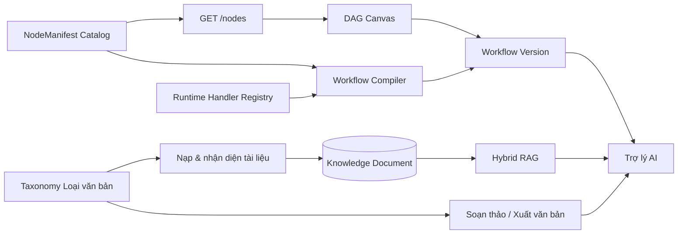

# NHẬN XÉT CHỨC NĂNG NODE CATALOG VÀ LOẠI VĂN BẢN

> Ngày đánh giá: 18/09/2026
>
> Phạm vi: `/nodes`, NodeManifest, DAG Canvas, Workflow Runtime Registry, taxonomy loại văn bản; phụ lục mở rộng đánh giá Trợ lý AI, RAG, OCR, ModelOps, Tools, Evaluation, Dashboard, Hội thoại/Handoff, Kênh phân phối và Dev Access Gate
>
> Phương pháp: rà soát mã nguồn, đối chiếu hợp đồng Frontend–Backend và chạy toàn bộ Backend test suite cùng kiểm tra tĩnh Frontend; không thay đổi mã nguồn, cấu hình runtime hoặc dữ liệu nghiệp vụ

---

## 1. Kết luận điều hành

`/nodes` và **Loại văn bản** không phải hai màn hình quản trị phụ. Đây là hai hợp đồng nền tảng quyết định độ tin cậy của toàn bộ Workflow và Trợ lý AI:

- **Node Catalog là Capability Contract**: xác định Workflow được phép làm gì, cấu hình gì, nhận đầu vào nào, tạo đầu ra nào và Runtime có thực thi được hay không.
- **Taxonomy loại văn bản là Semantic Contract**: xác định tài liệu là loại gì, được xử lý theo chiến lược nào, có giá trị pháp lý và độ ưu tiên ra sao, được đưa vào RAG và soạn thảo như thế nào.

Nền tảng hiện đã có kiến trúc đúng hướng:

- 13 NodeManifest có version, schema và trạng thái.
- 12/13 loại node trong manifest có handler tương ứng trong Runtime Registry.
- 37 loại văn bản, chia thành 4 nhóm; 28 mã thuộc phạm vi NĐ 30/2020/NĐ-CP.
- Taxonomy đã được lưu trong PostgreSQL, gắn khóa ngoại vào tài liệu và được dùng trong ingestion, drafting và document exporter.
- Giao diện của cả hai chức năng đã có loading, error, empty state, tìm kiếm, lọc và trang chi tiết phù hợp.

Tuy nhiên, hai hợp đồng này **chưa trở thành Single Source of Truth xuyên suốt**:

1. `/nodes` trả về catalog thật nhưng DAG Canvas vẫn dùng catalog hardcode riêng.
2. Một số node hiển thị trên Canvas không tạo đúng loại node thực thi.
3. Manifest schema mới chỉ được xem, chưa điều khiển form cấu hình và compiler validation.
4. Loại văn bản chưa rõ nguồn phân loại và độ tin cậy; file không nhận diện được vẫn bị ép thành một loại cụ thể.
5. Loại Core có thể chỉnh sửa/vô hiệu hóa trên UI nhưng sẽ bị đồng bộ lúc khởi động ghi đè trở lại.
6. Độ ưu tiên pháp lý trên màn hình ingestion đang là logic Frontend riêng, chưa phải policy RAG thật.

### Điểm đánh giá đề xuất

| Chức năng | Điểm hiện tại | Trạng thái phù hợp |
| :--- | :---: | :--- |
| Trang `/nodes` và API Node Catalog | 7.5/10 | Catalog Preview |
| Đồng bộ Node Catalog → Canvas → Runtime | 4.5/10 | Chưa đạt Runtime Contract |
| Taxonomy và API Loại văn bản | 8.0/10 | Internal Beta |
| Tự nhận diện và sử dụng loại văn bản trong RAG | 5.5/10 | Cần kiểm soát độ tin cậy |
| Tổng thể hai chức năng | **6.5/10** | Nền tảng tốt, chưa đủ làm hợp đồng production |

---

## 2. Vai trò trong kiến trúc Workflow và Trợ lý AI



Hai nhánh này gặp nhau tại Trợ lý AI:

- Workflow chọn **node nào** để thực thi.
- Node RAG, drafting hoặc export cần biết **loại văn bản nào** đang được xử lý.
- Nếu Node Catalog sai, trợ lý gọi sai năng lực hoặc workflow không xuất bản được.
- Nếu loại văn bản sai, tài liệu có thể bị chunk, ưu tiên, truy xuất hoặc xuất bản sai ngữ nghĩa.

Vì vậy, lỗi ở hai chức năng này có tính lan truyền cao hơn lỗi giao diện thông thường.

---

## 3. Đánh giá chức năng `/nodes`

### 3.1. Những phần đang làm tốt

1. **Catalog có nguồn thật và có version**
   - 13 tệp JSON trong [`configs/nodes`](../configs/nodes/) được đọc trực tiếp, không cần seed database giả.
   - Mỗi manifest có `type`, `version`, `category`, schema và compatibility status.

2. **API đơn giản và tương thích Core**
   - Endpoint trả về envelope `{ items: [...] }`.
   - Hỗ trợ tìm kiếm, lọc category và status.
   - Việc đọc file được đưa sang worker thread, không chặn event loop.

3. **UI catalog tương đối hoàn chỉnh**
   - Có thống kê tổng node, category và node active.
   - Có tìm kiếm, bộ lọc, trạng thái lỗi/trống và xem chi tiết schema.
   - Không fallback sang dữ liệu mock nếu Backend lỗi.

4. **Compiler đã kiểm tra node type**
   - Workflow Compiler từ chối node không có handler trong Runtime Registry.
   - Đây là hàng rào đúng, nhưng hiện chưa được phản ánh ngược lên catalog UI.

### 3.2. Các vấn đề quan trọng

#### P1 — DAG Canvas không sử dụng `/nodes` làm nguồn dữ liệu

[`frontend/src/components/admin/node-catalog-drawer.tsx`](../frontend/src/components/admin/node-catalog-drawer.tsx) vẫn khai báo `CATALOG_NODE_ITEMS` gồm 8 node hardcode. Trong khi đó trang `/nodes` lấy 13 manifest thật từ API.

Hệ quả:

- Có hai catalog khác nhau trong cùng hệ thống.
- Thêm manifest mới không tự xuất hiện trên Canvas.
- Sửa tên, trạng thái hoặc schema trong manifest không cập nhật Canvas.
- Người dùng có thể xem một node ở `/nodes` nhưng không thể thêm node đó vào workflow.

#### P1 — API Caller bị biến thành Human Approval khi thêm vào Canvas

Hàm mapping trong [`frontend/src/pages/dag-canvas-page.tsx`](../frontend/src/pages/dag-canvas-page.tsx) ánh xạ theo `category`, không theo `manifest.type`:

- `tool.api_caller` thuộc category `tool`.
- Mọi category `tool` lại được chuyển thành `tool.human_approval`.

Kết quả là người dùng chọn **Gọi API & Dữ liệu Ngoài**, nhưng workflow được tạo ra lại chứa node phê duyệt con người. Đây là lỗi sai ngữ nghĩa, có thể làm workflow nhìn đúng trên giao diện nhưng chạy sai nghiệp vụ.

#### P1 — Node `active` chưa đồng nghĩa với Runtime khả dụng

Manifest `tool.api_caller` có status `active`, nhưng [`backend/app/modules/workflows/registry.py`](../backend/app/modules/workflows/registry.py) chưa đăng ký handler `tool.api_caller`.

Kết quả đối chiếu hiện tại:

| Chỉ số | Giá trị |
| :--- | :---: |
| Manifest trong catalog | 13 |
| Manifest có Runtime handler | 12 |
| Manifest chưa có handler | `tool.api_caller` |

Status trong manifest hiện đang mô tả maturity (`active`, `experimental`), không mô tả khả năng thực thi thật. UI cần hiển thị riêng:

- `maturity_status`.
- `runtime_available`.
- `disabled_reason` nếu chưa khả dụng.

#### P1 — Schema mới chỉ để xem, chưa phải hợp đồng thực thi

Manifest đã có `config_schema`, `input_schema` và `output_schema`, nhưng hệ thống chưa dùng chúng để:

- Sinh form cấu hình node trên Property Inspector.
- Tự điền giá trị mặc định.
- Kiểm tra required fields khi lưu hoặc publish.
- Kiểm tra output port của node nguồn có phù hợp input port node đích.
- Kiểm tra config trước khi Runtime gọi handler.

Canvas hiện tạo node với `workflowConfig: {}` ngay cả khi manifest yêu cầu trường bắt buộc. Compiler chỉ kiểm tra node type và cấu trúc graph nên một workflow có thể publish với config thiếu.

#### P2 — Manifest lỗi kiểu dữ liệu có thể làm hỏng toàn endpoint

Loader có ý định bỏ qua manifest lỗi, nhưng `_mapping()` có thể ném `TypeError`, trong khi `_load_manifest_file()` chưa bắt ngoại lệ này. Một manifest có `spec` hoặc schema sai kiểu có thể làm `asyncio.gather()` thất bại và khiến toàn bộ `/nodes` trả lỗi thay vì chỉ loại bỏ một file hỏng.

#### P2 — Thiếu kiểm tra tính duy nhất và tương thích phiên bản

Catalog chưa kiểm tra:

- Trùng cặp `type@version` giữa nhiều file.
- `min_runtime_version` có phù hợp Runtime hiện tại hay không.
- Handler operation trong manifest có khớp handler thực tế hay không.
- Node deprecated có đang được workflow chính thức sử dụng hay không.

### 3.3. Kiến trúc mục tiêu cho `/nodes`

1. Backend hợp nhất Manifest Registry và Runtime Registry.
2. `/nodes` trả về cả metadata manifest và trạng thái Runtime.
3. DAG Canvas lấy trực tiếp dữ liệu từ `/nodes`, không có mảng catalog hardcode.
4. Khi thêm node, Canvas giữ nguyên `manifest.type` và `manifest.version`.
5. Property Inspector được sinh từ `config_schema`.
6. Compiler validate config, port, permission và compatibility trước publish.
7. Runtime validate lại theo nguyên tắc defense-in-depth trước execute.

---

## 4. Đánh giá chức năng Loại văn bản

### 4.1. Những phần đang làm tốt

1. **Taxonomy có phạm vi đủ rộng cho QNU**
   - 37 loại văn bản.
   - 4 nhóm: quy phạm/nội bộ, hành chính, học thuật và biểu mẫu.
   - 28 loại được đánh dấu thuộc NĐ 30.

2. **Database là runtime source of truth**
   - Có bảng `platform_document_types`.
   - Có version, source hash, thời điểm đồng bộ và phân biệt Core/custom.
   - `knowledge_documents.document_type_code` có khóa ngoại và index.

3. **Đã nối vào luồng nghiệp vụ thật**
   - Ingestion kiểm tra mã tồn tại và đang active trước khi lưu.
   - Knowledge API hỗ trợ lọc tài liệu theo loại.
   - Drafting field extractor chuẩn hóa mã loại văn bản.
   - Document exporter từ chối loại văn bản không hợp lệ.

4. **UI quản trị có chiều sâu**
   - Có danh sách, tìm kiếm, lọc category và thống kê.
   - Có trang chi tiết riêng, deep link, số tài liệu đang sử dụng và audit metadata.
   - Cho phép tạo loại tùy chỉnh mà không sửa trực tiếp catalog nguồn.

### 4.2. Các vấn đề quan trọng

#### P1 — Không nhận diện được vẫn bị ép thành một loại cụ thể

[`frontend/src/lib/file-inspector.ts`](../frontend/src/lib/file-inspector.ts) trả về `thong_bao` khi tên file không khớp từ khóa; nếu mã này không có, hàm lấy phần tử đầu tiên trong danh sách active.

Ví dụ `scan_001.pdf` có thể bị ghi thành **Thông báo** dù chưa có bằng chứng. Backend sau đó lưu `document_type_source = "user"` chỉ vì Frontend đã gửi một mã, dù người dùng không chủ động chọn.

Đây là rủi ro data integrity vì loại văn bản sai sẽ tồn tại lâu dài trong kho tri thức và ảnh hưởng đến:

- Bộ lọc tài liệu.
- Chunking strategy.
- RAG retrieval/reranking.
- Soạn thảo và xuất văn bản.
- Báo cáo thống kê theo loại.

Hành vi đúng khi không đủ căn cứ phải là:

```json
{
  "document_type_code": null,
  "classification_status": "unclassified",
  "classification_source": "filename_heuristic",
  "classification_confidence": 0
}
```

Chỉ tự chọn khi confidence vượt ngưỡng; nếu thấp phải yêu cầu người dùng xác nhận.

#### P1 — Chỉnh sửa/vô hiệu hóa loại Core không bền vững

Trang chi tiết cho phép chỉnh metadata và vô hiệu hóa cả loại Core. Tuy nhiên, [`backend/app/modules/document_types/service.py`](../backend/app/modules/document_types/service.py) ghi đè lại các trường từ catalog trong mỗi lần `sync_from_catalog()`.

Việc sync lại chạy lúc Backend khởi động, nên thay đổi của người dùng có thể biến mất sau restart.

Cần chọn rõ một mô hình:

1. **Core immutable**: loại Core chỉ đọc; chỉ loại custom được sửa.
2. **Core + Local Override**: metadata gốc không đổi, nhưng Platform có bảng/cột override riêng cho `is_enabled`, display label hoặc policy cục bộ.

Mô hình thứ hai linh hoạt hơn nếu QNU cần tắt một loại Core mà vẫn muốn giữ khả năng đồng bộ phiên bản mới.

#### P1 — Thiếu nguồn phân loại và confidence trong dữ liệu

Model tài liệu mới chỉ giữ `document_type_code`. Metadata `document_type_source` hiện quá đơn giản và chưa phân biệt:

- Người dùng chọn thủ công.
- Gợi ý từ tên file.
- Phân loại từ nội dung OCR.
- Phân loại từ collection context.
- Mã được sửa trong bước Human Verification.

Đối với RAG và audit, cần lưu tối thiểu:

- `document_type_code`.
- `document_type_source`.
- `document_type_confidence`.
- `document_type_model_version` hoặc rule version.
- `document_type_verified_by` và `verified_at` khi đã xác nhận.

#### P2 — Không có nút kích hoạt lại trên UI

Backend update có thể nhận `is_active=true`, nhưng trang chi tiết chỉ có nút **Vô hiệu hóa**. Loại custom đã tắt không thể được bật lại bằng giao diện.

#### P2 — Ưu tiên pháp lý trên ingestion không dùng taxonomy thật

Frontend tự chia mã thành các nhóm và hiển thị hệ số `x100`, `x50`, `x10`. Logic này:

- Không sử dụng `priority` trả về từ API.
- Chứa một số mã không có trong taxonomy hiện tại.
- Chưa được Backend RAG áp dụng vào retrieval/reranking.

Vì vậy, cụm từ “Mức độ ưu tiên pháp lý tự động” hiện có thể gây hiểu nhầm. Nếu ưu tiên có tác dụng thật, policy phải nằm ở Backend, có công thức rõ ràng và được ghi vào trace retrieval.

#### P2 — Kiểm thử mới tập trung vào catalog tĩnh

Test hiện xác nhận 37 loại, 28 mã NĐ30, alias normalization, exporter và field extractor. Chưa có integration test đầy đủ cho:

- Create/update/deactivate/reactivate.
- Sync idempotency trên database thật.
- Core override có được bảo toàn hay không.
- Loại custom trùng mã catalog mới.
- Ingestion với loại inactive/unknown.
- Frontend classification không được phép fallback sai.

---

## 5. Ảnh hưởng trực tiếp tới Workflow và Trợ lý AI

| Rủi ro | Workflow | Trợ lý AI |
| :--- | :--- | :--- |
| Canvas dùng catalog hardcode | Không thêm được đầy đủ node; node mới không tự xuất hiện | Trợ lý không khai thác được năng lực mới dù manifest đã có |
| Mapping node theo category | Workflow có thể chạy sai loại handler | Trợ lý gọi hành động khác với cấu hình quản trị |
| Node active nhưng thiếu handler | Publish/execute bị từ chối | Trợ lý thất bại ở runtime hoặc phải fallback |
| Không validate config schema | Workflow thiếu required config vẫn được lưu | Trợ lý lỗi muộn, khó giải thích cho người dùng |
| Ép loại văn bản khi không chắc chắn | DAG định tuyến nhầm chunker/tool/exporter | RAG truy xuất và trả lời trên nhãn sai |
| Core taxonomy bị sync ghi đè | Policy thay đổi không ổn định qua restart | Hành vi trợ lý thay đổi ngoài dự kiến |
| Ưu tiên chỉ có trên UI | Workflow trace không phản ánh policy thật | Trợ lý có thể tuyên bố ưu tiên pháp lý nhưng RAG không thực thi |

---

## 6. Thứ tự ưu tiên triển khai

### Giai đoạn A — Bảo đảm đúng hợp đồng thực thi

1. Thay `CATALOG_NODE_ITEMS` bằng dữ liệu từ `/nodes`.
2. Bỏ mapping node theo category; giữ nguyên `manifest.type`.
3. Bổ sung `runtime_available` và chỉ cho thêm node thực thi được.
4. Hoặc triển khai handler `tool.api_caller`, hoặc chuyển manifest về disabled/experimental cho đến khi hoàn thành.
5. Thêm test bắt buộc: mọi manifest `active` phải có Runtime handler.

### Giai đoạn B — Schema-driven DAG

1. Mở rộng response `/nodes` với execution policy, permissions, ports và compatibility.
2. Sinh Property Inspector từ `config_schema`.
3. Validate required config, kiểu dữ liệu và port compatibility khi publish.
4. Validate lại tại Runtime trước execute.

### Giai đoạn C — Taxonomy có kiểm chứng

1. Bỏ fallback `thong_bao` và `availableCodes[0]`.
2. Thêm `unclassified`, nguồn phân loại và confidence.
3. Cho người dùng xác nhận loại văn bản tại bước đối soát HITL.
4. Chuyển classification rule về Backend hoặc cung cấp endpoint phân loại dùng chung.

### Giai đoạn D — Vòng đời Core/custom rõ ràng

1. Chọn Core immutable hoặc Core + Local Override.
2. Bổ sung kích hoạt lại loại custom.
3. Dùng `priority` từ Backend làm nguồn duy nhất.
4. Nếu RAG dùng ưu tiên pháp lý, thêm policy và trace chứng minh hệ số thực tế.

---

## 7. Production acceptance gate

Hai chức năng chỉ nên được xem là sẵn sàng cho Workflow/Assistant production khi đạt đồng thời:

- [ ] Canvas không còn catalog node hardcode.
- [ ] 100% node `active` có Runtime handler hoặc bị vô hiệu hóa rõ ràng.
- [ ] Chọn một node trên UI tạo đúng `type@version` trong DAG.
- [ ] Config schema được validate trước publish và trước execute.
- [ ] Manifest lỗi không làm sập toàn bộ `/nodes`.
- [ ] Không có tài liệu nào bị gán loại mặc định khi thiếu căn cứ.
- [ ] Mọi phân loại tự động có source, confidence và trạng thái xác minh.
- [ ] Core sync không âm thầm ghi đè local override.
- [ ] Có luồng deactivate/reactivate hoàn chỉnh.
- [ ] Độ ưu tiên hiển thị trên UI trùng với policy Backend thực tế.
- [ ] Có integration test cho manifest-runtime parity và taxonomy lifecycle.

---

## 8. Kết quả kiểm chứng

Bộ test mục tiêu đã chạy:

```text
tests/test_node_catalog.py
tests/test_document_types.py
tests/test_workflows.py
```

Kết quả:

- **28/28 test passed**.
- Node Catalog API, filter, taxonomy contract, normalization, exporter và Workflow Compiler đều pass.
- Có một cảnh báo kết nối Qdrant dùng API key trên HTTP không mã hóa; cảnh báo này không phát sinh từ hai chức năng được đánh giá.

Kết quả test hiện tại xác nhận nền tảng cơ bản hoạt động, nhưng chưa phủ các invariant quan trọng được nêu trong báo cáo. Việc bổ sung test parity và lifecycle là bắt buộc để tránh UI/catalog/runtime tiếp tục lệch nhau.

---

## 9. Kết luận cuối

Hướng thiết kế của dự án là đúng: NodeManifest và taxonomy loại văn bản đã được tách thành hai miền rõ ràng, có API và giao diện quản trị. Giá trị lớn nhất hiện nay không nằm ở việc bổ sung thêm nhiều node hay nhiều loại văn bản, mà ở việc biến hai danh mục này thành **hợp đồng có hiệu lực thật từ cấu hình đến Runtime**.

Ưu tiên quan trọng nhất là:

> **Một Node hiển thị phải là một Node chạy được; một loại văn bản được lưu phải là một phân loại có căn cứ.**

Khi hai điều kiện này được bảo đảm, Workflow sẽ ổn định hơn, Trợ lý AI sẽ có hành vi dự đoán được, và các lớp RAG, drafting, tool gateway, approval cũng có thể mở rộng mà không tạo thêm các nguồn dữ liệu lệch nhau.

---

## 10. Phụ lục mở rộng: đánh giá các chức năng còn lại

Phần mở rộng này đánh giá toàn bộ các chức năng liên quan trực tiếp đến vòng đời của một Trợ lý AI, thay vì chỉ xem từng màn hình riêng lẻ. Kết luận chung là dự án đã có **bề rộng sản phẩm và kiến trúc tốt**, nhưng mức sẵn sàng vận hành thật chưa đồng đều.

Những cải thiện gần đây là có giá trị thực:

- Assistant đã bind được model chính/dự phòng, collection và workflow runtime profile.
- Workflow đã có draft, validate, publish version bất biến, rollback, execution trace và checkpoint phê duyệt.
- RAG đã có dense + sparse retrieval, RRF, reranker, facts, citation guard, no-answer policy và cache phân vùng theo tenant/model.
- Tool Gateway đã kiểm tra allowlist theo Assistant, chặn tool cần phê duyệt và lưu audit log.
- Evaluation đã gọi Assistant/RAG thật và không còn tự lấy ground truth làm câu trả lời khi runtime thất bại.
- Frontend đã bỏ nhiều fallback giả trước đây, có loading/error/empty state và các trang master-detail tương đối rõ.

Tuy nhiên, vẫn còn một ranh giới chưa được khóa chặt giữa **Demo/Test Mode** và **Live Mode**. Đây là nguyên nhân chính khiến dự án hiện phù hợp với mức **Internal Beta**, chưa nên tự nhận là production-ready.

### 10.1. Scorecard mở rộng

| Phân hệ | Điểm đề xuất | Nhận xét ngắn |
| :--- | :---: | :--- |
| Trợ lý AI và Chat runtime | 7.2/10 | Cấu hình 7 lớp và binding runtime khá tốt; độ tin cậy còn phụ thuộc các tầng ModelOps/RAG bên dưới |
| Workflow Control Plane | 7.0/10 | Draft/version/rollback/approval/trace tốt; Runtime còn thiếu timeout, retry và cancellation |
| Kho tri thức, Ingestion và OCR | 6.3/10 | Luồng thật tương đối đầy đủ; mock OCR tự động vẫn có thể tạo nội dung giả và ghi nhận thành công |
| Hybrid RAG và Citation | 6.5/10 | Kiến trúc đúng hướng, filter/citation đã cải thiện; mock embedding LiveMode là blocker dữ liệu |
| ModelOps và Provider Resilience | 6.0/10 | Có quota, key rotation, circuit breaker, cost log; provider adapter còn trả mock như kết quả thành công |
| Tool Gateway và Export | 5.5/10 | Backend có kiểm soát tốt hơn; Frontend vẫn tự dựng artifact/UIS result khi API lỗi |
| Evaluation TM-08 | 6.0/10 | Đã chạy runtime thật; metric hiện là heuristic nội bộ, chưa phải Ragas đầy đủ và chưa lưu chi tiết từng test case |
| Dashboard và Observability | 4.5/10 | Có bố cục tốt nhưng còn KPI/provider breakdown gán cứng và health check gây hiểu nhầm |
| Hội thoại và Human Handoff | 2.0/10 | Hiện là prototype local state với dữ liệu mẫu, chưa có persistence/backend thật |
| Kênh phân phối và Web Widget | 3.0/10 | Có configurator/preview, nhưng chưa chứng minh CDN widget và channel lifecycle vận hành thật |
| Dev Access Gate tối giản | 2.5/10 | Backend có login/cookie dependency, nhưng chưa được áp dụng bảo vệ API và chưa có trang đăng nhập Frontend |
| **Tổng thể Platform hiện tại** | **6.4/10** | **Internal Beta; kiến trúc tốt nhưng Truthfulness Gate chưa đóng kín** |

Điểm tổng thể giữ ở 6.4/10 vì các cải thiện về immutable workflow version, tenant filtering, tool approval và citation là đáng kể, nhưng bị cân bằng bởi những fallback mô phỏng còn nằm trên đường chạy thật.

---

## 11. Những phần đang làm tốt và nên tiếp tục phát huy

### 11.1. Trợ lý AI đã trở thành thực thể cấu hình thật

Assistant không còn chỉ là năm card tĩnh. Backend đã có CRUD, seed idempotent, export bundle, runtime profile và chat endpoint. Frontend có trang danh sách, tạo mới và chi tiết độc lập, đúng hướng master-detail.

Cấu hình đã bao phủ các lớp quan trọng:

- Persona và phạm vi.
- Knowledge binding.
- Primary/fallback model.
- Guardrails và no-answer policy.
- Tool allowlist.
- Workflow binding.
- Evaluation policy và sample questions.

Đây là nền móng tốt để năm trợ lý hiện tại đóng vai trò **Official Starter Templates**, không biến thành giới hạn cứng của hệ thống.

### 11.2. Workflow Control Plane có cấu trúc enterprise rõ

Các điểm tốt đáng ghi nhận:

- Có working draft và optimistic revision để hạn chế ghi đè đồng thời.
- Publish tạo version bất biến và content hash.
- Rollback không sửa lịch sử mà tạo publication event mới.
- Execution lưu workflow version, assistant revision, runtime profile và correlation ID.
- Approval có trạng thái `paused_for_approval`, lưu request và tiếp tục từ checkpoint.
- Engine fail-closed khi node không tồn tại, handler thiếu hoặc port rẽ nhánh không hợp lệ.

Đây là phần có tiến bộ rõ nhất so với một DAG Canvas chỉ để trình diễn.

### 11.3. ModelOps có đúng các cấu phần vận hành cốt lõi

Luồng generate không-stream đã có:

- Kiểm tra quota trước khi gọi model.
- Ưu tiên provider/model theo Assistant.
- Key pool rotation khi 429/quota.
- Circuit breaker theo provider.
- Dynamic fallback qua các provider.
- Ghi token, chi phí, latency và `is_fallback`.

Thiết kế này phù hợp với nền tảng nhiều nhà cung cấp và tốt hơn đáng kể so với gọi trực tiếp OpenAI/Gemini trong Assistant service.

### 11.4. Evaluation không còn tự tạo kết quả đẹp

Evaluation hiện gọi Assistant runtime trước, sau đó mới thử RAG trực tiếp. Nếu cả hai thất bại, answer/context để trống thay vì chép ground truth. Kết quả run được lưu PostgreSQL và summary metrics được tổng hợp từ các run đã hoàn thành.

Đây là cải thiện quan trọng vì nó biến Evaluation từ màn hình minh họa thành một quality loop có dữ liệu thật, dù công thức metric vẫn cần nâng cấp thêm.

### 11.5. Phân tách dữ liệu mẫu trong OCR Studio đã đúng hướng

Frontend chỉ dùng `MOCK_VERIFICATION_DOCUMENT` khi người dùng mở đúng tài liệu demo có ID riêng. Với tài liệu thật, Studio gọi Backend và fallback sang mapping chunk thật, không clone tài liệu mẫu sang document ID mới.

Đây là mẫu thiết kế nên áp dụng cho toàn Platform:

> Demo phải có ID, nhãn và đường chạy riêng; LiveMode không được âm thầm mượn dữ liệu Demo.

---

## 12. Các vấn đề cần ưu tiên cải thiện

### P0 — LiveMode còn trả dữ liệu mô phỏng như kết quả thành công

Đây là vấn đề nghiêm trọng nhất còn lại.

#### LLM Provider adapters

Khi thiếu API key, OpenAI, Gemini, Mistral và Cloudflare adapters hiện tạo `mock_text` rồi trả `LLMResponse` thành công. Local vLLM còn bắt mọi exception và trả câu trả lời mô phỏng với tên model/provider thật.

Hệ quả:

- Circuit breaker có thể ghi nhận success dù provider không hoạt động.
- Quota, token và cost log có thể ghi số liệu của phản hồi giả.
- Chat hiển thị câu trả lời như đã được model xử lý.
- Evaluation có thể chấm một đường chạy không hề gọi model thật.

#### OCR

Khi OCR engine được chọn gặp lỗi, service tự chuyển sang `mock_ocr`. Adapter này tạo nội dung quy chế QNU cố định, confidence 0.97 và kết quả cuối được lưu với `status="success"`.

Nếu kết quả đó đi tiếp vào chunking/indexing, hệ thống có thể đưa nội dung không thuộc file người dùng vào Knowledge Base và RAG.

#### Embedding

Khi BGE-M3 không tải được hoặc inference timeout, VectorIndexer sinh deterministic mock vectors rồi tiếp tục index. Đây không phải degraded mode an toàn vì collection vẫn có points và có thể trông như đã sẵn sàng, trong khi chất lượng semantic retrieval không còn ý nghĩa.

#### Tool Frontend

Nếu `/tools/execute` lỗi hoặc không kết nối được, Frontend tự trả:

- Artifact DOCX/XLSX giả với đường dẫn local và S3 URI giả.
- Thông tin UIS từ constant nhưng đánh dấu `status: success/found`.
- Tên file, size và timestamp như thể Backend đã tạo file thật.

#### Khuyến nghị bắt buộc

1. Thêm một `APP_MODE=test|demo|live` rõ ràng; mock adapter chỉ được đăng ký trong test/demo.
2. LiveMode phải fail-closed hoặc trả `degraded/failed`, không được trả `success`.
3. Sparse-only fallback có thể được phép khi embedding lỗi, nhưng phải có health flag và tuyệt đối không ghi mock vector.
4. OCR thất bại phải giữ document ở `review_pending/ocr_failed`, không được index.
5. Tool thất bại phải hiện lỗi thật; nút dùng dữ liệu mẫu phải là hành động riêng do người dùng chủ động chọn.
6. Sau khi sửa, chạy reconciliation để phát hiện và re-index mọi document/vector từng được tạo bởi mock engine.

### P0 — Dev Access Gate đã có khung nhưng chưa bảo vệ hệ thống

Phạm vi người dùng mong muốn là hợp lý: trong giai đoạn phát triển chỉ cần **một trang nhập mật khẩu**, không cần RBAC/SSO phức tạp. Tuy nhiên, khung hiện tại chưa hoàn thành mục tiêu tối giản đó:

- `get_current_actor()` đã tồn tại nhưng chưa được dùng bởi bất kỳ router nghiệp vụ nào.
- Toàn bộ router vẫn được mount công khai.
- Frontend chưa có login page hoặc route guard.
- `DATABASE_URL`, MinIO credential, `SECRET_KEY`, `INTERNAL_API_KEY` và mật khẩu truy cập đang có giá trị mặc định nhạy cảm trong source.
- Cookie luôn đặt `secure=False`.
- Lỗi decode token bị nuốt mà không có audit context.

Không cần mở rộng thành hệ thống phân quyền phức tạp. Gói sửa đúng phạm vi chỉ gồm:

1. Đưa password hash, signing secret và credential hoàn toàn về biến môi trường.
2. Tạo một login page duy nhất và route guard phía Frontend.
3. Áp dependency/middleware cho toàn bộ trang quản trị và API thay đổi dữ liệu; chỉ miễn `/health`, `/auth/login` và tài nguyên công khai cần thiết.
4. Đặt cookie `secure=True` ngoài local development, giữ HttpOnly và SameSite.
5. Dùng actor từ session cho tenant/workspace/approval/published_by thay vì tin dữ liệu client gửi lên.

### P1 — Dashboard đang trộn dữ liệu thật với KPI gán cứng

Dashboard có UI tốt nhưng chưa phải nguồn quan sát vận hành đáng tin cậy:

- Khi API quota/evaluation chưa có dữ liệu, UI dùng mặc định `1.458.200 tokens`, `$0.4374`, `94.2%` và `5 collections`.
- Phân bổ token OpenAI/Gemini/Local là số gán cứng.
- Frontend gọi `/health/live` nhưng tự gắn database và Redis là `connected`; liveness không kiểm tra hai dependency này.
- Banner tự nhận “Hệ Thống Sản Xuất Đạt Chuẩn” trong khi Platform vẫn còn blocker LiveMode.

Khuyến nghị:

- Không có dữ liệu thì hiển thị `Chưa có dữ liệu`, không hiển thị số mẫu.
- Dashboard dùng `/health/ready` cho dependency health.
- Provider breakdown phải tổng hợp từ `llm_usage_logs` theo thời gian thực.
- Chỉ hiển thị production badge khi toàn bộ acceptance gate đạt.

### P1 — ModelOps streaming chưa đồng nhất với generate thường

`generate()` đã kiểm tra quota và ghi token/cost/usage log. `generate_stream()` hiện chỉ chọn provider, stream token và cập nhật circuit breaker; chưa thấy:

- Quota pre-check.
- Token accounting sau stream.
- Cost tracking.
- Usage log và `is_fallback`.
- Active key usage/cooldown accounting đầy đủ như non-stream path.

Do Chat Studio ưu tiên SSE, đây không phải chi tiết phụ. Nếu không thống nhất, dashboard/quota có thể thiếu phần lớn lưu lượng thật.

Ngoài ra, `backend/app/modules/modelops/service.py` đã khoảng 2.138 dòng. Nên tách ít nhất thành ProviderConfigService, KeyPoolService, QuotaService, ModelRouter và UsageAccountingService.

### P1 — Workflow Runtime còn thiếu resilience ở mức node

Engine hiện thực thi tuần tự node ready đầu tiên. Nó có max steps và fail-closed tốt, nhưng chưa có:

- Timeout theo node và timeout toàn workflow.
- Retry/backoff theo policy node.
- Cancellation token/cooperative cancellation.
- Parallel execution thật cho các nhánh độc lập.
- Dead-letter/retry queue cho side effect.
- Evaluation gate bắt buộc khi chưa từng có evaluation run; hiện chỉ chặn khi có run mới nhất và run đó không đạt.

Vì vậy Control Plane đã mạnh, nhưng Runtime mới phù hợp với workflow ngắn và tải thấp.

### P1 — Evaluation có tên “Ragas” nhưng công thức vẫn là heuristic nội bộ

Evaluator hiện dùng token overlap, sentence overlap và kiểm tra con số. Đây là baseline hữu ích nhưng chưa tương đương Ragas đầy đủ hoặc LLM-as-judge:

- Faithfulness không tách claim và kiểm chứng từng claim bằng entailment/judge.
- Answer relevance chủ yếu dựa trên từ khóa.
- Context precision dựa trên overlap với ground truth.
- `item_scores` không được lưu chi tiết; run chỉ giữ aggregate.
- Gap Inbox đang suy ra từ run không đạt, chưa lưu chính câu hỏi no-answer thực tế từ người dùng.

Khuyến nghị gọi đúng là `TM-08 Heuristic Baseline` cho đến khi tích hợp evaluator chuẩn, đồng thời lưu từng test case, model/version, retrieval trace, citation verdict và failure reason.

### P1 — Hội thoại/Handoff hiện chỉ là prototype

`/conversations` dùng `MOCK_THREADS`, state cục bộ và thao tác handoff/reply chỉ thay đổi bộ nhớ trình duyệt. Trang đang chứa tên, email và nội dung tư vấn mẫu trông giống dữ liệu thật.

Nên chọn một trong hai hướng rõ ràng:

- Gắn nhãn **Demo/Prototype**, không đưa vào navigation vận hành; hoặc
- Xây backend conversation/message/handoff assignment, SSE/WebSocket update, audit actor, SLA và PII retention policy.

Không nên để cán bộ hiểu rằng tiếp quản hội thoại hiện đã có hiệu lực thật.

### P1 — Kênh phân phối mới là configurator giao diện

`/channels` hiện tạo đoạn script trỏ tới `https://ai.qnu.edu.vn/cdn/v1/widget.js`, dùng danh sách năm assistant hardcode và preview cục bộ. Chưa có bằng chứng trong repository về:

- Widget bundle/CDN thực.
- Channel record và API key/domain allowlist.
- CORS/origin validation.
- Version/revoke/rotate embed key.
- Telemetry và consent/PII policy cho widget.

Trang này nên được gắn nhãn Preview cho đến khi widget lifecycle thực sự tồn tại.

### P2 — Test suite xanh nhưng còn warning và kiểm thử đang chấp nhận mock

Full backend suite pass 182 test nhưng có 19 warnings, gồm coroutine/AsyncMock chưa await, PostgreSQL cancellation cleanup và Qdrant API key qua HTTP. Đồng thời test `test_embed_texts_falls_back_without_model` đang xác nhận hành vi mock embedding.

Điều này không phủ nhận giá trị của test suite, nhưng cho thấy acceptance criteria cần đổi từ “fallback chạy được” sang “LiveMode không ghi dữ liệu giả”.

---

## 13. Thứ tự triển khai đề xuất cho các chức năng còn lại

### Gói 1 — Truthfulness Gate cho LiveMode

1. Cấm mock LLM, OCR, embedding và tool result trong LiveMode.
2. Chuẩn hóa trạng thái `failed/degraded/review_pending`.
3. Tạo data reconciliation cho OCR/vector/artifact cũ.
4. Bổ sung test chạy cùng `APP_MODE=live` để khẳng định không có mock success.

Đây là gói phải làm trước mọi mở rộng chatbot mới.

### Gói 2 — Dev Access Gate tối giản nhưng có hiệu lực

1. Env-only secrets/password hash.
2. Login page một ô mật khẩu.
3. Global route/API protection.
4. Trusted actor cho tenant, approval và audit.

Không cần RBAC/SSO ở giai đoạn hiện tại.

### Gói 3 — Observability và Accounting trung thực

1. Hợp nhất streaming/non-streaming quota, token, cost và usage log.
2. Xóa KPI mặc định trên Dashboard.
3. Dùng readiness health và dữ liệu provider breakdown thật.
4. Lưu per-case evaluation result và no-answer events thật.

### Gói 4 — Workflow Runtime Resilience

1. Timeout/retry/backoff/cancellation theo node.
2. Mandatory evaluation gate trước publish.
3. Parallel branches có context isolation.
4. Hoàn thiện parity Catalog–Canvas–Compiler–Runtime đã nêu ở phần `/nodes`.

### Gói 5 — Hoàn thiện hoặc hạ nhãn các chức năng prototype

1. Conversations/Handoff: làm backend thật hoặc gắn nhãn Demo.
2. Channels/Widget: bổ sung widget bundle, domain allowlist, channel key và telemetry hoặc gắn nhãn Preview.
3. Tools UI: bỏ offline business fallback, chỉ cho chạy mẫu khi người dùng chọn Demo.

---

## 14. Production acceptance gate mở rộng

Ngoài gate của `/nodes` và Loại văn bản ở phần 7, Platform chỉ nên được xem là production-ready khi:

- [ ] `APP_MODE=live` không đăng ký hoặc gọi bất kỳ mock LLM/OCR/embedding/tool adapter nào.
- [ ] Provider, OCR hoặc embedding lỗi không thể tạo response/job/index `success` giả.
- [ ] Dashboard không hiển thị KPI nghiệp vụ mặc định khi thiếu dữ liệu.
- [ ] Streaming và non-streaming cùng enforce quota, cost và usage log.
- [ ] Dev Access Gate thực sự bảo vệ Frontend và API quản trị; không còn secret nhạy cảm mặc định trong source.
- [ ] Tenant/workspace/actor đến từ trusted session context.
- [ ] Workflow có timeout, retry/backoff, cancellation và mandatory evaluation gate.
- [ ] Evaluation lưu per-case result và phân biệt rõ heuristic baseline với Ragas chính thức.
- [ ] Hội thoại/Handoff và Channel Widget hoặc vận hành thật, hoặc được gắn nhãn Demo/Preview không gây hiểu nhầm.
- [ ] Backend suite không còn warning coroutine/resource cleanup đáng kể.
- [ ] Có E2E LiveMode chứng minh API hỏng sẽ hiện lỗi thật, không sinh dữ liệu nghiệp vụ thay thế.

---

## 15. Kết quả kiểm chứng mở rộng

Các kiểm tra đã chạy trên trạng thái worktree hiện tại:

```text
Backend:  uv run --extra dev pytest -q
Frontend: npm run lint
Frontend: npm run typecheck
```

Kết quả:

- Backend: **182/182 test passed**, 19 warnings.
- Frontend Biome: **124 files checked, 0 lỗi**.
- Frontend TypeScript: **0 lỗi**.
- Không chạy `npm run build` trong phần mở rộng này vì không thay đổi mã Frontend; build gần nhất đã thành công ở phiên remediation trước.
- Không thay đổi PostgreSQL, Qdrant, Redis, MinIO hoặc dữ liệu người dùng.

Kết quả kiểm thử xác nhận codebase hiện ổn định theo các test đang có. Các blocker trong phần 12 là vấn đề về **tiêu chuẩn hành vi LiveMode và tính trung thực của dữ liệu**, không phải lỗi cú pháp hoặc lỗi test đơn thuần.

---

## 16. Kết luận cập nhật

QNU AI Platform hiện đã vượt qua giai đoạn prototype kiến trúc: các module chính tồn tại, có API, database model, UI và kiểm thử tương đối rộng. Phần lõi Assistant–Workflow–RAG đã có hình dáng của một nền tảng có thể phát triển tiếp.

Điểm cần tập trung bây giờ không phải là thêm nhiều màn hình hoặc thêm chatbot. Ưu tiên đúng là đóng kín **Truthfulness Gate**:

> **Dịch vụ thật lỗi thì hệ thống phải nói là lỗi hoặc degraded; không được tạo một kết quả đẹp để thay thế.**

Sau khi xử lý mock LiveMode, hoàn tất Dev Access Gate tối giản và làm accounting/observability nhất quán, dự án có thể tăng từ Internal Beta lên Pilot có kiểm soát. Conversations, Channels và các phần trải nghiệm bổ sung có thể hoàn thiện sau mà không làm chậm độ tin cậy của lõi Trợ lý AI.
