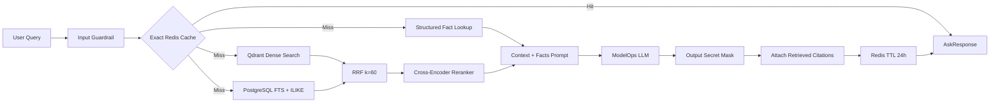
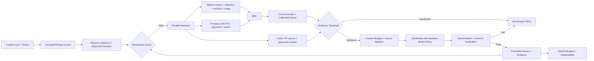

# NHẬN XÉT HỆ THỐNG RAG HIỆN TẠI CỦA QNU AI PLATFORM

> Ngày đánh giá: 18/09/2026
>
> Phạm vi: ingestion-to-retrieval integrity, Qdrant dense search, PostgreSQL FTS, RRF, reranker, Structured Fact Layer, ModelOps synthesis, semantic cache, citation/no-answer, evaluation và giao diện thử nghiệm
>
> Mốc mã nguồn: nhánh `main`, commit `cd667f0`
>
> Trạng thái worktree: đang có thay đổi RAG/ModelOps/Assistant chưa commit từ phiên khác; báo cáo đánh giá đúng snapshot worktree hiện tại nhưng không sửa các tệp mã nguồn đó

---

## 1. Kết luận điều hành

RAG hiện tại của QNU AI Platform có kiến trúc thành phần khá đầy đủ và đi đúng hướng Hybrid RAG:

- Dense retrieval bằng Qdrant và embedding BGE-M3 1024 chiều.
- Sparse retrieval bằng PostgreSQL Full-Text Search, có ILIKE fallback.
- Reciprocal Rank Fusion với `k=60`.
- Cross-Encoder reranking có graceful fallback.
- Structured Fact Layer cho dữ liệu bảng và số liệu.
- Answer Format Planner.
- ModelOps LLM synthesis.
- Citation và No-Answer Policy.
- Redis cache và Retrieval Sandbox trên giao diện.

So với lần đánh giá tổng thể trước, worktree hiện đã có hai cải tiến đáng ghi nhận:

1. `RagService` đã gọi ModelOps để tổng hợp câu trả lời thay vì chỉ trả raw chunk.
2. Sparse retrieval đã thử PostgreSQL `tsvector/ts_rank` trước khi fallback sang `ILIKE`.

Tuy nhiên, mức sẵn sàng production chưa tăng tương ứng vì lớp dữ liệu và hàng rào tin cậy còn có lỗi nghiêm trọng:

- Sparse retrieval đang lấy tài liệu `pending` chỉ vì `is_active=true`.
- Structured Fact Layer có 788 facts của Question Bank nhưng toàn bộ trỏ tới document ID không còn tồn tại.
- Collection Qdrant chuẩn `col_question_bank` rỗng, trong khi 16 points nằm ở collection legacy `col_col_question_bank`.
- Embedding lỗi có thể âm thầm chuyển sang vector mô phỏng ngay trong LiveMode.
- Không có score threshold; chỉ cần có một candidate là hệ thống có thể trả `answered`.
- Citation được gắn từ toàn bộ chunks đã retrieve, chưa chứng minh từng claim trong câu trả lời được hỗ trợ bởi nguồn nào.
- Cache không chứa tenant, assistant profile, model hoặc content revision và chưa được invalidate khi dữ liệu thay đổi.
- Evaluation TM-08 trong worktree đã bắt đầu gọi Assistant/RAG runtime thật, nhưng khi thiếu answer hoặc context lại fallback sang answer/context dựng trực tiếp từ ground truth; vì vậy quality gate vẫn có thể pass mà không phản ánh runtime.

Trạng thái phù hợp hiện nay:

> **Internal Beta / RAG Engineering Preview — pipeline có đủ lớp kỹ thuật để tiếp tục hoàn thiện, nhưng chưa đủ bảo đảm data integrity và groundedness để dùng làm nguồn trả lời chính thức.**

### Điểm đánh giá tổng hợp

| Nhóm đánh giá | Điểm / 10 | Nhận xét ngắn |
| :--- | :---: | :--- |
| Kiến trúc pipeline | 7.0 | Phân lớp rõ, đúng hướng Hybrid RAG |
| Dense retrieval/Qdrant | 5.0 | Có vector thật 1024 chiều; drift collection, thiếu revision/tenant và có mock embedding |
| Sparse PostgreSQL FTS | 6.0 | Đã có `ts_rank`; thiếu persisted tsvector/GIN, status/tenant filter chưa đúng |
| RRF fusion | 7.5 | Công thức chuẩn, code đơn giản và dễ kiểm thử |
| Cross-Encoder reranker | 6.0 | Có Cloudflare/custom fallback; score semantics và observability chưa rõ |
| Structured Fact Layer | 3.0 | Có extractor và Markdown table; dữ liệu live đang có 788 orphan facts |
| ModelOps answer synthesis | 6.0 | Đã gọi LLM thật; chưa truyền tenant, assistant, primary/fallback model |
| Citation và No-Answer | 4.5 | Có DTO và nhánh từ chối; chưa có claim-evidence verification hoặc score gate |
| Semantic cache | 3.5 | Thực chất là exact-query cache, key thiếu nhiều chiều và không được invalidate |
| Multi-tenancy và security | 3.0 | RAG API chưa dùng trusted tenant/workspace context |
| Data readiness | 2.5 | Chỉ Soạn thảo có index chuẩn; Question Bank lệch index, ba kho còn rỗng |
| Evaluation và observability | 3.5 | Đã thử gọi runtime và tổng hợp metric từ DB; vẫn fail-open sang ground-truth simulation |
| Frontend retrieval UX | 6.5 | Có sandbox/citation UI; score gây hiểu nhầm và Chat còn mock fallback |

**Điểm tổng thể đề xuất: 5.0/10.**

Nếu chấm riêng:

- **Thiết kế pipeline trong mã nguồn:** khoảng 6.5–7.0/10.
- **Độ tin cậy của dữ liệu live:** khoảng 2.5–3.0/10.
- **Khả năng dùng làm RAG production:** khoảng 4.0–4.5/10.

---

## 2. Phương pháp và giới hạn đánh giá

Báo cáo được lập dựa trên:

1. Đối chiếu chuẩn `qnu-rag-pipeline`, `qnu-knowledge-ingestion`, Backend architecture và Clean Code của dự án.
2. Rà soát toàn bộ module `backend/app/modules/rag/`.
3. Rà soát liên kết với Knowledge, ModelOps, Workflow, Assistant, Redis và Evaluation.
4. Kiểm tra read-only PostgreSQL để đếm collection, document, chunk, fact và trạng thái tài liệu.
5. Kiểm tra trực tiếp Qdrant collections, point payload và vector dimension.
6. Chạy test RAG hiện tại và kiểm tra Ruff trong phạm vi module RAG.
7. Rà soát Retrieval Sandbox và Chat/Citation Frontend.

### Giới hạn runtime

- Backend HTTP ở port `8001` không phản hồi tại thời điểm đánh giá.
- PostgreSQL, Redis và Qdrant vẫn truy cập được trực tiếp.
- Không gửi câu hỏi qua Chat/Assistant vì có thể tạo execution, gọi provider hoặc ghi cost log.
- Không sửa hoặc format các tệp RAG đang được phiên khác thay đổi.
- Kết quả PostgreSQL/Qdrant trong báo cáo là snapshot read-only tại khoảng 15:25–15:31 ngày 18/09/2026.

---

## 3. Kiến trúc RAG hiện tại

Luồng trên có đủ các lớp phổ biến của Hybrid RAG. Điểm cần lưu ý:

- Dense và sparse hiện chạy tuần tự, chưa song song như comment/kiến trúc mong muốn.
- Fact lookup cũng chạy trước retrieval, chưa được song song hóa.
- No-answer chỉ kích hoạt khi hoàn toàn không có candidate và không có fact.
- Citation được tạo từ candidate trước khi biết LLM thực sự dùng evidence nào.
- Cache hit trả ngay, không kiểm tra content revision hoặc assistant policy hiện tại.

---

## 4. Dữ liệu live quan sát được

### 4.1. PostgreSQL

| Collection | Active documents | Trạng thái | Chunks | Facts |
| :--- | ---: | :--- | ---: | ---: |
| `col_admissions` | 0 | Không có tài liệu | 0 | 0 |
| `col_drafting` | 1 | `processed` | 6 | 7 |
| `col_library` | 0 | Không có tài liệu | 0 | 0 |
| `col_question_bank` | 2 | Cả hai `pending` | 17 | 788 |
| `col_regulations` | 0 | Không có tài liệu | 0 | 0 |

Chi tiết chất lượng:

- `col_drafting`: 6/6 chunks có page và section.
- `col_question_bank`: 8/17 chunks thiếu page; 17/17 chunks thiếu section.
- `col_drafting`: 7 facts, confidence trung bình 1.0, trỏ đúng document còn tồn tại.
- `col_question_bank`: 788 facts, confidence trung bình 0.892.
- Toàn bộ 788 facts Question Bank trỏ tới sáu document ID không còn tồn tại.

Hai document hiện có trong `col_question_bank` đều không sở hữu facts nào, trong khi Fact Layer vẫn trả facts từ các document cũ đã biến mất.

### 4.2. Qdrant

| Qdrant collection | Points | Vector dimension | Nhận xét |
| :--- | ---: | ---: | :--- |
| `col_drafting` | 6 | 1024 | Khớp số chunks PostgreSQL; payload tương đối đầy đủ |
| `col_question_bank` | 0 | N/A | Collection chuẩn đang rỗng |
| `col_col_question_bank` | 16 | 1024 | Collection legacy; lệch 1 chunk và thiếu nhiều metadata |

Payload mẫu trong `col_col_question_bank` thiếu các trường như `collection_id`, `is_active`, `section`, `page_number` và title chuẩn. Runtime hiện tìm `col_question_bank`, nên 16 vectors legacy này không phục vụ dense retrieval chuẩn.

`indexed_vectors_count=0` trên các collection nhỏ không có nghĩa vector bị thiếu; kiểm tra point trực tiếp xác nhận vector có đủ 1024 chiều. Đây thường là trạng thái HNSW chưa cần build vì số points dưới ngưỡng tối ưu hóa.

### 4.3. Kiểm chứng đường retrieval

Truy vấn sparse read-only với câu `Công nghệ thông tin` trên `col_question_bank` trả về chunks từ cả hai document `pending`.

Fact lookup cùng chủ đề trả về facts từ các document ID không tồn tại, ví dụ:

- `doc_42f349932880`.
- `doc_c681961274de`.

Điều này chứng minh lỗi không chỉ nằm ở dữ liệu lưu trữ; dữ liệu pending/orphan thực sự đi qua retrieval hiện tại và có thể được gắn nhãn `BẢNG SỐ LIỆU ĐÃ XÁC THỰC` trong prompt.

---

## 5. Những phần RAG đang làm tốt

### 5.1. Tách module theo trách nhiệm tương đối rõ

RAG đã được chia thành:

- `vector_indexer.py` — Qdrant và embedding.
- `retriever.py` — dense/sparse orchestration.
- `fusion.py` — RRF.
- `reranker.py` — reranker adapter và fallback.
- `facts.py` — fact lookup.
- `composer.py` — output format và prompt assembly.
- `citation_guard.py` — citation/no-answer.
- `service.py` — pipeline orchestration.

Cấu trúc này phù hợp với Strategy/Adapter/Pipeline, dễ thay từng thành phần hơn một service nguyên khối.

### 5.2. RRF được cài đặt đúng và dễ kiểm chứng

`reciprocal_rank_fusion`:

- Dùng rank 1-indexed.
- Cộng điểm từ dense và sparse.
- Dùng `k=60`.
- Khử trùng theo `chunk_id`.
- Giữ lại dense/sparse rank để điều tra.

Đây là một trong những phần sạch và ổn định nhất của pipeline.

### 5.3. Reranker có graceful degradation

Hệ thống hỗ trợ:

- Cloudflare Workers AI reranker.
- Custom HTTP reranker.
- Fallback về thứ tự RRF khi dịch vụ lỗi hoặc chưa cấu hình.

Việc không làm cả câu trả lời thất bại chỉ vì reranker offline là quyết định resilience hợp lý.

### 5.4. Sparse retrieval đã tiến gần yêu cầu thiết kế

Worktree hiện đã dùng:

- `plainto_tsquery`.
- `to_tsvector`.
- `ts_rank_cd`.
- ILIKE fallback khi FTS không đủ kết quả.

Đây là cải tiến thật so với tìm kiếm `ILIKE` thuần túy.

### 5.5. ModelOps synthesis đã được nối

RAG hiện gửi system instruction, câu hỏi, facts và các đoạn trích tới ModelOps. Khi ModelOps lỗi, hệ thống fallback về việc hiển thị facts hoặc chunk gốc thay vì tạo thêm nội dung không có nguồn.

Hướng fallback này tương đối an toàn về mặt bịa đặt, dù cần gắn nhãn degraded mode rõ ràng.

### 5.6. Có Structured Fact Layer và provenance từ extractor

Fact extractor đã:

- Nhận diện mã ngành, tên ngành, chỉ tiêu, điểm chuẩn, tổ hợp, phương thức và học phí.
- Xử lý số theo định dạng Việt Nam.
- Lưu confidence.
- Lưu page/table/row trong `raw_data`.

Đây là nền tảng đúng để tránh LLM tự suy đoán con số.

### 5.7. Có No-Answer Policy và Retrieval Sandbox

- Khi không có context và facts, RAG trả hướng dẫn liên hệ phù hợp phân hệ.
- Trang chi tiết collection có playground gọi retrieval thật, hiển thị chunk, section và score.
- Backend không trả canned results cho endpoint test collection.

---

## 6. Các vấn đề nghiêm trọng cần xử lý

### 6.1. Retrieval chưa lọc theo trạng thái được phê duyệt

Sparse query chỉ kiểm tra:

- `KnowledgeChunk.collection_id`.
- `KnowledgeDocument.is_active = true`.

Nó không kiểm tra `KnowledgeDocument.status`. Vì vậy `pending` và `processed` vẫn được truy xuất.

Đây là lỗi P0 đối với quy trình có Human-in-the-loop: dữ liệu chưa được cán bộ duyệt có thể trở thành căn cứ trả lời chính thức.

### 6.2. Fact Layer đang phục vụ orphan facts

`KnowledgeFact.document_id` không có foreign key đến `knowledge_documents`. Fact lookup chỉ lọc `collection_id` và từ khóa, không join document.

Hệ quả live:

- 788 facts Question Bank vẫn tồn tại sau khi document nguồn đã biến mất.
- Facts không bị chặn bởi `pending`, `archived` hoặc `is_active=false`.
- LLM nhận chúng dưới tiêu đề “Bảng số liệu đã xác thực”.
- Citation trả về chỉ dựa trên chunks, không trích dẫn nguồn fact tương ứng.

Đây là rủi ro P0 về tính đúng đắn dữ liệu.

### 6.3. PostgreSQL và Qdrant đang lệch nhau

Question Bank có:

- 17 chunks trong PostgreSQL.
- 0 points ở `col_question_bank`.
- 16 points ở `col_col_question_bank`.

Điều này khiến dense retrieval không hoạt động theo collection chuẩn và kết quả phụ thuộc gần như hoàn toàn vào sparse search/facts.

### 6.4. Mock embedding có thể chạy trong LiveMode

Khi Cloudflare và local SentenceTransformer đều không dùng được, `embed_texts` trả deterministic mock vectors. Query embedding cũng dùng cùng cơ chế fallback.

Mock vector không biểu diễn ngữ nghĩa. Nó có thể:

- Đưa các chunk không liên quan lên đầu.
- Tạo cảm giác Qdrant vẫn hoạt động bình thường.
- Làm kết quả kiểm thử/demo khó phân biệt với retrieval thật.
- Gây index hỗn hợp giữa vector thật và vector giả.

LiveMode phải fail rõ hoặc chuyển sang sparse-only có nhãn degraded; không được coi mock vector là dense retrieval hợp lệ.

### 6.5. Không có tenant/workspace enforcement xuyên suốt

RAG request không có trusted tenant context. Dense payload hiện không bắt buộc `tenant_id/workspace_id`, Fact Layer và sparse query cũng không lọc tenant.

Dù collection ID hiện mang tính toàn cục, đây chưa phải hàng rào multi-tenancy đủ mạnh. Người dùng không được phép quyết định collection/tenant chỉ bằng payload.

### 6.6. Không có relevance threshold

RAG chỉ từ chối khi cả candidates và facts đều rỗng. Một candidate rất yếu vẫn dẫn đến:

- `status="answered"`.
- Citation được trả.
- LLM được yêu cầu tổng hợp câu trả lời.

RRF score không phải xác suất relevance. Cần threshold được hiệu chỉnh theo reranker score hoặc classifier groundedness, không thể dùng việc “có kết quả” như bằng chứng đủ căn cứ.

### 6.7. Citation chưa chứng minh claim-evidence

Citation hiện được tạo bằng cách lấy tối đa 200 ký tự đầu của mỗi candidate. Nó chưa kiểm tra:

- LLM đã dùng chunk nào.
- Claim nào dựa trên citation nào.
- Con số trả lời có khớp fact không.
- Quote có chứa nội dung hỗ trợ claim không.
- Source document còn active/approved và đúng revision không.

Title citation còn lấy `section` hoặc `Tài liệu <id>`, chưa ưu tiên metadata title/document name.

### 6.8. Output guardrail không phải groundedness guard

`OutputGuardrail` chỉ mask mẫu API key và PostgreSQL URL. Nó không kiểm tra:

- Hallucination.
- Citation entailment.
- Numeric consistency.
- No-answer compliance.
- PII trong output.

Do đó tên gọi guardrail dễ tạo cảm giác an toàn cao hơn năng lực thật.

---

## 7. Các vấn đề kiến trúc và chất lượng cần cải thiện

### 7.1. “Semantic cache” hiện là exact-query cache

Cache key là hash của `query.strip().lower()` và `collection_id`. Nó chưa thực hiện semantic similarity.

Key còn thiếu:

- Tenant/workspace.
- Content/index revision.
- Assistant/system prompt.
- Model và temperature.
- Retrieval/top-k/reranker policy.
- Guardrail/output policy.

Hai trợ lý cùng hỏi một câu trên cùng collection có thể nhận lại answer đã cache theo prompt/model của trợ lý khác.

### 7.2. Cache chưa được invalidate

`invalidate_collection` đã tồn tại nhưng không có nơi nào gọi nó. Vì TTL là 24 giờ, câu trả lời cũ có thể tồn tại sau:

- Approve hoặc reindex tài liệu.
- Sửa nội dung đối soát.
- Archive/delete document.
- Thay model/prompt/policy.

Ngoài ra invalidation dùng Redis `KEYS`, không phù hợp khi keyspace lớn; nên dùng versioned namespace hoặc `SCAN`.

### 7.3. Assistant policy chưa được bind đầy đủ

RAG workflow truyền system prompt, temperature và max tokens, nhưng `RagService` chưa nhận:

- Tenant ID.
- Assistant code.
- Primary/fallback model.
- Retrieval limit.
- Structured facts requirement.
- Minimum relevance threshold.

ModelOps request vì vậy dùng tenant mặc định `qnu-default` và global provider cascade thay vì đúng policy của Assistant.

### 7.4. System model defaults chưa phải dependency ổn định

Embedding/reranker runtime đọc biến `settings` toàn cục. API ModelOps cập nhật settings trong bộ nhớ của process đang nhận request, nhưng:

- Restart process có thể trở lại giá trị config mặc định nếu startup không hydrate từ DB.
- Nhiều worker có thể không đồng bộ cùng lúc.
- RAG không dùng provider registry/credential resolution nhất quán với ModelOps.
- Đổi embedding model không tự động kích hoạt reindex theo model version.

### 7.5. Dense và sparse chưa chạy song song

`retrieve` gọi dense xong mới gọi sparse. Với Cloudflare embedding/reranker, latency tổng sẽ cộng dồn.

Nên dùng task group/`asyncio.gather` với timeout riêng, sau đó fusion các nhánh thành công.

### 7.6. PostgreSQL FTS chưa có index chuyên dụng

`to_tsvector("simple", content)` được tính tại query time. Chưa thấy generated column hoặc GIN index tương ứng.

Khi số chunks tăng, truy vấn có nguy cơ full scan. Cần:

- Persisted `tsvector` column.
- GIN index.
- Unicode NFC/unaccent strategy.
- Query normalization tiếng Việt.
- Đánh giá `simple` config so với custom Vietnamese tokenization.

### 7.7. Request contract có trường chưa được dùng

`SearchRequest.filters` và `module_code` hiện không chi phối retrieval. Điều này làm API contract gây hiểu nhầm và cản trở filter theo document type, year, status hoặc metadata.

`AskRequest` lại không có top-k/rerank-top-k nên service gán cứng 8/5, bỏ qua `retrieval_limit` của Assistant.

### 7.8. Score trả về không có ngữ nghĩa thống nhất

Trước rerank, `rrf_score` thường khoảng 0.016–0.033. Sau rerank, cùng field có thể bị ghi đè bằng cross-encoder score.

Frontend hiển thị tất cả dưới nhãn “Điểm phù hợp”, khiến người dùng khó hiểu hoặc so sánh. Cần tách:

- `dense_score`.
- `sparse_rank`.
- `rrf_score`.
- `reranker_score`.
- `final_relevance_score` đã hiệu chỉnh.

### 7.9. Context assembly chưa có token budget

Service ghép toàn bộ nội dung năm candidates và facts vào prompt, chưa có:

- Token budget theo model context window.
- Dedup đoạn gần giống.
- Parent/neighbor expansion có kiểm soát.
- Truncation theo evidence priority.
- Source markers gắn ID citation rõ ràng.

### 7.10. Chưa phòng chống prompt injection từ tài liệu

Input guardrail chỉ kiểm tra câu hỏi người dùng. Nội dung được retrieve có thể chứa câu lệnh độc hại hoặc text điều khiển LLM.

RAG cần coi document context là dữ liệu không đáng tin, phân cách bằng delimiters và áp instruction hierarchy rõ ràng; tài liệu không được phép thay đổi system policy.

### 7.11. Clean Code còn điểm cần dọn

Trong `RagService.ask`:

- Prompt được assemble vào `full_prompt` nhưng không dùng để gọi ModelOps.
- `context_texts` được tính hai lần.
- Comment “Mock/LLM generation” đã lỗi thời.
- Pipeline orchestration đang dài và nên tách thành các stage nhỏ.

`FusionCandidate.metadata` khai báo `dict` nhưng mặc định `None`; nên dùng `field(default_factory=dict)`.

---

## 8. Đánh giá test hiện tại

### Kết quả chạy

- `pytest tests/test_rag.py -v`: **10/10 passed**, 3 warnings.
- `ruff check app/modules/rag tests/test_rag.py`: **1 lỗi import order** trong test mới `test_api_rag_ask_with_modelops_synthesis`.

Lỗi Ruff thuộc tệp đang được phiên khác chỉnh sửa nên báo cáo không tự động sửa.

### Phần đã được test

- RRF fusion.
- Reranker fallback.
- Fact Markdown formatting.
- Answer format planner.
- Mock embedding và dimension fit.
- No-answer message.
- API no-context.
- ModelOps synthesis qua mock.

### Phần còn thiếu

- PostgreSQL FTS thật với GIN và tiếng Việt.
- Dense search thật trên Qdrant.
- Dense/sparse/re-rank end-to-end với cùng corpus.
- Chặn document pending/archived.
- Chặn orphan facts.
- Tenant isolation.
- Cache invalidation/revision.
- Low-score no-answer.
- Citation entailment và numeric consistency.
- Embedding provider down mà không dùng mock trong LiveMode.
- Drift/reconciliation PostgreSQL–Qdrant.
- Evaluation trên Assistant/RAG runtime thật.
- Evaluation không được fallback sang ground truth khi runtime lỗi hoặc thiếu context; trường hợp đó phải fail/no-answer rõ ràng.

Các test hiện tại chứng minh module có thể ghép nối về mặt kỹ thuật, chưa chứng minh chất lượng retrieval hoặc độ trung thực nghiệp vụ.

---

## 9. Rủi ro theo mức ưu tiên

### P0 — Xử lý trước khi dùng cho dữ liệu chính thức

1. Sparse retrieval lấy tài liệu `pending/processed`, không chỉ dữ liệu đã duyệt và index thành công.
2. Fact Layer trả 788 orphan facts và không kiểm tra document status/revision.
3. Question Bank lệch Qdrant collection: canonical rỗng, legacy có 16/17 chunks.
4. Mock embedding có thể chạy trong LiveMode và tạo index/truy vấn giả ngữ nghĩa.
5. Thiếu trusted tenant/workspace filter trên DB, Qdrant, facts và cache.
6. Frontend Chat vẫn có thể thay lỗi Backend bằng answer/citation nghiệp vụ mẫu.

### P1 — Hoàn thiện groundedness và runtime contract

1. Thêm relevance threshold và No-Answer cho context yếu.
2. Claim-citation entailment và numeric fact consistency.
3. Bind Assistant retrieval/model/fact policy xuống RAG/ModelOps.
4. Cache key theo tenant, revision, assistant, model và policy; invalidate khi dữ liệu đổi.
5. Đưa source evidence của Fact Layer vào citation.
6. Persisted tsvector + GIN index và query normalization tiếng Việt.
7. Dense/sparse chạy song song, timeout và degraded-state rõ ràng.
8. Implement `filters` hoặc loại trường khỏi contract.

### P2 — Tối ưu chất lượng và khả năng vận hành

1. Tách score theo từng stage và hiển thị rõ trên Retrieval Sandbox.
2. Context token budgeting, dedup và source markers.
3. Query rewriting/multi-query cho câu hỏi dài hoặc có nhiều ý.
4. Hybrid weight tuning theo từng collection/domain.
5. Dashboard Recall@K, MRR, NDCG, cache hit, reranker fallback và no-answer rate.
6. Refactor `RagService.ask` thành pipeline stages nhỏ.

---

## 10. Kiến trúc mục tiêu đề xuất

### Invariant bắt buộc

1. Chỉ document revision ở trạng thái `ready` mới được retrieval.
2. Mọi fact phải có document FK, source evidence và content revision hợp lệ.
3. PostgreSQL chunks/facts và Qdrant points phải cùng collection, revision và tenant.
4. LiveMode không được tạo hoặc truy vấn mock embedding.
5. Không có evidence vượt threshold thì phải No-Answer.
6. Mỗi claim/con số quan trọng phải truy vết được tới fact hoặc quote cụ thể.
7. Cache không được vượt qua tenant/revision/policy boundary.

---

## 11. Lộ trình hoàn thiện đề xuất

### Đợt 0 — RAG Data Safety Hotfix

1. Sparse retrieval join document và collection, chỉ lấy `status=ready/approved`, `is_active=true` và đúng tenant/workspace.
2. Fact lookup join document, chặn pending/archived và thêm FK/cascade cho `document_id`.
3. Xóa/rebuild 788 orphan facts từ tài liệu đang tồn tại và đã duyệt.
4. Reconcile 17 chunks Question Bank sang collection chuẩn; xóa legacy sau kiểm chứng.
5. Tắt mock embedding trong LiveMode; khi embedding lỗi chuyển sparse-only với trạng thái degraded.
6. Tắt business mock fallback trong Chat LiveMode.

### Đợt 1 — Index và cache integrity

1. Thêm `content_revision`, `indexed_revision`, `embedding_model_version` và `retrieval_state`.
2. Chuyển approve/index sang state machine `review_pending → indexing → ready/index_failed`.
3. Chỉ commit trạng thái ready sau khi Qdrant upsert và parity check thành công.
4. Archive/delete/edit phải dọn hoặc supersede vector/fact theo revision.
5. Cache key chứa tenant/collection/revision/assistant/model/policy; invalidation bằng version, không dùng Redis `KEYS`.

### Đợt 2 — Retrieval quality

1. Persisted `tsvector` và GIN index.
2. Chuẩn hóa query NFC, dấu câu, alias ngành/mã ngành và từ dừng.
3. Chạy dense/sparse/facts song song có timeout.
4. Tách stage scores và calibrate relevance threshold theo golden dataset.
5. Implement metadata filters: year, document type, status, source, effective date.
6. Theo dõi degraded mode: dense down, sparse down, reranker fallback.

### Đợt 3 — Grounded generation

1. Truyền tenant, assistant code, primary/fallback model và quota context vào ModelOps.
2. Context budget theo context window và max output tokens.
3. Gắn source marker ổn định cho từng chunk/fact trong prompt.
4. Trích dẫn fact theo document/page/table/row.
5. Kiểm tra entailment theo claim và đối chiếu số với Fact Layer.
6. Phòng document prompt injection và context poisoning.

### Đợt 4 — Evaluation và vận hành

1. Chạy golden questions qua Assistant → Workflow → RAG → ModelOps thật.
2. Lưu query, retrieved IDs/scores, reranker result, answer, citations, model và cost.
3. Đo Recall@5, MRR, NDCG, Faithfulness, Answer Relevance và Context Precision.
4. Quality gate fail-closed cho production publish.
5. Dashboard drift, orphan facts, vector parity, cache freshness và no-answer rate.

---

## 12. Production acceptance gate đề xuất

### Data integrity

- 0 document pending/archived xuất hiện trong retrieval.
- 0 orphan fact.
- 100% facts có source evidence và content revision.
- 100% document ready có chunk/vector parity đúng revision.
- 0 legacy collection không có mapping/owner.

### Retrieval quality

- Recall@5 ≥ 90% trên golden set từng collection.
- MRR@5 và NDCG@5 có baseline, threshold và regression gate.
- Low-relevance query kích hoạt No-Answer đúng.
- Dense/sparse/reranker score được log và phân biệt rõ.

### Answer quality

- Faithfulness ≥ 0.90.
- Answer Relevance ≥ 0.85.
- Context Precision ≥ 0.80.
- 100% câu trả lời số liệu dùng Structured Fact có nguồn hợp lệ.
- 100% citation trỏ đúng document, section/page và quote hỗ trợ claim.

### Security

- Tenant/workspace lấy từ auth context và enforce ở DB, Qdrant, facts, cache.
- Retrieved document context được coi là untrusted data.
- Không có mock answer/vector/fact trong LiveMode.
- Cache không rò dữ liệu giữa assistant/tenant/revision.

### Reliability

- Dense, sparse, reranker và ModelOps có timeout/degraded behavior rõ.
- Index/reindex idempotent, không sinh point trùng.
- Cache được invalidate khi content/index/policy thay đổi.
- Reconciliation job phát hiện và sửa drift PostgreSQL–Qdrant.

---

## 13. Gói công việc ưu tiên đề xuất

Nếu chỉ chọn một gói triển khai tiếp theo, nên chọn:

> **RAG Data Integrity & Groundedness**

Phạm vi tối thiểu:

1. Retrieval chỉ lấy tài liệu approved/ready đúng tenant và revision.
2. Xóa/rebuild orphan facts, bổ sung FK và provenance.
3. Reconcile Question Bank Qdrant collection.
4. Cấm mock embedding/answer trong LiveMode.
5. Thêm relevance threshold và fact/citation verification.
6. Version hóa cache theo content revision.

Gói này cần hoàn thành trước khi tối ưu thêm prompt, model hoặc giao diện, vì một LLM tốt hơn không thể sửa được nguồn dữ liệu pending, stale hoặc orphan.

---

## 14. Kết luận cuối

RAG của QNU AI Platform đã có bộ khung kỹ thuật tốt và không cần viết lại từ đầu. RRF, reranker fallback, Structured Fact Layer, ModelOps synthesis và Retrieval Sandbox là những nền tảng đáng giữ lại.

Điểm nghẽn hiện tại không còn là thiếu thành phần RAG. Điểm nghẽn là hệ thống chưa bảo đảm rằng evidence được retrieve là:

- Đã được phê duyệt.
- Còn tồn tại.
- Đúng collection chuẩn.
- Đúng tenant và revision.
- Được embedding bằng model thật.
- Đủ liên quan để trả lời.
- Thực sự hỗ trợ từng claim/citation.

Nguyên tắc chốt cho giai đoạn tiếp theo:

> **RAG không đáng tin chỉ vì có vector, RRF và citation. RAG chỉ đáng tin khi mọi evidence đều có vòng đời hợp lệ, provenance rõ ràng và được kiểm chứng tới từng claim trước khi trả lời.**
