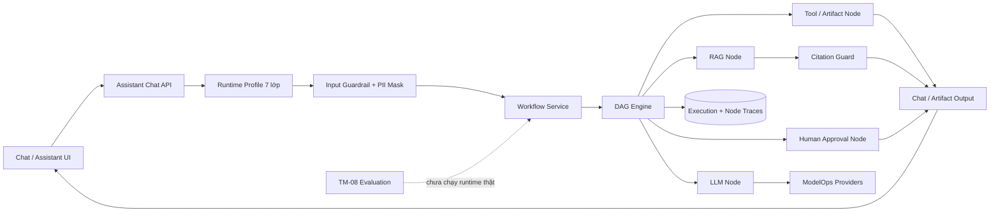
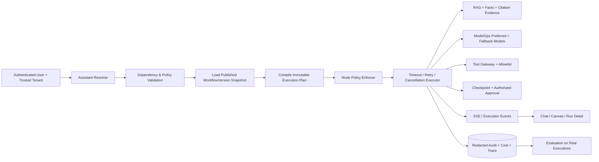

# NHẬN XÉT CHỨC NĂNG TRỢ LÝ AI VÀ QUY TRÌNH WORKFLOW QNU AI PLATFORM

> Ngày đánh giá: 18/09/2026
>
> Phạm vi: Assistant Lifecycle, Chat Runtime, Workflow Control Plane, DAG Compiler/Engine, Human Approval, Guardrails, Tools, ModelOps, RAG, Citation, Evaluation TM-08 và giao diện quản trị
>
> Mốc mã nguồn: nhánh `main`, commit `cd667f0`
>
> Trạng thái worktree: có thay đổi ModelOps/Provider từ một phiên khác đang chạy song song; báo cáo này không sửa mã nguồn, cấu hình runtime hoặc dữ liệu nghiệp vụ

---

## 1. Kết luận điều hành

QNU AI Platform đã xây dựng được một khung Trợ lý AI và Workflow có định hướng kiến trúc tốt hơn nhiều so với một chatbot RAG thông thường. Hệ thống đã có:

- Cấu hình trợ lý theo vòng đời 7 lớp.
- Năm trợ lý và năm workflow chuyên trách.
- DAG dạng dữ liệu, có node catalog, compiler, draft, publish, version, rollback và execution audit.
- Runtime profile của trợ lý được chụp lại cùng lần chạy.
- Checkpoint và mô hình phê duyệt thủ công.
- Giao diện quản trị master-detail, Canvas Studio, lịch sử phiên bản và chạy thử.

Điểm mạnh hiện nay nằm ở **mô hình quản trị và control plane**. Điểm yếu nằm ở **khả năng thực thi đúng cam kết cấu hình**. Nhiều thuộc tính quan trọng đã có trong schema hoặc giao diện nhưng chưa thật sự được engine thi hành, gồm model chính/dự phòng, giới hạn truy xuất, tool allowlist, timeout, retry, permission, edge condition, checkpoint policy và evaluation gate trên runtime thật.

Đáng chú ý hơn, một số đường chạy hiện tại có thể làm hệ thống trông hoàn chỉnh hơn thực tế:

- Chat tự truyền `is_approved = true`, làm mất ý nghĩa Human-in-the-loop.
- Frontend có thể hiển thị câu trả lời, citation và tệp xuất giả khi Backend lỗi.
- TM-08 đang đánh giá bằng câu trả lời/ngữ cảnh mô phỏng và trả thêm số liệu tổng hợp gán cứng.
- Workflow ghi nhận `workflow_version_id` nhưng thực thi và resume từ DAG hiện hành, không khóa tuyệt đối vào snapshot phiên bản đó.

Trạng thái phù hợp hiện nay:

> **Internal Beta / Workflow Control Plane Preview — đủ tốt để cấu hình, trình diễn và thử nghiệm nội bộ; chưa đủ an toàn để tự động hóa nghiệp vụ thật hoặc phát hành câu trả lời chính thức ở quy mô production.**

### Điểm đánh giá tổng hợp

| Nhóm đánh giá | Điểm / 10 | Nhận xét ngắn |
| :--- | :---: | :--- |
| Mô hình cấu hình Trợ lý 7 lớp | 7.5 | Schema khá đầy đủ, có runtime profile; nhiều policy chưa được runtime dùng |
| UI/UX quản trị Trợ lý | 8.0 | List/create/detail tốt, deep route rõ; còn KPI giả và thiếu một số trường nâng cao |
| Workflow Control Plane | 7.5 | Draft/version/hash/rollback/checkpoint là nền móng tốt |
| DAG Compiler | 6.5 | Bắt được cycle, unreachable, node type và citation guard; thiếu schema/port/policy validation |
| DAG Runtime Engine | 4.0 | Có branch/fan-out/fan-in/pause; thiếu timeout, retry, cancellation, permission và exact-version execution |
| Assistant → Workflow binding | 4.0 | Có truyền profile, collection, prompt và vài tham số; chưa bind toàn bộ model/tool/knowledge policy |
| Guardrail và chống bịa đặt | 4.5 | Có input filter, PII masking, citation/no-answer; kiểm chứng căn cứ còn nông |
| Human-in-the-loop và Tools | 3.5 | Có mô hình checkpoint nhưng chat đang tự duyệt; tool allowlist chưa được enforce |
| Evaluation/TM-08 | 2.5 | Có model và giao diện, nhưng phép đo hiện chưa chạy qua runtime thật |
| Multi-tenancy, RBAC và audit identity | 3.5 | Có trường tenant/correlation/audit; tenant và người duyệt còn lấy từ payload |
| Streaming và trải nghiệm chat | 5.0 | UI streaming tốt về cảm giác; Backend vẫn trả JSON và Frontend mô phỏng token |
| Kiểm thử và quan sát | 5.5 | Test tốt cho cấu trúc DAG cơ bản; thiếu kiểm thử các invariant production quan trọng |

**Điểm tổng thể đề xuất: 5.2/10.**

Nếu chấm riêng:

- **Thiết kế quản trị và UI:** 7.5–8.0/10.
- **Control plane workflow:** 7.0–7.5/10.
- **Runtime thực thi nghiệp vụ production:** 3.5–4.5/10.

---

## 2. Phương pháp và giới hạn đánh giá

Báo cáo được lập dựa trên:

1. Đối chiếu quy trình 7 bước trong `qnu-chatbot-builder`.
2. Rà soát module `assistants`, `workflows`, `rag`, `modelops`, `evaluation` và các node handler Backend.
3. Rà soát năm workflow JSON trong `configs/workflows/`.
4. Rà soát màn hình quản trị Trợ lý, DAG Canvas, Workflow list và hook Chat Frontend.
5. Đối chiếu test Backend cho Assistant/Workflow và test E2E Chat/DAG.
6. Sử dụng số liệu runtime đã ghi nhận ở phiên đánh giá tổng thể #85.

### Giới hạn quan sát runtime

- Trong phiên #85, hệ thống đã ghi nhận 5 trợ lý, 5 workflow và 25 lần chạy workflow.
- Tại thời điểm lập báo cáo này, Backend cổng `8001` không phản hồi nên không tạo thêm lần chạy chat hay thay đổi dữ liệu.
- Không gửi câu hỏi tới trợ lý vì hành động đó tạo execution record, có thể gọi LLM/tool và không cần thiết cho một phiên đánh giá read-only.
- Các thay đổi ModelOps chưa commit từ phiên song song được giữ nguyên. Báo cáo đánh giá trạng thái worktree hiện tại nhưng không can thiệp các tệp đó.

---

## 3. Luồng kiến trúc hiện tại

Kiến trúc thành phần hợp lý. Vấn đề chính là các mũi tên chưa mang đầy đủ policy đã cấu hình và một số thành phần an toàn đang bị bypass hoặc mô phỏng.

---

## 4. Đánh giá theo quy trình 7 bước của Trợ lý AI

| Bước | Đã có | Runtime thực tế | Mức hoàn thiện |
| :--- | :--- | :--- | :---: |
| 1. Persona & Scope | `system_prompt`, phạm vi, chủ đề cho phép, thông điệp ngoài phạm vi | System prompt được truyền; phạm vi/chủ đề chưa được kiểm tra ngữ nghĩa đầy đủ | 65% |
| 2. Knowledge & RAG | `collection_id`, chunker, structured facts, retrieval limit | Collection và prompt được truyền; chunker/facts/retrieval limit chưa bind đầy đủ | 50% |
| 3. ModelOps & Fallback | Primary/fallback model, temperature, max tokens | Temperature/max tokens được dùng; primary/fallback model chưa được node LLM truyền xuống | 45% |
| 4. Guardrails | Prompt injection, PII mask, grounded answer, no-answer | Input filter còn theo cụm từ; output guard chủ yếu kiểm tra status/citation có tồn tại | 45% |
| 5. Tools & Approval | Tool allowlist, human approval | Allowlist chưa enforce; Assistant Chat tự đánh dấu đã duyệt | 25% |
| 6. Output & Citation | Format, citation, suggestion, artifact | No-answer/citation có đường chạy; format policy và citation mapping chưa nhất quán | 50% |
| 7. Evaluation & Observability | TM-08 thresholds, execution trace, latency | Audit nền tảng tốt; evaluation dùng dữ liệu mô phỏng, metric tổng hợp gán cứng | 35% |

Kết luận quan trọng:

> Trợ lý hiện được **cấu hình đủ 7 lớp**, nhưng mới **thực thi đáng tin cậy khoảng 3–4 lớp**. Đây là khoảng cách giữa “configuration completeness” và “runtime enforcement”.

---

## 5. Những phần Trợ lý AI đang làm tốt

### 5.1. Schema cấu hình có hướng enterprise

`AssistantLifecycleConfig` đã tách rõ:

- Persona và phạm vi.
- Knowledge policy.
- Model policy.
- Guardrails.
- Tools và approval.
- Output policy.
- Evaluation policy.

Cách tổ chức này đúng hướng vì cấu hình không bị dồn vào một system prompt lớn. Nó tạo nền tảng để version hóa, kiểm toán và áp policy theo từng lớp.

### 5.2. Có runtime snapshot cho khả năng tái hiện

Mỗi lần chạy workflow có thể lưu:

- Assistant ID và revision.
- Workflow version ID.
- Runtime profile.
- Inputs, outputs, latency và correlation ID.
- Trace theo từng node.

Đây là nền móng rất tốt cho audit, điều tra lỗi và evaluation hồi cứu. Khi sửa exact-version execution, hệ thống có thể tái hiện chính xác một lần chạy.

### 5.3. Seed và bundle phục vụ triển khai nhiều môi trường

Năm trợ lý mặc định được seed idempotent và có khả năng export/import bundle kèm workflow. Điều này phù hợp với nhu cầu chuyển cấu hình giữa development, staging và production.

### 5.4. Input guardrail đã có các bước tối thiểu cần thiết

Runtime đã:

- Chuẩn hóa Unicode NFC.
- Chặn một số mẫu prompt injection phổ biến.
- Che email, số điện thoại và chuỗi số có hình dạng giấy tờ định danh.

Đây là baseline tốt, dù chưa đủ thay cho một lớp guardrail chuyên sâu.

### 5.5. Giao diện quản trị có chiều sâu

Frontend đã có:

- Danh sách, tạo mới và trang chi tiết độc lập.
- Chọn collection và workflow thực.
- Cấu hình model, temperature, max tokens và guardrails.
- Câu hỏi gợi ý, trạng thái active/inactive và bundle export.
- Liên kết sang workflow và hiển thị thông tin TM-08.

Thiết kế master-detail phù hợp với quy mô vận hành lâu dài.

---

## 6. Những phần Trợ lý AI cần hoàn thiện

### 6.1. Model chính/dự phòng chưa thật sự điều khiển lần gọi LLM

Assistant lưu `primary_model` và `fallback_model`. Worktree ModelOps hiện đã có khả năng ưu tiên provider/model trong request, nhưng `LLMGenerateNodeHandler` chỉ truyền:

- `tenant_id`.
- `assistant_code`.
- `temperature`.
- `max_tokens`.

Node chưa truyền model chính, model dự phòng hoặc provider ưu tiên. Kết quả là người quản trị có thể chọn model trên UI nhưng runtime vẫn đi theo cascade toàn cục của ModelOps.

### 6.2. Knowledge policy mới bind một phần

RAG node đã dùng `collection_id`, `system_prompt`, `temperature` và `max_tokens`. Tuy nhiên các cấu hình sau chưa chi phối retrieval:

- `retrieval_limit`.
- `chunker`.
- `structured_facts_required`.
- Quy tắc ưu tiên fact cho số liệu.
- Ngưỡng score/no-answer riêng theo trợ lý.

Với câu hỏi học phí, điểm chuẩn hoặc chỉ tiêu, việc không enforce Structured Fact Layer có thể dẫn đến suy diễn từ văn bản thay vì lấy con số đã được xác minh.

### 6.3. Tool allowlist chưa phải hàng rào thực thi

`enabled_tools` được lưu trong profile nhưng node export/tool không kiểm tra:

- Tool có nằm trong allowlist của trợ lý hay không.
- Người dùng hiện tại có quyền gọi tool hay không.
- Tool có cần approval hay không.
- Connection được dùng có thuộc tenant/workspace hay không.

Đây là khoảng trống an toàn quan trọng khi hệ thống bổ sung tool có tác dụng ghi dữ liệu hoặc phát hành văn bản.

### 6.4. Human approval đang bị bypass từ Chat API

Assistant Chat luôn tạo workflow input với:

- `is_approved = true`.
- `format = "docx,pdf"`.

Do đó workflow Soạn thảo và Ngân hàng câu hỏi có node phê duyệt nhưng khi gọi qua Trợ lý, node đó nhận trạng thái đã duyệt ngay từ đầu. Human-in-the-loop chỉ hoạt động khi gọi workflow theo đường khác với `is_approved = false`.

Đây là rủi ro P0 vì giao diện và sơ đồ thể hiện có phê duyệt, trong khi đường chạy chính lại tự động vượt qua bước này.

### 6.5. Guardrail đầu ra và citation còn nông

Citation guard hiện chủ yếu kiểm tra:

- RAG status có thuộc nhóm chấp nhận.
- Answer có nội dung.
- Danh sách citation có rỗng hay không.

Nó chưa xác minh:

- Citation có thuộc đúng collection/tenant/revision hay không.
- Trích đoạn có tồn tại trong nguồn gốc hay không.
- Mỗi claim quan trọng có evidence tương ứng hay không.
- Con số trong câu trả lời có khớp Structured Fact hay không.
- System prompt/API key có bị lộ trong output hay không.

### 6.6. Streaming hiện là hiệu ứng Frontend

Frontend gửi `stream: true` và có bộ phân tích SSE, nhưng Assistant endpoint khai báo response JSON và service bỏ qua trường `stream`. Khi nhận JSON hoàn chỉnh, Frontend chia chuỗi ra để hiển thị dần bằng `streamSimulatedText`.

Hệ quả:

- Người dùng thấy hiệu ứng streaming nhưng server đã hoàn thành toàn bộ câu trả lời.
- Nút dừng chỉ dừng hiệu ứng phía client, không hủy generation phía server.
- Không đo được time-to-first-token thật.

### 6.7. Frontend LiveMode có fallback dữ liệu nghiệp vụ giả

Khi Backend lỗi, `use-rag-stream.ts` có thể trả:

- Câu trả lời tuyển sinh/quy chế/thư viện mẫu.
- Citation mẫu.
- DOCX/PDF artifact mẫu cho trợ lý soạn thảo.

Hành vi này vi phạm nguyên tắc No-Answer và có thể khiến người dùng hiểu dữ liệu mẫu là kết quả thật. LiveMode phải hiển thị ErrorState hoặc trạng thái offline; DemoMode phải là lựa chọn riêng, có nhãn rõ ràng.

### 6.8. KPI và số lượng trên UI có giá trị dự phòng giả

Trang chi tiết Trợ lý có các giá trị như 128 lượt chạy hoặc 3 tài liệu khi dữ liệu thật bằng 0/không có. Trang Workflow cũng có số node/cạnh mặc định 5/4. Đây là lỗi integrity ở lớp trình bày: số 0 hợp lệ không được thay bằng số đẹp để lấp chỗ trống.

---

## 7. Những phần Workflow đang làm tốt

### 7.1. Control plane có cấu trúc đúng

Workflow đã tách:

- `WorkflowDefinition`: định nghĩa đang dùng.
- `WorkflowDraft`: bản nháp và optimistic revision.
- `WorkflowVersion`: snapshot bất biến, hash và validation report.
- `WorkflowExecution`: lịch sử chạy.
- `WorkflowNodeExecution`: trace từng node.
- `WorkflowCheckpoint`: trạng thái có thể resume.
- `WorkflowApprovalRequest`: quyết định phê duyệt.

Đây là mô hình dữ liệu có khả năng phát triển thành workflow platform thực thụ.

### 7.2. Draft, publish và rollback đã đi đúng hướng

- Save draft có kiểm tra revision để tránh ghi đè xung đột.
- Publish tạo version mới thay vì sửa version cũ.
- Rollback cũng tạo version bất biến mới.
- Definition giữ `published_version_id`.

Các quyết định này tốt hơn cách lưu một JSON duy nhất và sửa trực tiếp.

### 7.3. Compiler có các kiểm tra cấu trúc quan trọng

Compiler hiện phát hiện được:

- Node ID trùng.
- Entry node không hợp lệ.
- Node type chưa hỗ trợ.
- Edge tham chiếu sai hoặc trùng.
- Node không thể đi tới.
- Chu trình.
- Thiếu terminal node.
- RAG workflow thiếu citation guard/no-answer.
- Vượt giới hạn bước.

Đây là baseline đáng tin cậy cho một DAG Studio.

### 7.4. Engine đã có branch, fan-out, fan-in và pause

Engine không chỉ chạy chuỗi tuyến tính. Nó đã có:

- Nhánh theo output port.
- Kích hoạt nhiều đường đi.
- Chờ các predecessor đang active trước khi join.
- Dừng tại node approval.
- Resume từ checkpoint.
- Ghi trace theo node.

Test Backend cũng đã phủ các hành vi cấu trúc này.

### 7.5. Giao diện Workflow là phần trình bày mạnh

Canvas Studio hỗ trợ:

- Chọn workflow và chỉnh node.
- Catalog drawer và property inspector.
- Dirty state, save draft, validate và publish.
- Version history và rollback.
- Chạy thử trong canvas.
- Xử lý approval.
- Deep link tới workflow và execution.

Về trải nghiệm quản trị, đây là một trong những phần hoàn thiện nhất của dự án.

---

## 8. Những phần Workflow cần hoàn thiện

### 8.1. Execution chưa khóa vào immutable version

Khi chạy workflow, service:

1. Đọc `dag_spec` hiện hành từ `WorkflowDefinition`.
2. Đọc riêng `published_version_id` để ghi vào execution.
3. Chạy DAG vừa lấy ở bước 1.

Khi resume sau approval, service cũng đọc lại DAG hiện hành. Vì vậy:

- DAG được chạy có thể không đúng snapshot của `workflow_version_id` đã ghi.
- Một workflow được publish/rollback trong lúc execution đang pause có thể làm lần resume chạy logic mới.
- Audit không bảo đảm tái hiện chính xác.

Đây là rủi ro P0 về tính toàn vẹn quy trình.

### 8.2. Policy trong JSON chưa được engine thi hành

Các workflow đã khai báo:

- `timeout_seconds`.
- `max_attempts`.
- `checkpoint_after`.
- `required_permissions`.
- `run_timeout_seconds`.
- `max_parallel_nodes`.
- `default_retry`.
- `data_classification`.
- `allowed_connection_ids`.

Nhưng engine hiện chưa enforce các policy này. Nó lấy node sẵn sàng đầu tiên và chạy tuần tự. Vì vậy JSON đang mô tả một năng lực lớn hơn runtime thật.

### 8.3. `edge.condition` chưa điều khiển routing

Engine kích hoạt nhánh bằng `selected_port` hoặc `next_node_override`, nhưng không đánh giá biểu thức `edge.condition`. Nếu Canvas cho phép người dùng cấu hình condition trên edge, thay đổi đó có thể không tạo ra hành vi như kỳ vọng.

### 8.4. Thiếu timeout, retry, backoff, cancellation và compensation

Nếu một node gọi OCR, LLM, RAG hoặc export bị treo/lỗi:

- Không có timeout thực thi ở engine.
- Không có retry theo policy.
- Không có exponential backoff/jitter.
- Không có cancellation xuyên suốt.
- Không có compensation cho side effect đã xảy ra.
- Lỗi bất ngờ có thể đưa thông điệp exception nội bộ vào response.

Đây là khác biệt lớn giữa demo DAG và workflow runtime production.

### 8.5. Permission và tenant chưa phải trusted context

Các endpoint Assistant/Workflow chưa thể hiện cơ chế lấy tenant, user và role từ một authentication context đáng tin cậy. `tenant_id`, `published_by` và `decided_by` có thể đến từ request body hoặc giá trị Frontend gán cứng.

Hệ quả:

- Audit identity không đáng tin.
- Người dùng có thể yêu cầu tenant khác nếu không có lớp chặn bên ngoài.
- `required_permissions` trên node không có tác dụng.
- Approval chưa chứng minh người duyệt có quyền.

### 8.6. Trace có nguy cơ lưu dữ liệu nhạy cảm quá mức

Mỗi node trace đang chép toàn bộ `context.inputs`. Nếu workflow nhận PII, bí mật kết nối hoặc nội dung tài liệu mật, dữ liệu có thể bị lặp lại ở nhiều node execution. Cần redaction theo schema và data classification trước khi ghi audit.

### 8.7. Compiler chưa kiểm tra hợp đồng dữ liệu

Compiler cần bổ sung:

- Schema cấu hình theo từng node type.
- Kiểu dữ liệu input/output và port compatibility.
- Edge condition syntax/type.
- Quyền cần thiết và connection allowlist.
- Node version compatibility.
- Timeout/retry hợp lệ.
- Quy tắc data classification.
- Invariant của side-effect node và approval.

### 8.8. Service và page đang quá lớn

`workflows/service.py`, `assistant-create-page.tsx`, `assistant-detail-page.tsx` và `dag-canvas-page.tsx` đã vượt kích thước phù hợp cho một trách nhiệm. Điều này làm tăng rủi ro sửa một chức năng ảnh hưởng nhiều luồng khác và khó kiểm thử từng phần.

---

## 9. Đánh giá từng workflow chuyên trách

| Workflow | Điểm | Nhận xét hiện tại | Điều kiện để dùng thật |
| :--- | :---: | :--- | :--- |
| Tuyển sinh | 5.5/10 | Topology rõ: route → RAG → citation guard → answer/no-answer. Collection hiện thiếu dữ liệu; citation guard còn nông | Nạp corpus chính thức, facts số liệu, bind retrieval policy, runtime evaluation |
| Quy chế | 5.0/10 | Cấu trúc đúng cho nghiệp vụ yêu cầu grounded answer; chưa kiểm chứng Điều/Khoản/Trang theo claim | Corpus versioned, clause-aware retrieval, citation entailment, no-answer nghiêm ngặt |
| Thư viện | 4.5/10 | Có RAG/citation flow nhưng collection chưa có dữ liệu; tool catalog search trong allowlist chưa được gọi/enforce | Kết nối catalog thật, permission, structured response và kiểm thử tồn tại đầu sách |
| Soạn thảo | 4.0/10 | Topology tham vọng nhưng clarify chưa phải tương tác chờ; RAG mẫu không được đưa vào prompt LLM; approval bị bypass; format bị gán cứng | Stateful interaction, context assembly, approval thật, template metadata động và export fail-fast |
| Ngân hàng câu hỏi | 3.5/10 | Chưa có RAG tới đề cương/CĐR; extract node không trích ma trận Bloom thật; approval bị bypass | Syllabus/CLO binding, matrix validator, rubric constraints, lecturer approval và artifact versioning |

### 9.1. Workflow Tuyển sinh, Quy chế và Thư viện

Ba workflow này có topology hợp lý nhất. Mẫu chung `input → knowledge → citation guard → answer/no-answer` đơn giản, dễ kiểm soát và phù hợp cho trợ lý thông tin.

Điểm nghẽn không nằm ở sơ đồ mà nằm ở:

- Dữ liệu chính thức chưa đủ.
- RAG/Structured Facts chưa bind toàn bộ policy.
- Citation guard chưa kiểm chứng claim-evidence.
- Evaluation chưa chạy câu hỏi thật qua workflow.

### 9.2. Workflow Soạn thảo

Workflow hiện có node hỏi bổ sung, tra cứu mẫu, soạn thảo, phê duyệt, chọn format và export. Tuy nhiên:

- `interaction.clarify` đang dùng handler gần với input, chưa tạo trạng thái hỏi–chờ–resume theo trường còn thiếu.
- Kết quả tra cứu mẫu không được ghép vào messages của node LLM soạn thảo.
- Approval bị `is_approved=true` vượt qua khi gọi từ Assistant Chat.
- Format luôn là `docx,pdf`, không phải lựa chọn của người dùng.
- Artifact exporter có metadata người ký/đơn vị mang tính cố định.
- Nếu export lỗi, node có thể ghi log cảnh báo nhưng vẫn trả trạng thái đã xuất với danh sách tệp rỗng.

Vì vậy workflow này phù hợp demo luồng, chưa phù hợp phát hành văn bản hành chính thật.

### 9.3. Workflow Ngân hàng câu hỏi

Workflow chưa sử dụng kho tri thức dù trợ lý có collection riêng. Node `extract.fields` mới nhận diện trường ở mức đơn giản, chưa thực sự đọc:

- Chuẩn đầu ra học phần.
- Ma trận nội dung–mức độ Bloom.
- Số lượng câu theo chủ đề.
- Độ khó và tỷ lệ điểm.
- Quy tắc trùng lặp câu hỏi.

Node LLM vì vậy có thể sinh nội dung hợp ngôn ngữ nhưng không chứng minh được bám đề cương hay ma trận. Đây là workflow cần bổ sung domain validator trước khi ưu tiên làm giao diện đẹp hơn.

---

## 10. Rủi ro theo mức ưu tiên

### P0 — Cần xử lý trước khi cho người dùng nghiệp vụ sử dụng

1. **Human approval bị tự động bypass** bởi `is_approved=true` trong Assistant Chat.
2. **Frontend hiển thị dữ liệu nghiệp vụ và artifact giả khi Backend lỗi**.
3. **TM-08 mô phỏng nhưng được dùng như quality gate publish**, đồng thời gate bỏ qua nếu chưa có evaluation.
4. **Execution/resume không khóa vào immutable WorkflowVersion**.
5. **Tenant, người publish và người duyệt chưa lấy từ trusted auth context**.
6. **Tool/export chưa enforce allowlist, permission và approval policy**.

### P1 — Cần xử lý để runtime đúng với cấu hình

1. Bind primary/fallback model từ Assistant xuống ModelOps request.
2. Bind retrieval limit, structured facts và knowledge policy xuống RAG.
3. Thực thi timeout, retry/backoff, cancellation và run timeout.
4. Thực thi node permission, connection allowlist và data classification.
5. Chạy exact-version trên cả execute và resume.
6. Hoàn thiện clarify node dạng stateful wait/resume.
7. Truyền RAG/sample context vào LLM compose.
8. Sửa citation DTO mapping giữa Backend và Frontend.
9. Chuyển JSON response sang SSE thật nếu `stream=true`.
10. Loại bỏ KPI/count fallback giả trên giao diện.

### P2 — Cần xử lý để mở rộng và bảo trì tốt

1. Tách service/page lớn theo SRP.
2. Bổ sung typed node config registry và migration theo node version.
3. Redact trace dựa trên data classification.
4. Thêm run detail có timeline, retry, checkpoint và masked I/O.
5. Bổ sung event/outbox cho streaming và side effect đáng tin cậy.
6. Tách DemoMode rõ ràng khỏi LiveMode.

---

## 11. Kiến trúc runtime mục tiêu đề xuất

### Các invariant cần bắt buộc

1. Mỗi execution chạy đúng một `workflow_version_id` bất biến.
2. Resume luôn dùng cùng version và runtime profile ban đầu.
3. Node side effect không được chạy nếu thiếu permission/tool allowlist/approval.
4. Mọi provider/model/connection phải thuộc tenant và đang active.
5. LiveMode không trả mock nghiệp vụ khi lỗi.
6. Citation phải trỏ tới đúng source revision và evidence thật.
7. Evaluation phải gọi đúng Assistant/Workflow runtime được publish.
8. Audit identity phải đến từ auth context, không đến từ body.

---

## 12. Lộ trình hoàn thiện đề xuất

### Đợt 0 — Safety Hotfix

1. Bỏ `is_approved=true` và `format="docx,pdf"` khỏi đường Chat mặc định.
2. Tắt toàn bộ mock answer/citation/artifact trong LiveMode.
3. Export lỗi phải trả failed, không trả exported rỗng.
4. Bỏ KPI/count giả; hiển thị 0, N/A hoặc ErrorState đúng dữ liệu.
5. Lấy tenant/user/role từ auth context; không tin `tenant_id`, `decided_by`, `published_by` trong payload.

### Đợt 1 — Runtime Contract Binding

1. Tạo `AssistantExecutionPolicy` đã resolve và validate trước khi chạy.
2. Bind primary/fallback model, retrieval policy, output policy và tool allowlist.
3. Validate workflow, collection, providers và tools cùng tenant khi create/update/publish.
4. Load và chạy trực tiếp `WorkflowVersion.dag_spec`.
5. Resume đúng immutable version và profile snapshot.

### Đợt 2 — Production DAG Engine

1. Tạo `NodeExecutor` có timeout, retry/backoff và cancellation.
2. Enforce permission, connection allowlist và data classification.
3. Hỗ trợ edge condition bằng expression an toàn hoặc typed condition DSL.
4. Thực thi `checkpoint_after` và idempotency key cho side-effect node.
5. Hỗ trợ parallel-ready nodes có giới hạn và deterministic join.
6. Chuẩn hóa lỗi RFC 7807, không lộ exception nội bộ.

### Đợt 3 — Hoàn thiện 5 workflow nghiệp vụ

1. Tuyển sinh/Quy chế: facts số liệu, clause citation và no-answer nghiêm ngặt.
2. Thư viện: catalog adapter thật và response schema cho vị trí/tình trạng tài liệu.
3. Soạn thảo: clarify wait/resume, context assembly, approval thật, template metadata động.
4. Ngân hàng câu hỏi: syllabus/CLO RAG, Bloom matrix validator, rubric và lecturer approval.
5. Mỗi workflow có golden dataset và negative cases riêng.

### Đợt 4 — Streaming, Evaluation và Observability

1. SSE thật từ ModelOps/Workflow tới Chat, có cancel server-side.
2. Evaluation gọi runtime thật; lưu từng case, context, citation, model/version và cost.
3. Publish gate fail-closed: chưa có evaluation hợp lệ thì không publish production.
4. Dashboard lấy metric từ DB, không dùng hằng số.
5. Trace redaction, cost tracking, time-to-first-token và SLO theo node.

### Đợt 5 — Refactor và test hardening

1. Tách `WorkflowService` thành definition/draft/version/execution/approval services.
2. Tách các trang Assistant/DAG thành hooks và component chuyên trách.
3. Bổ sung contract tests, integration tests và E2E Backend-up/Backend-down.
4. Chạy chaos cases: provider lỗi, RAG rỗng, timeout, approval từ chối, resume sau publish mới.

---

## 13. Bộ kiểm thử còn thiếu quan trọng

### Assistant

- Chọn primary model A phải thực sự gọi model A.
- Model A lỗi phải chuyển đúng fallback B và ghi lý do.
- Tool ngoài allowlist phải bị từ chối.
- `human_approval_required=true` phải dừng workflow.
- Backend lỗi phải hiện ErrorState, không hiện câu trả lời mẫu.
- Citation JSON từ Backend phải hiển thị đúng source, section, page và quote.
- Tenant A không thể đọc/chạy Assistant của tenant B.

### Workflow

- Publish version N, sửa definition, execution vẫn chạy đúng version N.
- Pause ở version N, publish N+1, resume vẫn chạy N.
- Node timeout, retry đủ số lần rồi fail có cấu trúc.
- Edge condition đúng/sai phải chọn nhánh xác định.
- Permission thiếu phải dừng trước side effect.
- Cancellation phải ngắt provider/tool và đánh dấu execution canceled.
- Parallel fan-out không làm sai deterministic join.

### Evaluation

- Mỗi case phải gọi runtime thật, không dùng ground truth làm answer/context.
- Không có evaluation hoặc evaluation quá cũ phải chặn production publish.
- Metric summary phải tổng hợp từ EvaluationRun thật.
- RAG trống phải chấm đúng No-Answer Policy, không được pass nhờ mock.

---

## 14. Production acceptance gate đề xuất

Chức năng Trợ lý AI và Workflow chỉ nên được coi là production-ready khi đạt đồng thời:

### Runtime integrity

- 100% execution và resume chạy đúng immutable version.
- 100% cấu hình primary/fallback model, knowledge policy và tool allowlist được enforce.
- 0 đường chạy tự đặt `is_approved=true` cho nghiệp vụ cần phê duyệt.
- 0 business mock trong LiveMode.

### Safety và security

- 100% tenant/user/role đến từ trusted auth context.
- 100% side-effect node kiểm tra permission, allowlist và approval.
- Trace được redact theo data classification.
- Không lộ system prompt, secret hoặc exception nội bộ.

### Quality

- Evaluation chạy runtime thật trên golden dataset đã version hóa.
- Faithfulness ≥ 0.90.
- Answer Relevance ≥ 0.85.
- Context Precision ≥ 0.80.
- 100% câu trả lời số liệu có Structured Fact/citation hợp lệ.

### Reliability

- Timeout, retry/backoff, circuit breaker và cancellation được kiểm thử.
- Resume sau restart không mất state.
- Side-effect node có idempotency và không tạo artifact trùng.
- SSE thật có time-to-first-token và stop server-side.

### UX và vận hành

- UI phân biệt rõ Draft, Published, Paused, Failed, Canceled và Completed.
- Không hiển thị KPI/count giả khi dữ liệu rỗng.
- Có run detail với timeline, version, model/provider, cost, citation và approval actor.
- DemoMode có nhãn riêng và không trộn dữ liệu với LiveMode.

---

## 15. Gói công việc ưu tiên đề xuất

Nếu chỉ chọn một gói để triển khai tiếp, nên thực hiện:

> **Assistant–Workflow Runtime Integrity**

Phạm vi gồm:

1. Bỏ auto-approval và mock fallback LiveMode.
2. Khóa execute/resume vào immutable WorkflowVersion.
3. Bind model, RAG policy và tool allowlist xuống runtime.
4. Dùng trusted tenant/user context và enforce permission.
5. Thay evaluation mô phỏng bằng evaluation gọi runtime thật.

Gói này có giá trị cao hơn việc bổ sung thêm node hoặc màn hình, vì nó biến những gì người quản trị đã cấu hình thành cam kết thực thi có thể kiểm chứng.

---

## 16. Kết luận cuối

QNU AI Platform không thiếu ý tưởng hay thành phần. Trái lại, dự án đã có một khung Assistant + Workflow khá tham vọng và có nhiều quyết định kiến trúc đúng: cấu hình 7 lớp, DAG dạng dữ liệu, immutable version model, checkpoint, approval, trace và Canvas Studio.

Vấn đề hiện nay là **độ lệch giữa control plane và runtime plane**:

- Control plane nói có model policy, tool policy, approval, retry, permission, evaluation và versioning.
- Runtime mới thi hành một phần, đôi lúc còn bypass hoặc mô phỏng các cam kết đó.

Ưu tiên kỹ thuật nên là làm cho mọi lựa chọn trong màn hình quản trị trở thành một invariant ở runtime. Khi đạt được điều đó, hệ thống có thể tăng từ khoảng **5.2/10** lên **7.5–8.0/10** mà không cần thay đổi kiến trúc tổng thể hoặc làm lại giao diện.

Nguyên tắc chốt cho giai đoạn tiếp theo:

> **Một Trợ lý chỉ linh hoạt khi workflow có thể cấu hình; một workflow chỉ đáng tin khi runtime thực thi đúng version, đúng policy, đúng quyền và đúng dữ liệu đã cấu hình.**
