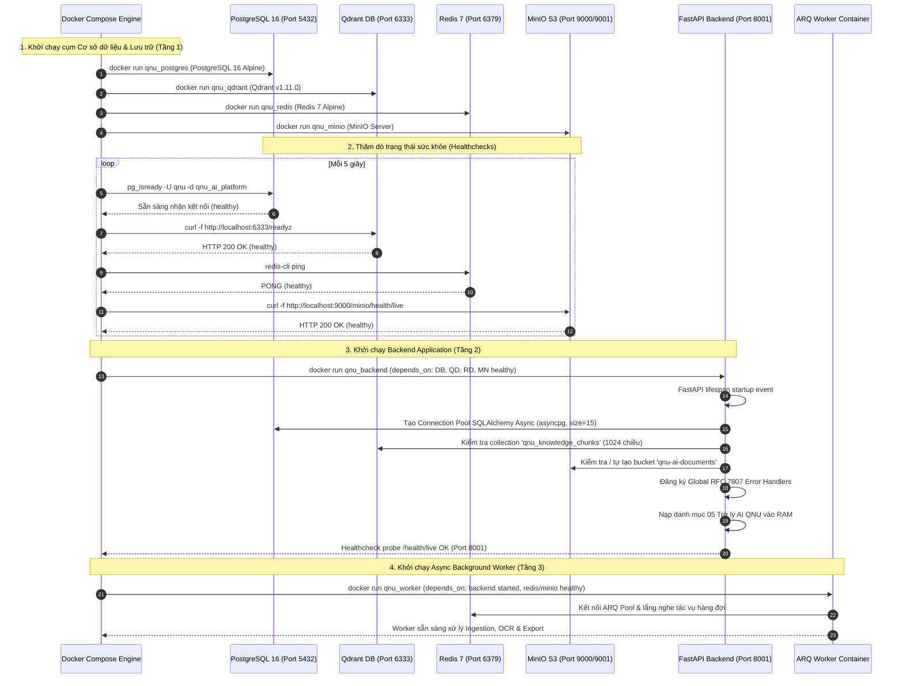

# QUY TRÌNH 01: KHỞI ĐỘNG & VÒNG ĐỜI NỀN TẢNG (BOOT SEQUENCE & PLATFORM LIFECYCLE)

Tài liệu này mô tả chi tiết thứ tự điều phối nạp các container, kiểm tra tính sẵn sàng (Healthcheck Probes) và khởi tạo kết nối hạ tầng khi nền tảng khởi động.

---

## 1. Sơ Đồ Tuần Tự Khởi Động (Boot Sequence Sequence Diagram)

---

## 2. Chi Tiết Các Bước Thực Thi

### Bước 1: Khởi động Hạ tầng Lưu trữ & CSDL (Tầng 1)
- **PostgreSQL 16**: Cấu hình bộ nhớ đệm `shared_buffers`, nạp extension tiếng Việt cho Full-Text Search.
- **Qdrant Vector DB**: Nạp engine lưu trữ vector trên ổ cứng tại volume `qnu_qdrant_data`.
- **Redis 7**: Nạp cơ chế semantic cache và lưu trữ hàng đợi tác vụ của ARQ.
- **MinIO S3**: Khởi tạo object storage server tại cổng `9000` (API) và `9001` (Console).

### Bước 2: Thăm Dò Sức Khỏe (Healthcheck Polling)
Để tránh hiện tượng `CrashLoopBackOff` khi Backend khởi động trước khi CSDL sẵn sàng:
- Lệnh kiểm tra PostgreSQL: `pg_isready -U qnu -d qnu_ai_platform`.
- Lệnh kiểm tra Qdrant: `curl -f http://localhost:6333/readyz || exit 1`.
- Lệnh kiểm tra Redis: `redis-cli ping`.
- Lệnh kiểm tra MinIO: `curl -f http://localhost:9000/minio/health/live || exit 1`.

### Bước 3: Vòng Đời Ứng Dụng FastAPI (`lifespan`)
Được quản lý trong hàm `lifespan(app: FastAPI)` tại [`app/main.py`](file:///d:/DuAnPhanMem/DeTaiAI/qnu-ai-platform/backend/app/main.py):
1. **Khởi tạo Logger có cấu trúc**: Đăng ký structlog định dạng JSON kèm `correlation_id`.
2. **Khởi tạo Connection Pool CSDL**: `asyncpg` mở sẵn 15 kết nối tới PostgreSQL.
3. **Đăng ký RFC 7807 Exception Handlers**: Bắt và chuẩn hóa toàn bộ lỗi ngoại lệ thành Problem Details.
4. **Graceful Shutdown**: Khi nhận tín hiệu `SIGTERM`, server ngưng nhận request mới, đợi các request đang chạy hoàn tất và đóng Connection Pool (`await engine.dispose()`).
