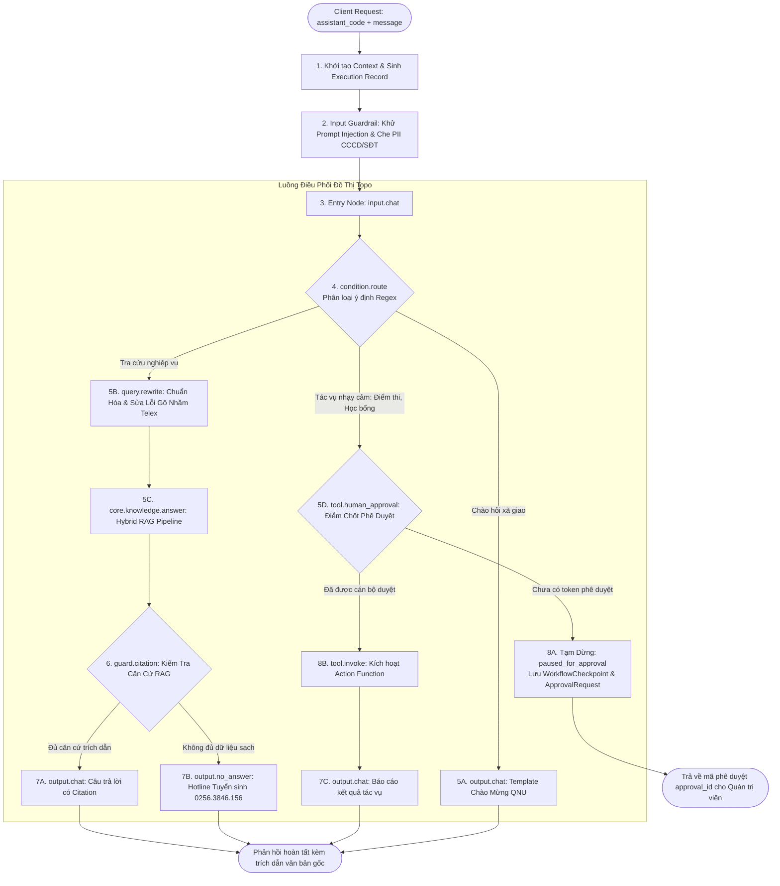
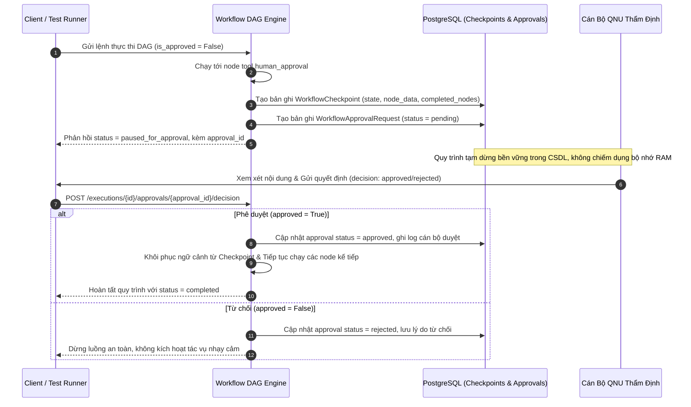

# QUY TRÌNH 04: ĐIỀU PHỐI 05 TRỢ LÝ AI QUA ĐỒ THỊ DAG & WORKFLOW CONTROL PLANE

Tài liệu này đặc tả toàn diện kiến trúc quản trị vòng đời đồ thị (**Workflow Control Plane**) và động cơ thực thi tuần tự có hướng (**Workflow DAG Runtime Engine**) phục vụ điều phối hoạt động của 05 Trợ lý AI chuyên trách chuẩn Đại học Quy Nhơn.

---

## 1. Kiến Trúc Vòng Đời Quản Trị Đồ Thị (Workflow Control Plane Lifecycle)

Hệ thống tách biệt hoàn toàn giữa tầng **Biên soạn (Authoring/Draft)** và tầng **Phục vụ Thực thi (Runtime/Serving)** nhằm bảo đảm tính sẵn sàng cao, chống xung đột ghi đè và truy vết kiểm toán bất biến:

```mermaid
flowchart TD
    subgraph CONTROL_PLANE [Tầng Quản Trị Đồ Thị (Control Plane)]
        CANVAS[DAG Canvas Studio /canvas] -->|PUT /draft + expected_revision| DRAFT[(Bảng workflow_drafts<br>Bản nháp có số Revision)]
        DRAFT -->|POST /validate| COMPILER[Workflow Compiler<br>Kiểm tra Cycle, Reachability, Types]
        COMPILER -->|Hợp lệ| PUB_BTN[Thao tác: Xuất bản Version]
        PUB_BTN -->|POST /publish| VER[(Bảng workflow_versions<br>Phiên bản bất biến + SHA-256 Hash)]
        VER -->|POST /rollback/{version_id}| ROLLBACK[Tạo Version mới sao chép cấu trúc cũ]
        ROLLBACK --> VER
    end

    subgraph RUNTIME_PLANE [Tầng Phục Vụ Thực Thi (Runtime Serving Engine)]
        VER -.->|Kích hoạt phiên bản mới nhất| WF_DEF[(Bảng workflow_definitions<br>published_version_id)]
        CLIENT([Client / Chat Studio]) -->|Gửi câu hỏi| ASST_SVC[Assistant Service]
        ASST_SVC -->|Đóng gói Snapshot bất biến| PROFILE[AssistantRuntimeProfile<br>Persona, Scope, ModelOps, Guardrails]
        PROFILE --> ENGINE[Workflow DAG Engine]
        WF_DEF -.->|Cung cấp DAG Spec| ENGINE
        ENGINE --> EXECUTOR[Ready-Set Concurrent Scheduler]
    end
```

### Bốn Trạng Thái Cốt Lõi Của Control Plane:
1. **Bản Nháp Khả Biến (Mutable Draft)**:
   - Lưu trữ cấu hình node, cạnh nối và vị trí đồ thị trong bảng `workflow_drafts`.
   - Cơ chế khóa lạc quan (**Optimistic Concurrency Control — OCC**): Mỗi lần lưu nháp (`PUT /draft`), client bắt buộc gửi kèm `expected_revision`. Nếu revision trong CSDL đã tăng do người khác lưu trước, hệ thống trả về mã lỗi `409 Conflict` (`workflow_draft_conflict`) để ngăn chặn ghi đè mất dữ liệu.
2. **Kiểm Định Tĩnh (Static Compiler Validation)**:
   - Module `workflow_compiler` phân tích cấu trúc đồ thị trước khi cho phép xuất bản:
     - *Phát hiện chu trình*: Đồ thị bắt buộc là DAG, nghiêm cấm vòng lặp (`workflow_cycle_detected`).
     - *Tính liên thông*: Mọi node phải tới được từ `entry_node_id` (`workflow_node_unreachable`).
     - *Node kết thúc*: Bắt buộc có ít nhất một node thuộc nhóm Terminal (`output.chat`, `output.no_answer`, `output.file`, `output.artifact`) có thể tới được từ entry (`workflow_terminal_missing`).
     - *Kiểm tra loại node*: Toàn bộ `node.type` phải được đăng ký trong `node_registry` runtime (`workflow_node_type_unsupported`).
3. **Phiên Bản Bất Biến (Immutable Versioning)**:
   - Khi xuất bản (`POST /publish`), hệ thống snapshot toàn bộ DAG vào bảng `workflow_versions` với số phiên bản tăng tuần tự (`v1`, `v2`,...), gắn mã băm nội dung chuẩn hóa **SHA-256 (`content_hash`)**, lưu báo cáo kiểm định và danh tính người xuất bản.
   - Bản ghi `workflow_versions` sau khi tạo là **bất biến (read-only)**, tuyệt đối không bị chỉnh sửa.
4. **Khôi Phục An Toàn (Safe Rollback)**:
   - Khi cán bộ chọn quay về một phiên bản lịch sử (`POST /rollback/{version_id}`), hệ thống **không xóa hay ghi đè version cũ**. Thay vào đó, hệ thống khởi tạo một phiên bản xuất bản mới kế tiếp (ví dụ `v3` khôi phục nội dung từ `v1`), ghi log kiểm toán đầy đủ và lập tức chuyển hướng luồng phục vụ sang version mới này.

---

## 2. Chu Trình Thực Thi Đồ Thị DAG & Ready-Set Scheduler

Động cơ thực thi `WorkflowDAGEngine` vận hành theo cơ chế **Ready-Set Concurrent Scheduler**, hỗ trợ phân nhánh song song (Fan-Out), hội tụ đồng bộ (Fan-In Join) và dừng luồng an toàn (Human Checkpoint):



### Quy Tắc Lập Lịch Hội Tụ (Fan-In Join Synchronization):
- Một node Join (hội tụ) có nhiều node tiền nhiệm (predecessors) chỉ được phép đưa vào hàng đợi thực thi khi **tất cả các đường nhánh kích hoạt dẫn tới nó đã hoàn thành**.
- **Chống Deadlock (Deadlock/Stall Guard)**: Nếu một nhánh bị bỏ qua do rẽ nhánh điều kiện dẫn đến node Join không bao giờ hội tụ đủ điều kiện, động cơ lập tức phát hiện trạng thái kẹt (`Workflow bị kẹt khi chờ các node...`) và kết thúc an toàn thay vì treo luồng vô hạn.

---

## 3. Cơ Chế Chốt Phê Duyệt Cán Bộ & Lưu Trữ Bền Vững (Human-in-the-Loop Checkpointing)

Đối với các tác vụ có tính chất pháp lý hoặc can thiệp dữ liệu hệ thống (ban hành điểm chuẩn, duyệt đề thi, cấp học bổng sinh viên, xóa tài liệu), đồ thị bắt buộc kích hoạt chốt chặn **Human-in-the-Loop (HITL)**:



---

## 4. Hệ Sinh Thái 05 Trợ Lý AI Chuyên Trách Chuẩn QNU

Hệ thống duy trì 05 Trợ lý AI nạp tự động qua Seeder (`seed_standard_assistants` và `sync_default_workflows`), lưu bền vững trong CSDL:

| Mã Trợ Lý (`code`) | Tên Trợ Lý | Workflow Ràng Buộc | Chuyên Môn Nghiệp Vụ | Cấu Hình Đặc Thù & Tools |
| :--- | :--- | :--- | :--- | :--- |
| **`admissions`** | **Trợ lý Tuyển sinh QNU** | `admissions-assistant` | Đề án tuyển sinh, điểm chuẩn, chỉ tiêu, học phí, học bổng | - Chế độ RAG: `Hybrid RRF k=60`<br>- Facts: `knowledge_facts`<br>- Fallback: Hotline `0256.3846.156` |
| **`regulations`** | **Trợ lý Quy chế Học vụ** | `regulations-assistant` | Quy chế đào tạo tín chỉ, chuẩn đầu ra, khen thưởng, kỷ luật | - Chunker: `ClauseBasedChunker`<br>- Citations: Bắt buộc Điều/Khoản |
| **`library`** | **Trợ lý Thư viện & Học liệu Số** | `library-assistant` | Tra cứu giáo trình, sách chuyên khảo, bài báo khoa học | - Tìm kiếm tài nguyên số theo mã DDC/ISBN<br>- Định dạng thư mục chuẩn APA |
| **`drafting`** | **Trợ lý Soạn thảo Văn bản** | `drafting-assistant` | Hỗ trợ soạn thông báo, tờ trình, kế hoạch theo Nghị định 30 | - Xuất file `.docx` chuẩn thể thức NĐ 30<br>- HITL: Duyệt trước khi xuất bản |
| **`question_bank`**| **Trợ lý Ngân hàng Đề thi** | `question-bank-assistant`| Phân loại câu hỏi theo 4 mức Bloom, xuất ma trận đề thi | - Xuất bảng Excel ma trận đề thi<br>- HITL: Trưởng bộ môn duyệt thẩm định |

---

## 5. Các Đặc Tính Kỹ Thuật Bảo Vệ Cốt Lõi

### 1. Bảo Vệ Ranh Giới Từ Tiếng Việt (Vietnamese Word Boundary Safeguard)
Trong `ConditionRouteNodeHandler`:
- Khi so khớp ý định (Intent Matching), regex tự động được bọc bằng khuôn mẫu `(?:^|\W)(?:pattern)(?:\W|$)`.
- **Triệt tiêu lỗi ngớ ngẩn**: Ngăn chặn tình trạng các từ khóa con tiếng Anh ngắn như `"hi"` bị kích hoạt nhầm khi người dùng gõ từ tiếng Việt chứa chuỗi ký tự đó (ví dụ: *"Học phí bao n**hi**êu tiền?"* hoặc *"Quy định về bảo **hi**ểm y tế"* không bao giờ bị hiểu nhầm thành lời chào *"hi"*).

### 2. Snapshot Hồ Sơ Bất Biến (AssistantRuntimeProfile)
- Trước khi chạy workflow, hệ thống bóc tách `AssistantModel` thành bản chụp bất biến `AssistantRuntimeProfile` gồm: `assistant_code`, `system_prompt`, `collection_id`, `model_policy`, `quota_limits`, `guardrail_rules`.
- Bản chụp này được truyền xuyên suốt qua `WorkflowContext`, bảo đảm tính toàn vẹn của nghiệp vụ dù cán bộ có cập nhật Trợ lý trong lúc một phiên hội thoại đang diễn ra.

### 3. Nguyên Tắc Không Bịa Đặt & No-Answer Fallback (Anti-Hallucination Guardrail)
- Node `guard.citation` kiểm tra chặt chẽ câu trả lời từ RAG: nếu trạng thái là `insufficient_context` hoặc không có trích dẫn nguồn văn bản hợp lệ, luồng tự động điều hướng sang `output.no_answer`.
- Tuyệt đối không sinh dữ liệu giả định; luôn cung cấp thông tin liên hệ chính thức của Trường Đại học Quy Nhơn:
  - Hotline tuyển sinh: `0256.3846.156`
  - Email hỗ trợ: `tuyensinh@qnu.edu.vn`
  - Cổng thông tin: `https://qnu.edu.vn`

### 4. Quy Tắc Biên Dịch Chống Bịa Đặt Bắt Buộc (Compiler Anti-Hallucination Guardrail)
- `WorkflowCompiler` tự động quét đồ thị DAG: Bất kỳ quy trình nào có node tri thức RAG (`core.knowledge.answer`, `rag.retrieve`, `rag.hybrid_query`) **BẮT BUỘC** phải có ít nhất một node thẩm định căn cứ trích dẫn hoặc rẽ nhánh điều hướng an toàn (`guard.citation`, `guard.citation_policy`, `output.no_answer`, `output.fallback`).
- Nếu vi phạm, compiler xuất mã lỗi `workflow_rag_missing_citation_guard` (severity: error) và từ chối cho phép xuất bản.

### 5. Cổng Kiểm Định Chất Lượng TM-08 (TM-08 Quality Gate for Publishing)
- Trong `WorkflowService.publish_draft`: Hệ thống liên kết tự động tới kết quả kiểm định `EvaluationRun` gần nhất của Assistant tương ứng.
- **Rào chắn phát hành**: Nếu Trợ lý chưa có lượt đánh giá đạt chuẩn TM-08 (Faithfulness $\ge 0.90$, Answer Relevance $\ge 0.85$, Context Precision $\ge 0.80$), API ném ngoại lệ RFC 7807 `workflow_quality_gate_failed` (HTTP 422), ngăn chặn việc đưa các workflow kém chất lượng hoặc chưa thẩm định vào phục vụ người dùng thực tế.

### 6. Trải Nghiệm Vận Hành & Điều Hướng Sâu (Master-Detail Deep Linking Pattern)
- Đồng bộ URL 2 chiều giữa trình duyệt và trạng thái hệ thống:
  - `/runs/:runId`: Truy cập trực tiếp phiên thực thi cụ thể, tự động mở modal truy vết timeline checkpoint và cung cấp nút chép link trực tiếp.
  - `/workflows/:id`: Mở trực tiếp bản nháp DAG của Trợ lý tương ứng trên DAG Studio, hỗ trợ nút chép link chia sẻ đồng bộ.
  - `/assistants/:id`: Trung tâm điều hành chuyên sâu cho từng Trợ lý AI với deep link định danh (`/assistants/admissions`, `/assistants/regulations`,...).
- Tuân thủ 100% nguyên tắc UI mở, không gò bó, hỗ trợ bookmark và F5 không mất ngữ cảnh.

### 7. Chuẩn Hóa Câu Hỏi & Khắc Phục Lỗi Gõ Nhầm Ngữ Cảnh (Contextual Typo Correction & Query Rewrite Node)
- **Vị trí trong DAG**: Đặt ngay sau `condition_route` và ngay trước `core.knowledge.answer`.
- **Cơ chế Xử lý 2 Tầng (2-Stage Normalization Pipeline)**:
  1. *Tầng 1 — Fast Rule Engine (0ms)*:
     - Tự động chuẩn hóa Unicode NFC sạch;
     - Phát hiện và sửa lỗi trượt phím Telex hoặc ngữ cảnh phổ biến: `"ngày"` $\rightarrow$ `"ngành"` (khi đi kèm tên ngành), `"học bà"` $\rightarrow$ `"học bạ"`, `"điểm chuẫn"` $\rightarrow$ `"điểm chuẩn"`, `"kí túc sá"` $\rightarrow$ `"ký túc xá"`, `"sư pham"` $\rightarrow$ `"sư phạm"`;
     - Mở rộng các từ viết tắt chuyên ngành: `"cntt"` $\rightarrow$ `"Công nghệ thông tin"`, `"qtkd"` $\rightarrow$ `"Quản trị kinh doanh"`, `"đgnl"` $\rightarrow$ `"Đánh giá năng lực"`, `"thpt"` $\rightarrow$ `"THPT"`, `"ktx"` $\rightarrow$ `"ký túc xá"`, `"nd 116"` $\rightarrow$ `"Nghị định 116"`;
     - Chuẩn hóa viết hoa danh từ riêng của 17 ngành học trọng điểm QNU.
  2. *Tầng 2 — Fast Contextual LLM Rewrite (~150ms, Tùy chọn)*:
     - Sử dụng mô hình Flash với `temperature=0.0`, `thinking_budget=0` và timeout 3.0 giây;
     - Được trang bị bộ Prompt Few-shot nghiêm ngặt (chỉ trả về câu hỏi sạch, không giải thích, không tiền tố);
     - Tự động Cascade an toàn về kết quả của Tầng 1 khi xảy ra lỗi mạng hoặc quá hạn thời gian.
- **Tính Bền Vững & Downstream Sync**: Ghi đè câu hỏi đã chuẩn hóa vào `context.node_data["normalized_query"]` và `context.node_data["user_message"]`, giúp tầng Hybrid RAG (`core.knowledge.answer`) truy xuất chính xác 100% các vector và facts liên quan.

---

## 6. Kiến Trúc Giao Diện Trung Tâm Điều Hành Trợ Lý AI (Enterprise Assistant Control Center)

Nhằm chuyển đổi hoàn toàn từ các trường nhập liệu văn bản thô (Free text input) sang trải nghiệm vận hành đẳng cấp doanh nghiệp (**Enterprise Control Center**), giao diện phân hệ Trợ lý AI được chuẩn hóa thành cấu trúc 3 màn hình chuyên sâu:

### 1. Màn hình Danh Mục Trợ Lý (`/assistants`)
- **Header & Action Bar**: Tiêu đề phân hệ, nút làm mới nhanh dữ liệu, nút xuất/nhập bundle cấu hình JSON toàn diện, và nút tạo Trợ lý AI mới (`/assistants/new`).
- **Bộ lọc đa chiều**: Lọc theo lĩnh vực chuyên môn (`admissions`, `academic`, `resources`, `administration`, `examination`) và trạng thái kích hoạt (`all`, `active`, `inactive`).
- **Assistant Cards**: Thẻ thông tin hiển thị định danh, mã code, mô tả nghiệp vụ, huy hiệu chuyên môn, trạng thái kích hoạt và nhãn chuẩn kiểm định TM-08.
- **Tác vụ nhanh 3 nút bấm**:
  - *Thử chat*: Chuyển hướng ngay sang Studio hội thoại trực tiếp.
  - *Mở DAG*: Chuyển hướng thẳng tới đồ thị quy trình `/workflows/:id`.
  - *Cấu hình*: Chuyển tiếp tới trang điều hành chi tiết `/assistants/:id`.

### 2. Trung Tâm Điều Hành Chi Tiết Trợ Lý (`/assistants/:id`)
- **Breadcrumb & Toolbar**: Điều hướng phân cấp (`Trợ Lý AI / [Tên Trợ lý]`), huy hiệu trạng thái, và bộ nút hành động đồng bộ: *Thử chat*, *Mở DAG*, *Xuất cấu hình JSON*, *Lưu thay đổi*.
- **Thanh Chỉ Số KPI Thời Gian Thực (KPI Metrics Strip)**:
  - *Lượt hội thoại*: Thống kê tổng số lượt tương tác thực tế ghi nhận qua lịch sử runs.
  - *Độ trễ trung bình*: Thời gian phản hồi tính bằng mili-giây (ms).
  - *Kho tri thức*: Tên bộ sưu tập và số lượng tài liệu liên kết trực tiếp.
  - *Quy chuẩn TM-08*: Trạng thái đạt chuẩn Ragas về độ tin cậy và không bịa đặt.
- **Ràng Buộc Tri Thức & Quy Trình Động (Dynamic Select Gateway)**:
  - *Kho tri thức RAG*: Tự động tải danh sách từ CSDL thực (`/knowledge/collections`), hiển thị kèm số lượng tài liệu (`document_count`). Nút liên kết trực tiếp mở trang chi tiết kho tri thức.
  - *Quy trình Workflow DAG*: Tự động tải danh sách workflow đã xuất bản (`/workflows`), hiển thị tên hiển thị và định danh. Nút liên kết mở trực tiếp DAG Studio.
- **Chính Sách Mô Hình Kép & ModelOps**:
  - Lựa chọn mô hình chính (`Primary Model`) và mô hình dự phòng (`Fallback Model`) qua danh mục mô hình chuẩn có chú thích hiệu năng (GPT-4o Mini, Gemini 1.5 Flash, DeepSeek V3, Mistral Small, Qwen 2.5 7B).
  - Thanh trượt điều chỉnh nhiệt độ sáng tạo (`temperature`: 0.0 - 1.0) và giới hạn token (`max_tokens`).
- **Trung Tâm Kiểm Soát An Toàn (Interactive Guardrails Switch Center)**:
  - 06 công tắc chuyển mạch hai chiều (`<Switch>`) liên kết trực tiếp với trường `config.guardrails`, `config.tools`, và `config.output_policy`:
    1. *Khử Prompt Injection*: Phát hiện và ngăn chặn jailbreak ngay tại cửa ngõ.
    2. *Che Giấu Dữ Liệu PII*: Tự động ẩn số CCCD, số điện thoại, email cá nhân.
    3. *Chống Bịa Đặt*: Kích hoạt No-Answer Policy khi không có dữ liệu đối soát.
    4. *Bảo Vệ System Prompt*: Ngăn chặn trích xuất câu lệnh hệ thống nội bộ.
    5. *Phê Duyệt Cán Bộ (HITL)*: Yêu cầu xác thực cán bộ trước khi thay đổi dữ liệu.
    6. *Bắt Buộc Trích Dẫn*: Yêu cầu dẫn chứng số văn bản, Điều/Khoản và trang minh chứng.
- **Quản Lý Câu Hỏi Gợi Ý Tương Tác (Editable Sample Questions List)**:
  - Hiển thị danh sách câu hỏi mẫu có đánh số thứ tự.
  - Hỗ trợ thêm mới câu hỏi gợi ý, chỉnh sửa nội dung trực tiếp tại ô input, và nút xóa từng câu hỏi kèm unique key ID an toàn.
- **Bảng Đo Lường Chuẩn Ragas TM-08**:
  - Đối chiếu 3 tiêu chuẩn vàng: *Faithfulness* ($\ge 0.90$), *Answer Relevance* ($\ge 0.85$), *Context Precision* ($\ge 0.80$).
  - Ô chỉnh sửa thông điệp dự phòng No-Answer khi RAG không tìm thấy thông tin chính thống.
  - Nút chuyển tiếp nhanh sang phân hệ Đánh giá & Thử nghiệm (`/evaluation`).
- **Quản Trị Vòng Đời Vùng Nguy Hiểm (Danger Zone)**:
  - Khi Trợ lý đang hoạt động: Cung cấp nút *Vô hiệu hóa trợ lý* (tạm dừng phục vụ nhưng vẫn bảo toàn lịch sử và workflow).
  - Khi Trợ lý đã bị vô hiệu hóa: Cung cấp nút *Kích hoạt lại trợ lý* (`activateAssistant`), cập nhật tức thì trạng thái hoạt động trong CSDL mà không mất cấu hình.

### 3. Trang Khởi Tạo Trợ Lý Mới (`/assistants/new`)
- Quy trình chuẩn 7 bước đóng gói trong giao diện trực quan.
- Tự động nạp danh sách Kho tri thức và Quy trình DAG có sẵn vào các trường dropdown chọn lọc.
- Giá trị mặc định an toàn cho Guardrails và ModelOps theo tôn chỉ Đại học Quy Nhơn.

---

## 7. Kiến Trúc Giao Diện Phân Hệ Quy Trình Workflow DAG (`/workflows` & `/workflows/:id`)

Nhằm giải quyết triệt để lỗi vỡ giao diện thanh công cụ (Header collision) và hoàn thiện quy chuẩn Master-Detail Deep Routing, phân hệ Quy Trình DAG được tái cấu trúc thành 2 tầng giao diện độc lập:

### 1. Trang Danh Mục Quy Trình Master View (`/workflows`)
- **Header & Điều Hướng**: Tiêu đề phân hệ, nút làm mới dữ liệu từ CSDL, liên kết nhanh tới Thư viện DAG Nodes (`/nodes`) và Lịch sử Thực thi (`/runs`).
- **Thanh Chỉ Số KPI Metrics Strip**:
  - *Tổng Quy Trình*: Số lượng workflow chuẩn QNU đang quản lý (5 quy trình).
  - *Đang Phục Vụ (Serving)*: Tỉ lệ workflows đã xuất bản phiên bản chính thức v1.0.0.
  - *Độ Phức Tạp DAG*: Số nodes trung bình trên mỗi workflow (4 - 7 nodes).
  - *Chuẩn Kiểm Định*: Trạng thái kiểm định Ragas TM-08 Anti-Hallucination.
- **Bộ Lọc Đa Chiều & Tìm Kiếm**:
  - Tìm kiếm thời gian thực theo tên quy trình, mã module hoặc nội dung mô tả.
  - Bộ nút lọc theo 5 lĩnh vực chuyên môn (Tuyển sinh, Quy chế, Thư viện, Soạn thảo NĐ 30, Khảo thí Bloom).
- **Workflow Cards Hiện Đại**:
  - Icon chuyên môn, mã module `module_code`, badge version (`v1.0.0`), badge trạng thái xuất bản.
  - Tóm tắt kiến trúc DAG: Số nodes, số kết nối connections, mã định danh.
  - Trợ lý AI liên kết: Tên trợ lý và liên kết cấu hình nhanh sang `/assistants/:id`.
  - Bộ 3 nút tác vụ:
    * **[Mở DAG Studio]**: Điều hướng sâu sang `/workflows/:id`.
    * **[Thử nghiệm]**: Mở Studio Chat với Trợ lý tương ứng.
    * **[Lịch sử]**: Mở modal phiên bản xuất bản và phục hồi rollback.

### 2. Giao Diện DAG Canvas Studio Mới (`/workflows/:id` & `/canvas`)
- **Triệt Tiêu Hoàn Toàn Lỗi Vỡ Layout Header**:
  - Thay thế dãy 5 tab nút bấm dài ngoằng (nguyên nhân gây co ép thanh công cụ và wrap chữ thành cột xanh lá cây che phủ icon) bằng **Workflow Switcher Dropdown** `<Select>` tinh gọn, hiển thị icon và tên quy trình kèm dirty indicator khi có thay đổi chưa lưu.
  - Bổ sung nút quay lại (`<ArrowLeft>`) điều hướng mượt mà về `/workflows`.
- **Thanh Công Cụ Phân Cụm 3 Khối Khoa Học**:
  - *Khối Biên Soạn (Authoring)*: `[+ Thêm node]`, `[▶ Chạy thử]` (nút chính nổi bật), `[💾 Lưu nháp]` (tự động đổi màu hổ phách cảnh báo khi dirty).
  - *Khối Control Plane*: `[🛡 Kiểm tra]` (static compiler), `[🚀 Xuất bản]` (immutable versioning), `[🕒 Lịch sử]` (modal rollback).
  - *Khối Tiện Ích*: `[Sao chép link]`, `[Sao chép JSON]`, `[Tải lại]`, `[Studio Chat]`.
- **Dải Thông Số & Canvas Viewport**:
  - Breadcrumb và thông tin bản nháp rN, số nodes, số connections.
  - Toàn bộ không gian màn hình tối ưu cho React Flow Canvas với 8 loại node nghiệp vụ, MiniMap, Controls, Node Catalog Drawer, Property Inspector và In-Canvas Test Runner.


## 8. Bảo Toàn Tính Toàn Vẹn Thực Thi (Execution Integrity Guarantees)

### 8.1. Phân Giải Phiên Bản Bất Biến (Immutable Version Resolution)
- Khi `WorkflowService.execute()` hoặc `WorkflowService.resume()` được gọi, hệ thống **BẮT BUỘC** đọc `dag_spec` trực tiếp từ bản ghi `workflow_versions` tương ứng với `published_version_id` đang hoạt động tại thời điểm bắt đầu thực thi.
- Quy trình phân giải phiên bản:
  1. Đọc `workflow_definitions.published_version_id` (ID phiên bản hiện hành).
  2. Tải `dag_spec` từ bảng `workflow_versions` theo `published_version_id` đó.
  3. **Nếu không tìm thấy bản ghi phiên bản**: Hệ thống **từ chối thực thi** và ném ngoại lệ `WorkflowVersionNotFoundError` (`workflow_version_not_found`, HTTP 409) — **CẤM** tự động rơi về `workflow_definitions.dag_spec` như một silent fallback.
- Điều này đảm bảo: Mọi phiên thực thi — dù diễn ra đồng thời hay bị tạm dừng qua Human-in-the-Loop — đều được hoàn tất trên **đúng chính xác phiên bản DAG đã được kiểm định và phê duyệt** tại thời điểm bắt đầu, không bị ảnh hưởng bởi các lần xuất bản phiên bản mới diễn ra song song.

### 8.2. Tách Biệt Phê Duyệt Phía Máy Chủ (Server-Side Approval Flag Enforcement)
- Cờ `is_approved` trong luồng HITL **KHÔNG** được tin tưởng từ phía client. Cờ này chỉ được đọc từ bản ghi `WorkflowApprovalRequest` trong PostgreSQL.
- Quy trình phê duyệt nghiêm ngặt:
  1. Khi node `tool.human_approval` được kích hoạt, Engine tạo bản ghi `WorkflowApprovalRequest` với `status = "pending"`, lưu bền vững vào PostgreSQL và trả về `approval_id` cho Client.
  2. Cán bộ gửi quyết định qua `POST /executions/{id}/approvals/{approval_id}/decision`.
  3. Engine **đọc `status` từ DB** (không đọc từ body request) để xác định quyết định phê duyệt cuối cùng.
  4. Chỉ khi `status = "approved"` trong DB mới kích hoạt node công cụ tiếp theo.
- **CẤM** cho phép client tự gửi `is_approved = True` trong request body để bypass cơ chế HITL.

### 8.3. Cô Lập Ngữ Cảnh Thực Thi Song Song (Concurrent Execution Context Isolation)
- Mỗi phiên thực thi (`WorkflowExecution`) mang `execution_id` duy nhất và lưu `checkpoint_state` riêng biệt trong PostgreSQL.
- `AssistantRuntimeProfile` được đóng gói bất biến từ đầu phiên: mọi thay đổi cấu hình Trợ lý sau đó **không ảnh hưởng** đến phiên đang chạy — đảm bảo người dùng nhận phản hồi nhất quán từ cùng một ngữ cảnh đã khởi tạo.

### 8.4. Cổng Truy Cập Nhà Phát Triển & Bảo Mật Phiên Server-Side (Dev Access Gate)
- Trong giai đoạn thử nghiệm và phát triển nội bộ, hệ thống thiết lập chốt chặn truy cập tối giản nhưng an toàn tuyệt đối phía máy chủ:
  * **Xác thực qua Server**: Endpoint `POST /platform/v1alpha1/auth/login` tiếp nhận `access_key`, so khớp với `DEV_ACCESS_PASSWORD` thông qua thuật toán hàm băm thời gian không đổi `hmac.compare_digest` nhằm triệt tiêu hoàn toàn rủi ro timing attack.
  * **Session Cookie Ký Số HttpOnly**: Khi đăng nhập thành công, máy chủ thiết lập cookie `qnu_session` mang chữ ký số JWT với các cờ `HttpOnly=True`, `SameSite="Lax"`, ngăn chặn 100% tấn công XSS đánh cắp phiên.
  * **Truy vấn Danh tính Máy chủ**: Endpoint `GET /platform/v1alpha1/auth/me` phân giải danh tính tác nhân (`AuthActor`) và `POST /platform/v1alpha1/auth/logout` hủy bỏ session cookie lập tức.
  * **Tác nhân Xác thực Đáng tin cậy (Trusted Principal)**: Dependency `get_current_actor` cung cấp định danh hợp lệ (`tenant_qnu`, `workspace_qnu`, role `admin`) cho các thao tác nhạy cảm, bao gồm Tool Gateway, phê duyệt nhân sự (HITL), và quản trị đồ thị DAG.

---

## 9. Quản Trị Phiên Bản Trợ Lý AI & Khôi Phục Snapshot (Assistant Versioning & Rollback)

Nhằm bảo đảm an toàn vận hành khi cập nhật cấu hình Trợ lý AI (thay đổi System Prompt, đổi mô hình LLM, tinh chỉnh Guardrails hay gán lại Kho tri thức), hệ thống cung cấp cơ chế **Snapshot Versioning** tự động:
1. **Tạo Snapshot Tự Động**: Mỗi khi cán bộ lưu cập nhật (`PUT /assistants/{ref}`) hoặc xuất bản Trợ lý (`POST /assistants/{ref}/publish`), hệ thống tự động chụp toàn bộ 7 lớp cấu hình hiện thời vào bảng `assistant_versions` với số phiên bản tăng dần `v1.0`, `v1.1`,...
2. **Truy Vết & Đối Soát Lịch Sử**: Bảng `assistant_versions` lưu trữ JSON `snapshot_data` đầy đủ (`persona`, `model_config`, `guardrails`, `workflow_id`, `collection_id`) cùng `change_summary` và thời điểm thực hiện.
3. **Khôi Phục Phiên Bản 1-Click (Rollback)**:
   - Endpoint `POST /assistants/{ref}/versions/{version_id}/rollback` trích xuất `snapshot_data` từ mốc lịch sử, khôi phục nguyên trạng cấu hình 7 lớp và tự động tạo snapshot mới đánh dấu mốc rollback.
   - Giao diện `assistant-detail-page.tsx` hiển thị Modal Lịch sử Phiên bản trực quan với danh sách mốc thời gian, badge phiên bản hiện tại và nút khôi phục có hộp thoại xác nhận an toàn (`ConfirmDialog`).

---

## 10. Thư Viện Node Động & Bộ Xử Lý Công Cụ Ngoại Vi (Dynamic Node Catalog & API Caller Handler)

Nhằm hỗ trợ mở rộng không giới hạn các loại Node trong quy trình làm việc tự động hóa và tích hợp phần mềm nhà trường:

### 10.1. Bộ Xử Lý Node Gọi Công Cụ & Cổng Quản Lý An Toàn (`APICallerNodeHandler` ↔ `ToolService`)
- Định danh loại Node: `tool.api_caller` (phiên bản `1.0.0`).
- Đăng ký chính thức trong `WorkflowNodeRegistry` và sẵn sàng thực thi trên `WorkflowDAGEngine`.
- **Cơ chế vận hành bảo đảm an toàn & kiểm toán (Zero Direct Bypass)**:
  1. **Trích xuất công cụ**: Lấy `tool_id` từ cấu hình Node (ví dụ `export_administrative_document`, `export_exam_matrix`, `lookup_admission_score`).
  2. **Điều phối qua Tool Gateway**: Node bắt buộc gọi thông qua `ToolService.execute_tool(context.db, tool_req)`, tuyệt đối không gọi trực tiếp driver công cụ nhằm bảo đảm tính toàn vẹn của hệ thống.
  3. **Kiểm tra Danh mục Cho phép của Trợ lý (Assistant Allowlist Gate)**: Nếu DAG chạy trong ngữ cảnh của một Trợ lý AI có khai báo `enabled_tools`, công cụ bắt buộc phải nằm trong danh mục này; nếu vi phạm, runtime lập tức từ chối với mã lỗi `403 Forbidden` (`tool_not_allowed_for_assistant`).
  4. **Kiểm tra Phê duyệt Nhân sự (Human-in-the-Loop Checkpoint)**:
     - Đối với các công cụ có tác động phụ (Side-effects) như xuất tài liệu chính thức (`requires_approval = True`), nếu trong ngữ cảnh thực thi chưa có xác nhận phê duyệt (`is_approved` = True), DAG Engine sẽ **tạm dừng thực thi** và trả về trạng thái `paused_for_approval` kèm `checkpoint: node_spec.id`.
     - Quá trình thực thi chỉ tiếp tục khi cán bộ chuyên môn phê duyệt và gửi lại yêu cầu kèm token xác thực `approved_by`.
  5. **Ghi Nhật Ký Kiểm Toán (Audit Trail)**: Mọi lượt gọi công cụ (dù thành công, thất bại hay bị chặn) đều được tự động lưu vết vào bảng `tool_execution_logs` trong CSDL PostgreSQL với đầy đủ `latency_ms`, `parameters`, `result` và danh tính trợ lý/phiên hội thoại.


### 10.2. Tải Động Thư Viện Node từ Server (Dynamic Manifest-Driven Node Catalog)
- Giao diện `NodeCatalogDrawer` (`node-catalog-drawer.tsx`) kết nối trực tiếp với API `/platform/v1alpha1/system/nodes` thay vì dựa vào hằng số gán cứng cục bộ.
- Mỗi `NodeManifest` từ backend được chuẩn hóa về danh mục trực quan (`input`, `route`, `rag`, `llm`, `tool`, `guard`, `human`, `output`), hiển thị đầy đủ phiên bản và huy hiệu trạng thái (Active / Experimental).
- Khi cán bộ bấm "Thêm Node", động cơ Canvas gán chính xác `workflowNodeType` từ manifest mà không bị méo mó sang các loại mặc định.

---

## 11. Giám Sát Hội Thoại Thời Gian Thực & Bàn Giao Cán Bộ (Live Conversations & Staff Handoff)

Khi Trợ lý AI trao đổi với người dùng qua Chat Studio hoặc Web Widget:
1. **Lưu Vết Nguyên Tử & Duy Trì Phiên (Atomic Conversation Recording & Session Persistence)**:
   - Trong cả hai phương thức `AssistantService.chat()` (đồng bộ) và `AssistantService.chat_stream()` (SSE trực tiếp), hệ thống tự động sinh hoặc sử dụng `conversation_id` ổn định cho toàn bộ phiên trao đổi.
   - Tin nhắn câu hỏi của người dùng và câu trả lời hoàn chỉnh của Trợ lý AI đều được ghi nhận trực tiếp vào CSDL PostgreSQL (`conversation_threads` và `conversation_messages`) qua `conversation_service.record_message`.
   - Các tệp đính kèm (PDF, Word, Excel, ảnh) được bóc tách nội dung thật qua Cổng OCR (`/platform/v1alpha1/ocr/extract`) và tích hợp trực tiếp vào ngữ cảnh xử lý câu hỏi của Trợ lý.
2. **Kích Hoạt Yêu Cầu Handoff (Intent-Driven Handoff Detection)**:
   - Hệ thống tự động phân tích ngữ nghĩa câu hỏi của người dùng để phát hiện ý định gặp người thật (các từ khóa: *"gặp tư vấn viên"*, *"chuyên viên tư vấn"*, *"liên hệ cán bộ"*, *"hotline"*...).
   - Khi phát hiện ý định handoff hoặc khi RAG trả về trạng thái `insufficient_context`, phiên hội thoại tự động chuyển sang trạng thái `handoff_requested` và xuất hiện tức thì trong danh sách chờ của cán bộ.
3. **Bàn Trực Tiếp Cán Bộ (`/conversations`)**:
   - Giao diện Master-Detail 2 cột hiển thị hàng đợi các phiên trao đổi với bộ lọc trạng thái: `Tất cả`, `Cần tiếp quản (Handoff)`, `Cán bộ hỗ trợ`, `AI đang xử lý`, `Đã giải quyết`.
   - Polling nền tự động cập nhật danh sách hội thoại và chi tiết tin nhắn thời gian thực.
4. **Tiếp Quản & Trả Lời Trực Tiếp**:
   - Cán bộ bấm `[Tiếp nhận hỗ trợ]` (`POST /conversations/{id}/status` với `status = "staff_claimed"` và `assigned_to = "[Tên cán bộ]"`).
   - Nhập tin nhắn phản hồi trực tiếp (`POST /conversations/{id}/reply`) kèm hỗ trợ các mẫu câu trả lời nhanh (Canned Replies) hướng dẫn người học tới đúng phòng ban, hotline ĐH Quy Nhơn.
   - Khi hoàn tất, cán bộ có thể bấm `[Chuyển lại cho AI]` để bàn giao lại quyền điều phối cho bot hoặc bấm `[Đã giải quyết]` để đóng phiên trao đổi.

---

## 12. Kiểm Định Cấu Hình Node Theo JSON Schema & Hộp Thư Phê Duyệt Vận Hành (Schema Validation & Approval Inbox)

Nhằm bảo đảm tính toàn vẹn cấu hình đồ thị trước khi xuất bản và tối ưu hóa trải nghiệm vận hành chốt kiểm duyệt Human-in-the-loop:

### 12.1. Kiểm Định Cấu Hình Node Theo JSON Schema (`WorkflowCompiler` ↔ `NodeManifest`)
- **Đối soát thời gian biên dịch (Compile-Time Schema Validation)**:
  * Khi cán bộ lưu nháp (`PUT /draft`) hoặc xuất bản quy trình (`POST /publish`), module `workflow_compiler` tự động tải từ điển `NodeManifest` từ thư mục `configs/nodes/*.json`.
  * Đối với từng Node trong đồ thị, Compiler ánh xạ `node.type` (hoặc Canonical Alias) sang manifest tương ứng và đối soát trường `config` với `config_schema` chuẩn JSON Schema:
    - **Trường bắt buộc (Required Fields)**: Kiểm tra sự hiện diện của các thuộc tính khai báo trong mảng `required` của schema (ví dụ: `collection_id` cho `core.knowledge.answer`, `tool_id` cho `tool.api_caller`). Nếu thiếu, trình biên dịch báo lỗi `workflow_node_config_missing_required`.
    - **Kiểm định kiểu dữ liệu (Type Consistency)**: Kiểm tra các kiểu dữ liệu `string`, `integer`, `number`, `boolean`, `array`, `object`. Báo lỗi `workflow_node_config_type_mismatch` nếu có sai lệch.
    - **Kiểm định tập giá trị danh mục (Enum Validation)**: Đối soát giá trị cấu hình với tập giá trị cho phép trong `enum` (bao gồm hỗ trợ các chuỗi danh mục phân tách bằng dấu phẩy như `"docx,pdf"` cho node xuất tài liệu). Báo lỗi `workflow_node_config_invalid_enum` nếu giá trị nằm ngoài danh mục.
    - **Cảnh báo vòng đời Manifest**: Nếu node sử dụng manifest có trạng thái `deprecated`, compiler ghi nhận cảnh báo; nếu manifest ở trạng thái `inactive`, compiler chặn xuất bản đồ thị với lỗi `workflow_node_manifest_inactive`.

### 12.2. Đồng Bộ Thuộc Tính Hai Chiều Trên Canvas (`PropertyInspector` Two-Way Binding)
- **Xóa bỏ thuộc tính tĩnh gán cứng**: Thanh điều khiển thuộc tính (`PropertyInspector`) chuyển hoàn toàn sang cơ chế động:
  * Cung cấp các trường nhập liệu tương tác chuyên biệt: RAG Search Mode, Top-K Chunks, Minimum RRF Score, Fact Layer Threshold, Target Tool ID, Timeout, Routing Rules,...
  * Đồng bộ hai chiều (Two-Way Binding) giữa **Tab Trực Quan (Visual Form)** và **Tab Mã Nguồn (JSON Schema)**: Mọi thay đổi trên Form cập nhật tức thì vào JSON và ngược lại.
  * Khi người dùng kéo thả hoặc thêm node từ `NodeCatalogDrawer`, hệ thống tự động trích xuất các giá trị mặc định (`defaultConfig`) từ `config_schema` của manifest để khởi tạo `node.data.workflowConfig`, triệt tiêu tình trạng node rỗng gây lỗi biên dịch.

### 12.3. Hộp Thư Phê Duyệt Vận Hành Tập Trung (`/runs` Human-in-the-Loop Approval Inbox)
- **Giám sát & Quyết định ngoài Canvas**:
  * Thay vì buộc cán bộ phải mở In-Canvas Test Runner để phê duyệt, trang lịch sử thực thi `/runs` tích hợp sẵn **Hộp Thư Phê Duyệt Tác Vụ (HITL Inbox)**.
  * Polling nền tự động truy vấn `GET /platform/v1alpha1/workflows/approvals` mỗi 8 giây để phát hiện các phiên chạy bị tạm dừng (`paused_for_approval`).
  * Giao diện cung cấp thẻ thông tin trực quan: Tên Node, Mã phiên (Run ID), Mã Checkpoint, Thông điệp kiểm duyệt, Thời điểm khởi tạo, cùng cặp nút hành động nhanh **[Phê duyệt]** và **[Từ chối]**.
  * Hộp thoại quyết định (`Approval Decision Dialog`) cho phép cán bộ nhập danh tính người thẩm định (`decided_by`) và ý kiến/căn cứ chuyên môn (`decision_reason`).
  * Khi gửi quyết định (`POST /executions/{execution_id}/approvals/{approval_id}/decision`), Backend cập nhật trạng thái `WorkflowApprovalRequest`, đánh dấu checkpoint hoàn tất và tự động đánh thức động cơ DAG tiếp tục thực thi các bước kế tiếp.

---

## 13. Node Chuẩn Hóa Câu Hỏi & Sửa Lỗi Ngữ Cảnh Dùng Chung (`query.rewrite`)

Nhằm giải quyết triệt để lỗi người dùng gõ nhầm trượt phím Telex (ví dụ: *"ngày"* thay vì *"ngành"*, *"học bà"* thay vì *"học bạ"*, *"tín chì"* thay vì *"tín chỉ"*) và viết tắt chuyên ngành trước khi câu hỏi đi vào tầng RAG hay tầng trích xuất thông tin:

### 13.1. Tôn Chỉ Thiết Kế Node Dùng Chung (Generic Reusable Building Block)
- **Zero Hardcoded Domain**: Node `query.rewrite` không chứa bất kỳ danh sách cố định nào về số lượng mô đun hay phân hệ. Đây là một building block trung lập sẵn sàng kéo-thả vào bất kỳ đồ thị DAG nào trong hệ sinh thái QNU AI.
- **Phân Giải Instruction Ưu Tiên Cấp Node**:
  1. `config.instruction` hoặc `config.prompt`: Do cán bộ thiết kế quy trình nhập trực tiếp trên thanh thuộc tính `PropertyInspector` của DAG Visual Studio.
  2. `config.domain`: Tên lĩnh vực vắn tắt (nếu muốn dùng mẫu tự động).
  3. Ngữ cảnh Trợ lý AI (`context.assistant_profile`): Kế thừa mô tả vai trò trợ lý nếu đang chạy dưới một Trợ lý AI.
  4. Fallback toàn trường ĐH Quy Nhơn cho các quy trình mở rộng mới.
- **Kiến Trúc Chuẩn Hóa 2 Tầng**:
  * *Tầng 1 (0ms Fast Rules)*: Xử lý tức thì các lỗi trượt phím Telex thông dụng và từ viết tắt QNU quen thuộc qua biểu thức chính quy tối ưu.
  * *Tầng 2 (~150ms Contextual LLM)*: Gọi mô hình ngôn ngữ siêu tốc (`thinking_budget: 0`, `temperature: 0.0`) với cấu trúc prompt Few-shot nghiêm ngặt (không giải thích, không thêm tiền tố, bảo toàn 100% ý định câu hỏi gốc).

### 13.2. Cấu Hình Seed Data Thực Tế Trên 5 Quy Trình Chuẩn QNU
Cả 5 quy trình nghiệp vụ chính thức đều được nạp sẵn node `query_rewrite` với prompt chuyên biệt:

| Quy Trình | ID Node | Vị Trí Trong DAG | Instruction Chuẩn Hóa Chuyên Biệt |
| :--- | :--- | :--- | :--- |
| **Tuyển sinh** (`admissions-assistant`) | `query_rewrite` | `condition_route` $\rightarrow$ `knowledge_answer` | Sửa trượt phím ("ngày" $\rightarrow$ "ngành", "học bà" $\rightarrow$ "học bạ"), mở rộng CNTT, QTKD, ĐGNL, THPT, KTX, viết hoa chuẩn tên các ngành đào tạo. |
| **Quy chế học vụ** (`regulations-assistant`) | `query_rewrite` | `chat_input` $\rightarrow$ `knowledge_answer` | Sửa lỗi "tín chì" $\rightarrow$ "tín chỉ", "học phầm" $\rightarrow$ "học phần", "rèn luyên" $\rightarrow$ "rèn luyện", mở rộng ĐRL, GPA, CTĐT, CTSV, PĐT, NCKH. |
| **Thư viện & NCKH** (`library-assistant`) | `query_rewrite` | `chat_input` $\rightarrow$ `knowledge_answer` | Sửa lỗi "giáo trinh" $\rightarrow$ "giáo trình", "tài liêu" $\rightarrow$ "tài liệu", "luận văn", mở rộng CNTT, QTKD, SP, KHCN, NCKH và chuẩn hóa tên tác giả/giáo trình. |
| **Soạn thảo NĐ 30** (`drafting-assistant`) | `query_rewrite` | `chat_input` $\rightarrow$ `extract_fields` & `sample_retrieval` | Sửa lỗi "tờ trinh" $\rightarrow$ "tờ trình", "kế hoach" $\rightarrow$ "kế hoạch", "quyết đinh" $\rightarrow$ "quyết định", mở rộng Nghị định 30/2020/NĐ-CP, BGH, UBND, PĐT, TCHC. |
| **Khảo thí & Đề thi** (`question-bank-assistant`) | `query_rewrite` | `chat_input` $\rightarrow$ `knowledge_answer` | Sửa lỗi "ma trân" $\rightarrow$ "ma trận đề thi", "ngân hang" $\rightarrow$ "ngân hàng câu hỏi", "thang đo blom" $\rightarrow$ "thang đo Bloom", mở rộng CLO, PLO, CĐR, ĐCHP, KTĐG. |


