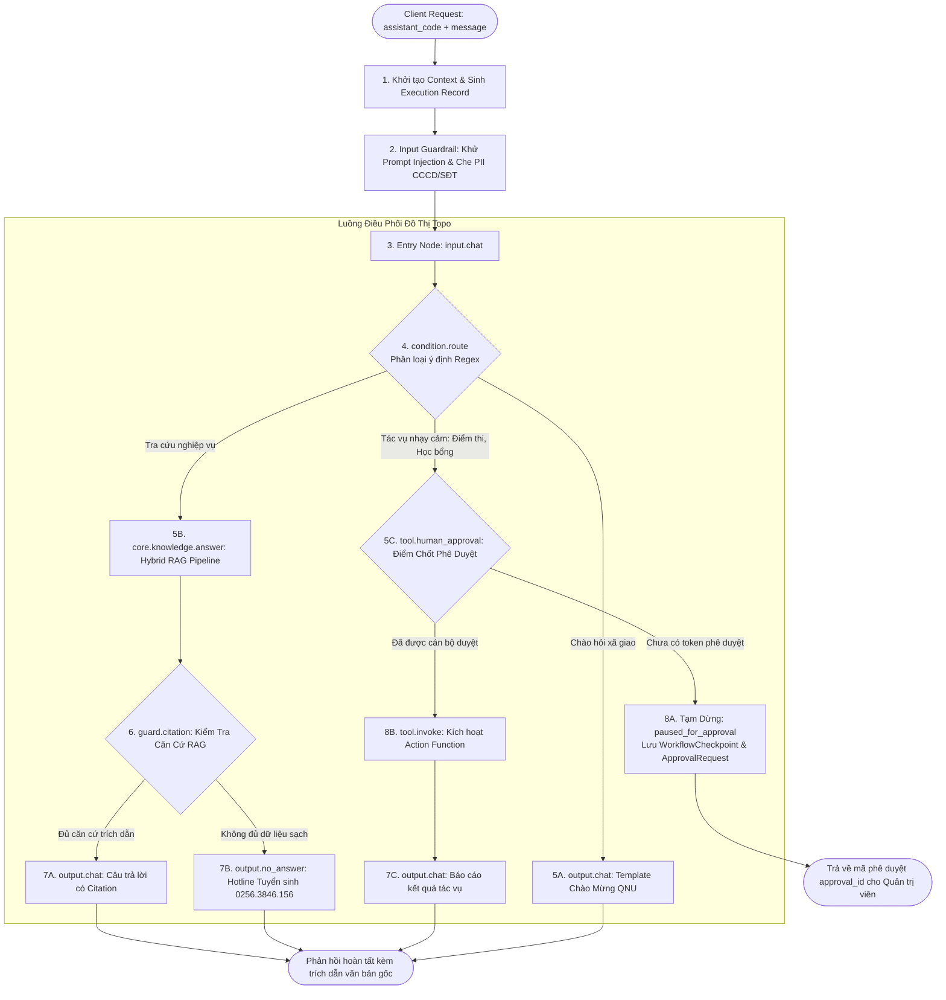
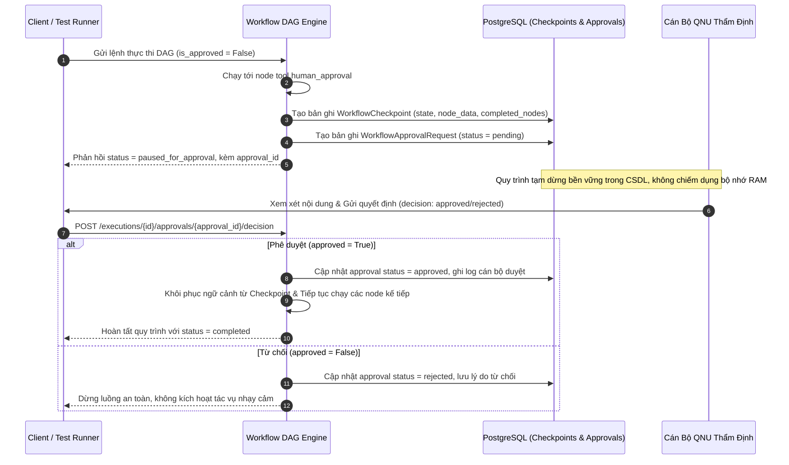

# QUY TRÌNH 04: ĐIỀU PHỐI 05 TRỢ LÝ AI QUA ĐỒ THỊ DAG & WORKFLOW CONTROL PLANE

Tài liệu này đặc tả toàn diện kiến trúc quản trị vòng đời đồ thị (**Workflow Control Plane**) và động cơ thực thi tuần tự có hướng (**Workflow DAG Runtime Engine**) phục vụ điều phối hoạt động của 05 Trợ lý AI chuyên trách chuẩn Đại học Quy Nhơn.

---

## 1. Kiến Trúc Vòng Đời Quản Trị Đồ Thị (Workflow Control Plane Lifecycle)

Hệ thống tách biệt hoàn toàn giữa tầng **Biên soạn (Authoring/Draft)** và tầng **Phục vụ Thực thi (Runtime/Serving)** nhằm bảo đảm tính sẵn sàng cao, chống xung đột ghi đè và truy vết kiểm toán bất biến:

```mermaid
flowchart TD
    subgraph CONTROL_PLANE [Tầng Quản Trị Đồ Thị (Control Plane)]
        CANVAS[DAG Canvas Studio /canvas] -->|PUT /draft + expected_revision| DRAFT[(Bảng workflow_drafts<br>Bản nháp có số Revision)]
        DRAFT -->|POST /validate| COMPILER[Workflow Compiler<br>Kiểm tra Cycle, Reachability, Types]
        COMPILER -->|Hợp lệ| PUB_BTN[Thao tác: Xuất bản Version]
        PUB_BTN -->|POST /publish| VER[(Bảng workflow_versions<br>Phiên bản bất biến + SHA-256 Hash)]
        VER -->|POST /rollback/{version_id}| ROLLBACK[Tạo Version mới sao chép cấu trúc cũ]
        ROLLBACK --> VER
    end

    subgraph RUNTIME_PLANE [Tầng Phục Vụ Thực Thi (Runtime Serving Engine)]
        VER -.->|Kích hoạt phiên bản mới nhất| WF_DEF[(Bảng workflow_definitions<br>published_version_id)]
        CLIENT([Client / Chat Studio]) -->|Gửi câu hỏi| ASST_SVC[Assistant Service]
        ASST_SVC -->|Đóng gói Snapshot bất biến| PROFILE[AssistantRuntimeProfile<br>Persona, Scope, ModelOps, Guardrails]
        PROFILE --> ENGINE[Workflow DAG Engine]
        WF_DEF -.->|Cung cấp DAG Spec| ENGINE
        ENGINE --> EXECUTOR[Ready-Set Concurrent Scheduler]
    end
```

### Bốn Trạng Thái Cốt Lõi Của Control Plane:
1. **Bản Nháp Khả Biến (Mutable Draft)**:
   - Lưu trữ cấu hình node, cạnh nối và vị trí đồ thị trong bảng `workflow_drafts`.
   - Cơ chế khóa lạc quan (**Optimistic Concurrency Control — OCC**): Mỗi lần lưu nháp (`PUT /draft`), client bắt buộc gửi kèm `expected_revision`. Nếu revision trong CSDL đã tăng do người khác lưu trước, hệ thống trả về mã lỗi `409 Conflict` (`workflow_draft_conflict`) để ngăn chặn ghi đè mất dữ liệu.
2. **Kiểm Định Tĩnh (Static Compiler Validation)**:
   - Module `workflow_compiler` phân tích cấu trúc đồ thị trước khi cho phép xuất bản:
     - *Phát hiện chu trình*: Đồ thị bắt buộc là DAG, nghiêm cấm vòng lặp (`workflow_cycle_detected`).
     - *Tính liên thông*: Mọi node phải tới được từ `entry_node_id` (`workflow_node_unreachable`).
     - *Node kết thúc*: Bắt buộc có ít nhất một node thuộc nhóm Terminal (`output.chat`, `output.no_answer`, `output.file`, `output.artifact`) có thể tới được từ entry (`workflow_terminal_missing`).
     - *Kiểm tra loại node*: Toàn bộ `node.type` phải được đăng ký trong `node_registry` runtime (`workflow_node_type_unsupported`).
3. **Phiên Bản Bất Biến (Immutable Versioning)**:
   - Khi xuất bản (`POST /publish`), hệ thống snapshot toàn bộ DAG vào bảng `workflow_versions` với số phiên bản tăng tuần tự (`v1`, `v2`,...), gắn mã băm nội dung chuẩn hóa **SHA-256 (`content_hash`)**, lưu báo cáo kiểm định và danh tính người xuất bản.
   - Bản ghi `workflow_versions` sau khi tạo là **bất biến (read-only)**, tuyệt đối không bị chỉnh sửa.
4. **Khôi Phục An Toàn (Safe Rollback)**:
   - Khi cán bộ chọn quay về một phiên bản lịch sử (`POST /rollback/{version_id}`), hệ thống **không xóa hay ghi đè version cũ**. Thay vào đó, hệ thống khởi tạo một phiên bản xuất bản mới kế tiếp (ví dụ `v3` khôi phục nội dung từ `v1`), ghi log kiểm toán đầy đủ và lập tức chuyển hướng luồng phục vụ sang version mới này.

---

## 2. Chu Trình Thực Thi Đồ Thị DAG & Ready-Set Scheduler

Động cơ thực thi `WorkflowDAGEngine` vận hành theo cơ chế **Ready-Set Concurrent Scheduler**, hỗ trợ phân nhánh song song (Fan-Out), hội tụ đồng bộ (Fan-In Join) và dừng luồng an toàn (Human Checkpoint):



### Quy Tắc Lập Lịch Hội Tụ (Fan-In Join Synchronization):
- Một node Join (hội tụ) có nhiều node tiền nhiệm (predecessors) chỉ được phép đưa vào hàng đợi thực thi khi **tất cả các đường nhánh kích hoạt dẫn tới nó đã hoàn thành**.
- **Chống Deadlock (Deadlock/Stall Guard)**: Nếu một nhánh bị bỏ qua do rẽ nhánh điều kiện dẫn đến node Join không bao giờ hội tụ đủ điều kiện, động cơ lập tức phát hiện trạng thái kẹt (`Workflow bị kẹt khi chờ các node...`) và kết thúc an toàn thay vì treo luồng vô hạn.

---

## 3. Cơ Chế Chốt Phê Duyệt Cán Bộ & Lưu Trữ Bền Vững (Human-in-the-Loop Checkpointing)

Đối với các tác vụ có tính chất pháp lý hoặc can thiệp dữ liệu hệ thống (ban hành điểm chuẩn, duyệt đề thi, cấp học bổng sinh viên, xóa tài liệu), đồ thị bắt buộc kích hoạt chốt chặn **Human-in-the-Loop (HITL)**:



---

## 4. Hệ Sinh Thái 05 Trợ Lý AI Chuyên Trách Chuẩn QNU

Hệ thống duy trì 05 Trợ lý AI nạp tự động qua Seeder (`seed_standard_assistants` và `sync_default_workflows`), lưu bền vững trong CSDL:

| Mã Trợ Lý (`code`) | Tên Trợ Lý | Workflow Ràng Buộc | Chuyên Môn Nghiệp Vụ | Cấu Hình Đặc Thù & Tools |
| :--- | :--- | :--- | :--- | :--- |
| **`admissions`** | **Trợ lý Tuyển sinh QNU** | `admissions-assistant` | Đề án tuyển sinh, điểm chuẩn, chỉ tiêu, học phí, học bổng | - Chế độ RAG: `Hybrid RRF k=60`<br>- Facts: `knowledge_facts`<br>- Fallback: Hotline `0256.3846.156` |
| **`regulations`** | **Trợ lý Quy chế Học vụ** | `regulations-assistant` | Quy chế đào tạo tín chỉ, chuẩn đầu ra, khen thưởng, kỷ luật | - Chunker: `ClauseBasedChunker`<br>- Citations: Bắt buộc Điều/Khoản |
| **`library`** | **Trợ lý Thư viện & Học liệu Số** | `library-assistant` | Tra cứu giáo trình, sách chuyên khảo, bài báo khoa học | - Tìm kiếm tài nguyên số theo mã DDC/ISBN<br>- Định dạng thư mục chuẩn APA |
| **`drafting`** | **Trợ lý Soạn thảo Văn bản** | `drafting-assistant` | Hỗ trợ soạn thông báo, tờ trình, kế hoạch theo Nghị định 30 | - Xuất file `.docx` chuẩn thể thức NĐ 30<br>- HITL: Duyệt trước khi xuất bản |
| **`question_bank`**| **Trợ lý Ngân hàng Đề thi** | `question-bank-assistant`| Phân loại câu hỏi theo 4 mức Bloom, xuất ma trận đề thi | - Xuất bảng Excel ma trận đề thi<br>- HITL: Trưởng bộ môn duyệt thẩm định |

---

## 5. Các Đặc Tính Kỹ Thuật Bảo Vệ Cốt Lõi

### 1. Bảo Vệ Ranh Giới Từ Tiếng Việt (Vietnamese Word Boundary Safeguard)
Trong `ConditionRouteNodeHandler`:
- Khi so khớp ý định (Intent Matching), regex tự động được bọc bằng khuôn mẫu `(?:^|\W)(?:pattern)(?:\W|$)`.
- **Triệt tiêu lỗi ngớ ngẩn**: Ngăn chặn tình trạng các từ khóa con tiếng Anh ngắn như `"hi"` bị kích hoạt nhầm khi người dùng gõ từ tiếng Việt chứa chuỗi ký tự đó (ví dụ: *"Học phí bao n**hi**êu tiền?"* hoặc *"Quy định về bảo **hi**ểm y tế"* không bao giờ bị hiểu nhầm thành lời chào *"hi"*).

### 2. Snapshot Hồ Sơ Bất Biến (AssistantRuntimeProfile)
- Trước khi chạy workflow, hệ thống bóc tách `AssistantModel` thành bản chụp bất biến `AssistantRuntimeProfile` gồm: `assistant_code`, `system_prompt`, `collection_id`, `model_policy`, `quota_limits`, `guardrail_rules`.
- Bản chụp này được truyền xuyên suốt qua `WorkflowContext`, bảo đảm tính toàn vẹn của nghiệp vụ dù cán bộ có cập nhật Trợ lý trong lúc một phiên hội thoại đang diễn ra.

### 3. Nguyên Tắc Không Bịa Đặt & No-Answer Fallback (Anti-Hallucination Guardrail)
- Node `guard.citation` kiểm tra chặt chẽ câu trả lời từ RAG: nếu trạng thái là `insufficient_context` hoặc không có trích dẫn nguồn văn bản hợp lệ, luồng tự động điều hướng sang `output.no_answer`.
- Tuyệt đối không sinh dữ liệu giả định; luôn cung cấp thông tin liên hệ chính thức của Trường Đại học Quy Nhơn:
  - Hotline tuyển sinh: `0256.3846.156`
  - Email hỗ trợ: `tuyensinh@qnu.edu.vn`
  - Cổng thông tin: `https://qnu.edu.vn`

### 4. Quy Tắc Biên Dịch Chống Bịa Đặt Bắt Buộc (Compiler Anti-Hallucination Guardrail)
- `WorkflowCompiler` tự động quét đồ thị DAG: Bất kỳ quy trình nào có node tri thức RAG (`core.knowledge.answer`, `rag.retrieve`, `rag.hybrid_query`) **BẮT BUỘC** phải có ít nhất một node thẩm định căn cứ trích dẫn hoặc rẽ nhánh điều hướng an toàn (`guard.citation`, `guard.citation_policy`, `output.no_answer`, `output.fallback`).
- Nếu vi phạm, compiler xuất mã lỗi `workflow_rag_missing_citation_guard` (severity: error) và từ chối cho phép xuất bản.

### 5. Cổng Kiểm Định Chất Lượng TM-08 (TM-08 Quality Gate for Publishing)
- Trong `WorkflowService.publish_draft`: Hệ thống liên kết tự động tới kết quả kiểm định `EvaluationRun` gần nhất của Assistant tương ứng.
- **Rào chắn phát hành**: Nếu Trợ lý chưa có lượt đánh giá đạt chuẩn TM-08 (Faithfulness $\ge 0.90$, Answer Relevance $\ge 0.85$, Context Precision $\ge 0.80$), API ném ngoại lệ RFC 7807 `workflow_quality_gate_failed` (HTTP 422), ngăn chặn việc đưa các workflow kém chất lượng hoặc chưa thẩm định vào phục vụ người dùng thực tế.

### 6. Trải Nghiệm Vận Hành & Điều Hướng Sâu (Master-Detail Deep Linking Pattern)
- Đồng bộ URL 2 chiều giữa trình duyệt và trạng thái hệ thống:
  - `/runs/:runId`: Truy cập trực tiếp phiên thực thi cụ thể, tự động mở modal truy vết timeline checkpoint và cung cấp nút chép link trực tiếp.
  - `/workflows/:id`: Mở trực tiếp bản nháp DAG của Trợ lý tương ứng trên DAG Studio, hỗ trợ nút chép link chia sẻ đồng bộ.
  - `/assistants/:id`: Trung tâm điều hành chuyên sâu cho từng Trợ lý AI với deep link định danh (`/assistants/admissions`, `/assistants/regulations`,...).
- Tuân thủ 100% nguyên tắc UI mở, không gò bó, hỗ trợ bookmark và F5 không mất ngữ cảnh.

---

## 6. Kiến Trúc Giao Diện Trung Tâm Điều Hành Trợ Lý AI (Enterprise Assistant Control Center)

Nhằm chuyển đổi hoàn toàn từ các trường nhập liệu văn bản thô (Free text input) sang trải nghiệm vận hành đẳng cấp doanh nghiệp (**Enterprise Control Center**), giao diện phân hệ Trợ lý AI được chuẩn hóa thành cấu trúc 3 màn hình chuyên sâu:

### 1. Màn hình Danh Mục Trợ Lý (`/assistants`)
- **Header & Action Bar**: Tiêu đề phân hệ, nút làm mới nhanh dữ liệu, nút xuất/nhập bundle cấu hình JSON toàn diện, và nút tạo Trợ lý AI mới (`/assistants/new`).
- **Bộ lọc đa chiều**: Lọc theo lĩnh vực chuyên môn (`admissions`, `academic`, `resources`, `administration`, `examination`) và trạng thái kích hoạt (`all`, `active`, `inactive`).
- **Assistant Cards**: Thẻ thông tin hiển thị định danh, mã code, mô tả nghiệp vụ, huy hiệu chuyên môn, trạng thái kích hoạt và nhãn chuẩn kiểm định TM-08.
- **Tác vụ nhanh 3 nút bấm**:
  - *Thử chat*: Chuyển hướng ngay sang Studio hội thoại trực tiếp.
  - *Mở DAG*: Chuyển hướng thẳng tới đồ thị quy trình `/workflows/:id`.
  - *Cấu hình*: Chuyển tiếp tới trang điều hành chi tiết `/assistants/:id`.

### 2. Trung Tâm Điều Hành Chi Tiết Trợ Lý (`/assistants/:id`)
- **Breadcrumb & Toolbar**: Điều hướng phân cấp (`Trợ Lý AI / [Tên Trợ lý]`), huy hiệu trạng thái, và bộ nút hành động đồng bộ: *Thử chat*, *Mở DAG*, *Xuất cấu hình JSON*, *Lưu thay đổi*.
- **Thanh Chỉ Số KPI Thời Gian Thực (KPI Metrics Strip)**:
  - *Lượt hội thoại*: Thống kê tổng số lượt tương tác thực tế ghi nhận qua lịch sử runs.
  - *Độ trễ trung bình*: Thời gian phản hồi tính bằng mili-giây (ms).
  - *Kho tri thức*: Tên bộ sưu tập và số lượng tài liệu liên kết trực tiếp.
  - *Quy chuẩn TM-08*: Trạng thái đạt chuẩn Ragas về độ tin cậy và không bịa đặt.
- **Ràng Buộc Tri Thức & Quy Trình Động (Dynamic Select Gateway)**:
  - *Kho tri thức RAG*: Tự động tải danh sách từ CSDL thực (`/knowledge/collections`), hiển thị kèm số lượng tài liệu (`document_count`). Nút liên kết trực tiếp mở trang chi tiết kho tri thức.
  - *Quy trình Workflow DAG*: Tự động tải danh sách workflow đã xuất bản (`/workflows`), hiển thị tên hiển thị và định danh. Nút liên kết mở trực tiếp DAG Studio.
- **Chính Sách Mô Hình Kép & ModelOps**:
  - Lựa chọn mô hình chính (`Primary Model`) và mô hình dự phòng (`Fallback Model`) qua danh mục mô hình chuẩn có chú thích hiệu năng (GPT-4o Mini, Gemini 1.5 Flash, DeepSeek V3, Mistral Small, Qwen 2.5 7B).
  - Thanh trượt điều chỉnh nhiệt độ sáng tạo (`temperature`: 0.0 - 1.0) và giới hạn token (`max_tokens`).
- **Trung Tâm Kiểm Soát An Toàn (Interactive Guardrails Switch Center)**:
  - 06 công tắc chuyển mạch hai chiều (`<Switch>`) liên kết trực tiếp với trường `config.guardrails`, `config.tools`, và `config.output_policy`:
    1. *Khử Prompt Injection*: Phát hiện và ngăn chặn jailbreak ngay tại cửa ngõ.
    2. *Che Giấu Dữ Liệu PII*: Tự động ẩn số CCCD, số điện thoại, email cá nhân.
    3. *Chống Bịa Đặt*: Kích hoạt No-Answer Policy khi không có dữ liệu đối soát.
    4. *Bảo Vệ System Prompt*: Ngăn chặn trích xuất câu lệnh hệ thống nội bộ.
    5. *Phê Duyệt Cán Bộ (HITL)*: Yêu cầu xác thực cán bộ trước khi thay đổi dữ liệu.
    6. *Bắt Buộc Trích Dẫn*: Yêu cầu dẫn chứng số văn bản, Điều/Khoản và trang minh chứng.
- **Quản Lý Câu Hỏi Gợi Ý Tương Tác (Editable Sample Questions List)**:
  - Hiển thị danh sách câu hỏi mẫu có đánh số thứ tự.
  - Hỗ trợ thêm mới câu hỏi gợi ý, chỉnh sửa nội dung trực tiếp tại ô input, và nút xóa từng câu hỏi kèm unique key ID an toàn.
- **Bảng Đo Lường Chuẩn Ragas TM-08**:
  - Đối chiếu 3 tiêu chuẩn vàng: *Faithfulness* ($\ge 0.90$), *Answer Relevance* ($\ge 0.85$), *Context Precision* ($\ge 0.80$).
  - Ô chỉnh sửa thông điệp dự phòng No-Answer khi RAG không tìm thấy thông tin chính thống.
  - Nút chuyển tiếp nhanh sang phân hệ Đánh giá & Thử nghiệm (`/evaluation`).
- **Quản Trị Vòng Đời Vùng Nguy Hiểm (Danger Zone)**:
  - Khi Trợ lý đang hoạt động: Cung cấp nút *Vô hiệu hóa trợ lý* (tạm dừng phục vụ nhưng vẫn bảo toàn lịch sử và workflow).
  - Khi Trợ lý đã bị vô hiệu hóa: Cung cấp nút *Kích hoạt lại trợ lý* (`activateAssistant`), cập nhật tức thì trạng thái hoạt động trong CSDL mà không mất cấu hình.

### 3. Trang Khởi Tạo Trợ Lý Mới (`/assistants/new`)
- Quy trình chuẩn 7 bước đóng gói trong giao diện trực quan.
- Tự động nạp danh sách Kho tri thức và Quy trình DAG có sẵn vào các trường dropdown chọn lọc.
- Giá trị mặc định an toàn cho Guardrails và ModelOps theo tôn chỉ Đại học Quy Nhơn.

