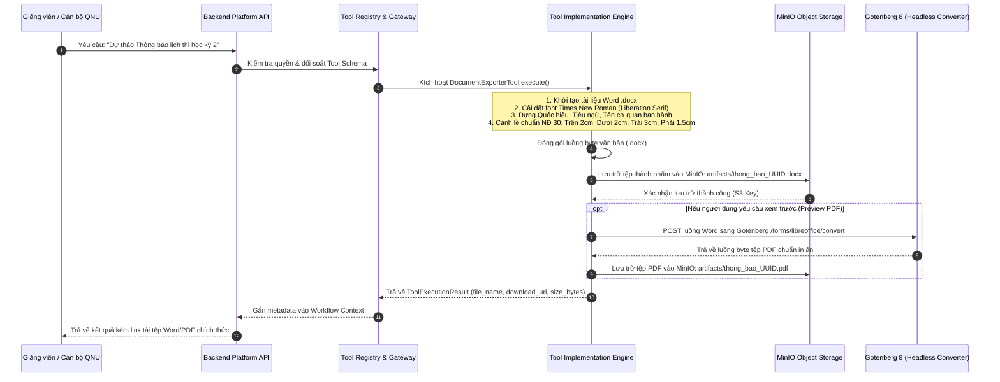

# QUY TRÌNH 05: CỔNG CÔNG CỤ & XUẤT BẢN TÀI LIỆU (TOOL GATEWAY & DOCUMENT EXPORT FLOW)

Tài liệu này đặc tả quy trình kết nối công cụ ngoại vi qua cơ chế Function Calling chuẩn OpenAPI, sinh tệp văn bản hành chính Word theo Nghị định 30/2020/NĐ-CP, tệp bảng tính Excel ma trận đề thi chuẩn Bloom, lưu trữ thành phẩm trên **MinIO Object Storage** và chuyển đổi PDF qua **Gotenberg 8**.

---

## 1. Sơ Đồ Quy Trình Thực Thi Công Cụ (Tool Gateway Sequence Diagram)

---

## 2. Các Công Cụ Tiêu Biểu Trong Hệ Thống

### 1. `DocumentExporterTool` — Xuất Văn Bản Hành Chính Nghị Định 30/2020/NĐ-CP
- **Tiêu chuẩn kỹ thuật tuân thủ**:
  - Phông chữ: `Times New Roman` (hoặc `Liberation Serif` trong môi trường Linux Docker).
  - Canh lề trang A4: Lề trên: 20 mm; Lề dưới: 20 mm; Lề trái: 30 mm; Lề phải: 15 mm.
  - Cấu trúc: Quốc hiệu & Tiêu ngữ in đậm canh giữa; Tên cơ quan chủ quản (BỘ GIÁO DỤC VÀ ĐÀO TẠO / TRƯỜNG ĐẠI HỌC QUY NHƠN); Số & Ký hiệu văn bản; Tên loại & Trích yếu nội dung; Chữ ký & Họ tên người ký; Nơi nhận.
- **Lưu trữ**: File sinh ra được đẩy ngay lên MinIO tại prefix `artifacts/`.

### 2. `ExamMatrixExporterTool` — Xuất Ma Trận Đề Thi 4 Cấp Độ Bloom
- **Mô hình khảo thí**: Phân bổ số câu và thang điểm theo 4 cấp độ tư duy:
  1. *Nhận biết* (Recognition)
  2. *Thông hiểu* (Comprehension)
  3. *Vận dụng* (Application)
  4. *Vận dụng cao* (Advanced Application)
- **Định dạng kết xuất**: Tệp bảng tính Microsoft Excel (`.xlsx`) sử dụng thư viện `openpyxl`, tự động tính toán tổng điểm, tỷ lệ phần trăm và định dạng bảng kẻ viền chuẩn khảo thí QNU.
- **Lưu trữ**: File sinh ra được đẩy lên MinIO tại prefix `artifacts/`.

### 3. `AdmissionScoreLookupTool` — Cổng Tra Cứu Dữ Liệu Tuyển Sinh
- Tra cứu bảng điểm chuẩn các năm (2024, 2025, 2026), mã ngành, tên ngành, tổ hợp môn xét tuyển từ CSDL nội bộ mà không cần phụ thuộc vào mô hình LLM ngoại vi.

---

## 3. Cơ Chế Tương Tác 3 Tầng & Dữ Liệu Mặc Định (Seed Data)

1. **Quy Tắc Vận Hành 3 Tầng Trong Trợ Lý Soạn Thảo (`ast_drafting`)**:
   - **Tầng 1 (Tư vấn & Phác thảo)**: Giải đáp quy cách thể thức, soạn thảo bản dự thảo văn bản hành chính theo văn phong sư phạm chuẩn mực.
   - **Tầng 2 (Chủ động gợi ý xuất file)**: Ở dòng cuối cùng của câu trả lời, trợ lý LUÔN chủ động gợi ý tự nhiên:
     > *"Thầy/Cô có muốn em xuất bản hoàn chỉnh văn bản này thành file Word (.docx) và PDF (.pdf) chuẩn thể thức Đại học Quy Nhơn (Nghị định 30) để in hoặc trình ký ngay không ạ?"*
   - **Tầng 3 (Kích hoạt xuất file chính thức)**: Khi người dùng đồng ý (*"Có"*, *"Xuất file đi"*, *"Tạo file giúp tôi"*...) hoặc có yêu cầu xuất file ngay từ đầu, trợ lý gọi `DocumentGeneratorService` / DAG Node `artifact.export` để render tệp Word `.docx` và chuyển đổi Gotenberg `.pdf`.
2. **Nạp Toàn Văn Nghị Định 30/2020/NĐ-CP Vào CSDL Mặc Định (Seed Data)**:
   - Toàn bộ 11 trang Nghị định 30/2020/NĐ-CP được đóng gói tại `backend/app/modules/knowledge/seed_data_nd30.py` gồm 6 Chunks chuẩn Chương/Điều và 7 Facts số hóa.
   - Tự động nạp vào collection `col_drafting` và đánh chỉ mục vector vào Qdrant khi ứng dụng khởi chạy (`seed_default_knowledge` trong lifespan startup).
   - Bảo đảm triệt tiêu hoàn toàn No-Answer Trap khi người dùng hỏi các câu hỏi quy chế/thể thức văn bản.

