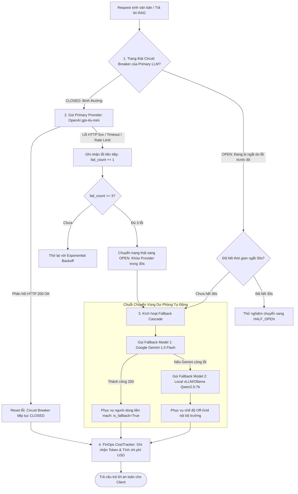

# QUY TRÌNH 06: QUẢN TRỊ MODELOPS, CIRCUIT BREAKER & DỰ PHÒNG TỰ ĐỘNG (MODELOPS RESILIENCE & FALLBACK FLOW)

Tài liệu này đặc tả cơ chế chịu lỗi của hệ thống khi kết nối các nhà cung cấp LLM ngoại vi (OpenAI, Google Gemini, Local vLLM/Ollama), thuật toán ngắt mạch Circuit Breaker 3 trạng thái, định tuyến dự phòng nhiều tầng (Fallback Cascade) và quản trị chi phí FinOps.

---

## 1. Sơ Đồ Cơ Chế Ngắt Mạch & Chuyển Vùng Dự Phòng (Circuit Breaker & Fallback)

---

## 2. Các Đặc Tuyến Kỹ Thuật Cốt Lõi

### 1. Vòng đời 3 trạng thái của Circuit Breaker
Triển khai tại [`app/modules/modelops/circuit_breaker.py`](file:///d:/DuAnPhanMem/DeTaiAI/qnu-ai-platform/backend/app/modules/modelops/circuit_breaker.py):
- **`CLOSED`**: Mọi request đi qua bình thường. Bộ đếm lỗi bằng 0.
- **`OPEN`**: Khi gặp 3 lỗi liên tiếp (timeout, 502, 503, 429), mạch ngắt lập tức, từ chối mọi request mới tới nhà cung cấp đó trong 30 giây để tránh làm nghẽn hàng đợi và tránh lãng phí thời gian chờ đợi.
- **`HALF_OPEN`**: Sau 30 giây, mạch cho phép 1 request đơn lẻ đi qua để thăm dò. Nếu thành công, mạch tự phục hồi về `CLOSED`; nếu thất bại, mạch lập tức chuyển lại về `OPEN` thêm 30 giây nữa.

### 2. Quản trị Hạn ngạch Token Tháng (Token Quota Enforcement)
- Hệ thống theo dõi số token sử dụng tích lũy của từng đơn vị/khoa phòng (Tenant).
- Khi vượt hạn ngạch tháng, hệ thống tự động khóa quyền gọi các mô hình đắt tiền (`gpt-4o`) và chuyển hướng sang các mô hình miễn phí chạy nội bộ (`qwen2.5:7b`).

### 3. Tối ưu Chi phí FinOps (CostTracker)
- Tự động bóc tách số `prompt_tokens` và `completion_tokens` của từng lượt gọi.
- Nhân với bảng giá chính thức (USD / 1.000.000 tokens) để ghi nhận chi phí vào bảng kiểm toán hệ thống.

### 4. Kiểm Thử Hiệu Lực Mô Hình LLM & Dọn Dẹp Model Hết Hỗ Trợ (Active Model Health Probing & 1-Click Cleanup)
- **Mục tiêu**: Đảm bảo các mô hình đang cấu hình trong Provider còn thực sự hoạt động, phát hiện sớm các model đã bị nhà cung cấp ngừng cung cấp (deprecated/404) hoặc hết hạn ngạch (429/403).
- **Endpoint Backend**: `POST /platform/v1alpha1/modelops/providers/{provider_id}/models/test`
  - Hỗ trợ payload `{ "model_name": "..." }` để test đơn lẻ hoặc để trống `{}` để test toàn bộ danh sách models của provider.
  - Kiểm soát đồng thời an toàn bằng `asyncio.Semaphore(5)` chống nghẽn đường truyền.
  - Cơ chế Lightweight Ping 1-token / model lookup phân nhánh thích ứng:
    - **Google Gemini**: Gọi endpoint `models/{model_id}:generateContent` với `maxOutputTokens: 1`. Bắt mã 404 (model không tồn tại/đã ngừng phục vụ).
    - **Cloudflare Workers AI**: Phân biệt mô hình embedding (`@cf/baai/bge-m3`) và LLM generation (`prompt`) với payload tối thiểu.
    - **Mistral AI**: Xử lý mô hình OCR chuyên biệt (`mistral-ocr-latest`) qua `GET /v1/models/{model}` và LLM qua `chat/completions` (max_tokens 1).
    - **OpenAI / Cổng tương thích OpenAI**: Ping qua `chat/completions` (max_tokens 1) hoặc `embeddings` (text "ping").
    - **Local / Docling / SentenceTransformers**: Kiểm tra registry in-memory nội bộ.
- **Trải Nghiệm UI & Dọn Dẹp 1-Click**:
  - Nút **[⚡ Test Tất Cả Models]** trên header thẻ *Mô Hình Khả Dụng* hiển thị spinner loading khi đang ping.
  - Từng thẻ tag model hiển thị chấm tròn & huy hiệu trạng thái: 🟢 Khả dụng (kèm độ trễ ms), 🔴 Không khả dụng (kèm lý do/mã 404), 🟡 Cooldown 429, kèm nút **[▶]** để test nhanh từng model riêng lẻ.
  - Khi phát hiện bất kỳ model nào bị 404/ngừng hỗ trợ, hệ thống hiển thị banner cảnh báo thông minh kèm nút **[🧹 Dọn Dẹp Model Lỗi]** để cán bộ quản trị loại bỏ ngay lập tức khỏi cấu hình chỉ với 1 click chuột.
