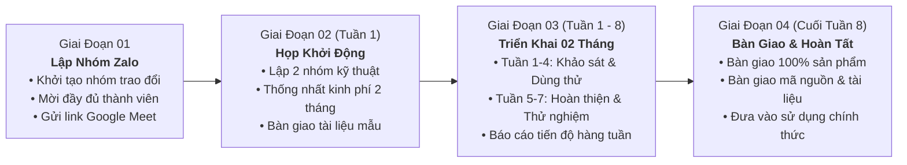

# KẾ HOẠCH LÀM VIỆC VỚI ĐẠI HỌC DUY TÂN
**Hợp Tác & Triển Khai Dự Án // Thời Gian Thực Hiện: 02 Tháng (8 Tuần)**

---

## THÔNG SỐ TỔNG QUAN

| Hạng Mục | Chi Tiết |
| :--- | :--- |
| **Tổng Thời Lượng** | **02 Tháng · 8 Tuần Triển Khai** |
| **Khởi Động Dự Án** | **Thứ Ba** (Họp trực tuyến qua Google Meet) |
| **Kênh Điều Phối Nhanh** | **Nhóm Zalo Công Việc** |
| **Mục Tiêu Trọng Tâm** | **Hoàn Thành & Bàn Giao 100% Sản Phẩm** |

---

## I. SƠ ĐỒ QUY TRÌNH TRIỂN KHAI & QUYẾT ĐỊNH

---

## II. NỘI DUNG CHI TIẾT BUỔI HỌP KHỞI ĐỘNG

### MỤC 01: Thành Phần Tham Dự
- **Thành phần tham dự:**
  - **Nhóm thực hiện:** Anh Đạt, Chị Hằng, Thi, Hồ Tuấn.
  - **Đơn vị đối tác:** Đại diện phía Đại học Duy Tân.

---

### MỤC 02: Lập Nhóm Kỹ Thuật & Thống Nhất Kinh Phí Cho Nhóm Làm Trong 2 Tháng
- **Cơ cấu 02 nhóm kỹ thuật chuyên trách:**
  1. **Nhóm kỹ thuật Đại học Quy Nhơn:** 2 người
  2. **Nhóm kỹ thuật Đại học Duy Tân:** 2 người
- **Thống nhất kinh phí thực hiện trong 2 tháng:** Thống nhất kinh phí 2 tháng/nhóm kỹ thuật Đại học Duy Tân  

---

### MỤC 03: Công Việc & Sản Phẩm Bàn Giao
- **Nhóm kỹ thuật Đại học Quy Nhơn:** 
  - Cung cấp tài liệu & biểu mẫu chuẩn: Giáo trình, đề cương chi tiết, ...
  - Phối hợp đánh giá chất lượng câu hỏi, kiểm thử học thuật và xác nhận tính đúng đắn của dữ liệu.
- **Nhóm kỹ thuật Đại học Duy Tân:** 
  - Phụ trách phát triển Chatbot Trợ lý ảo hỗ trợ tạo câu hỏi, ngân hàng câu hỏi theo chuẩn đầu ra.
- **Thời gian thực hiện:** 02 tháng (8 tuần).
- **Sản phẩm bàn giao cuối cùng:** 
  - Chatbot hỗ trợ tạo câu hỏi và ngân hàng câu hỏi theo chuẩn đầu ra (hoạt động ổn định).
  - Bộ mã nguồn hoàn chỉnh cùng tài liệu hướng dẫn cài đặt, cấu hình và chuyển giao.

---

## III. KẾ HOẠCH & TIẾN ĐỘ THỰC HIỆN TRONG 2 THÁNG (8 TUẦN)

### 3 Mốc Quan Trọng

| Mốc | Thời Gian | Mục Tiêu & Công Việc Chính |
| :---: | :---: | :--- |
| **Mốc 1** | **Tuần 1** | Họp khởi động, thống nhất công việc, bàn giao tài liệu mẫu |
| **Mốc 2** | **Tuần 4** | Đánh giá giữa kỳ, dùng thử và đóng góp ý kiến cho bản chatbot đầu tiên |
| **Mốc 3** | **Tuần 8** | Hoàn thành toàn diện, bàn giao chatbot và tài liệu hướng dẫn |

---

### Tiến Độ Chi Tiết Hàng Tuần

#### THÁNG 1: KHỞI ĐỘNG, CHUẨN BỊ DỮ LIỆU & LÀM BẢN DÙNG THỬ (Tuần 1 – Tuần 4)

- **Tuần 1: Họp khởi động và bàn giao tài liệu**
  - **ĐH Quy Nhơn:** Bàn giao tài liệu 1–2 môn học (giáo trình, đề cương chi tiết, chuẩn đầu ra, câu hỏi mẫu); ký biên bản cuộc họp.
  - **ĐH Duy Tân:** Tiếp nhận tài liệu, đọc hiểu nội dung và chuẩn bị hệ thống làm việc.
  - *Kết quả bàn giao:* Biên bản cuộc họp, tài liệu mẫu đã bàn giao.

- **Tuần 2: Xây dựng cách tạo câu hỏi theo chuẩn đầu ra**
  - **ĐH Quy Nhơn:** Hướng dẫn cấu trúc đề thi, cách chia các mức độ câu hỏi (dễ, trung bình, khó) bám theo chuẩn đầu ra của trường.
  - **ĐH Duy Tân:** Xử lý nội dung tài liệu, lập trình phần mềm tự động tạo câu hỏi trắc nghiệm và tự luận đúng nội dung bài học.
  - *Kết quả bàn giao:* Bản thử nghiệm tạo câu hỏi ban đầu.

- **Tuần 3: Làm giao diện chatbot và tính năng tạo câu hỏi**
  - **ĐH Quy Nhơn:** Chuẩn bị các tiêu chí để kiểm tra chất lượng câu hỏi.
  - **ĐH Duy Tân:** Làm giao diện web cho chatbot (chọn môn học, bài học, chuẩn đầu ra, mức độ khó, số lượng câu) và cho phép xem lại, chỉnh sửa trực tiếp câu hỏi.
  - *Kết quả bàn giao:* Bản chatbot chạy được trên trình duyệt web để dùng thử nội bộ.

- **Tuần 4: Họp đánh giá giữa kỳ và dùng thử chatbot (Mốc 2)**
  - **ĐH Quy Nhơn:** Dùng thử chatbot tạo khoảng 50–100 câu hỏi; kiểm tra độ chính xác kiến thức và độ phù hợp với chuẩn đầu ra; ghi lại các chỗ cần sửa.
  - **ĐH Duy Tân:** Trình diễn thử nghiệm chatbot tại buổi họp giữa kỳ, tiếp thu ý kiến góp ý để sửa trong tháng thứ 2.
  - *Kết quả bàn giao:* Biên bản đánh giá giữa kỳ và danh sách các điểm cần chỉnh sửa.

---

#### THÁNG 2: HOÀN THIỆN, XUẤT FILE, THỬ NGHIỆM & BÀN GIAO (Tuần 5 – Tuần 8)

- **Tuần 5: Sửa lỗi và làm tính năng xuất file Word/Excel**
  - **ĐH Quy Nhơn:** Gửi mẫu file Word và file Excel đề thi đang dùng tại trường.
  - **ĐH Duy Tân:** Sửa các lỗi phát hiện ở tuần 4, hoàn thiện tính năng xuất danh sách câu hỏi ra file Word và Excel theo đúng mẫu của trường.
  - *Kết quả bàn giao:* Chatbot tạo được câu hỏi và xuất được file Word/Excel.

- **Tuần 6: Cho giảng viên dùng thử thực tế**
  - **ĐH Quy Nhơn:** Mời 2–3 giảng viên dùng thử chatbot để tạo câu hỏi cho môn học thật; lấy ý kiến xem công cụ có dễ dùng và phục vụ tốt công việc hay không.
  - **ĐH Duy Tân:** Theo dõi hệ thống, hỗ trợ kỹ thuật và sửa các lỗi phát sinh khi giảng viên thao tác.
  - *Kết quả bàn giao:* Báo cáo kết quả dùng thử và danh sách lỗi đã xử lý.

- **Tuần 7: Đóng gói sản phẩm và viết tài liệu hướng dẫn**
  - **ĐH Quy Nhơn:** Rà soát lại toàn bộ câu hỏi đã tạo; chuẩn bị hồ sơ bàn giao.
  - **ĐH Duy Tân:** Hoàn thiện toàn bộ mã nguồn, viết tài liệu hướng dẫn cài đặt và tài liệu hướng dẫn sử dụng dành cho giảng viên.
  - *Kết quả bàn giao:* Bản phần mềm hoàn chỉnh, 2 bộ tài liệu hướng dẫn và hồ sơ bàn giao.

- **Tuần 8: Đánh giá tổng kết và bàn giao chính thức (Mốc 3)**
  - **ĐH Quy Nhơn:** Đánh giá chất lượng chatbot, ký biên bản bàn giao sản phẩm.
  - **ĐH Duy Tân:** Báo cáo tổng kết, bàn giao mã nguồn, hướng dẫn nhóm kỹ thuật ĐH Quy Nhơn tiếp nhận quản trị và cam kết bảo hành hỗ trợ.
  - *Kết quả bàn giao:* Biên bản bàn giao có chữ ký hai bên và đưa chatbot vào sử dụng chính thức.

---

## IV. BIỂU MẪU & SẢN PHẨM BÀN GIAO

### 1. Biểu Mẫu Áp Dụng
1. **Biên bản cuộc họp khởi động:** Ghi nhận nội dung thống nhất, thành phần tham gia và phân công trách nhiệm (Tuần 1).
2. **Bảng dự toán kinh phí:** Ghi rõ số tiền chi trả cho nhóm kỹ thuật ĐH Duy Tân (Tuần 1).
3. **Phiếu tiến độ tuần:** Cập nhật công việc đã làm và việc cần xử lý (Hàng tuần).
4. **Biên bản bàn giao sản phẩm:** Xác nhận hoàn thành các hạng mục theo thỏa thuận hai bên (Tuần 8).

### 2. Sản Phẩm Bàn Giao
- **Phần mềm Chatbot hoàn chỉnh:** Hoạt động ổn định, tạo được câu hỏi trắc nghiệm và tự luận bám sát chuẩn đầu ra, xuất được file Word và Excel theo mẫu.
- **Toàn bộ mã nguồn:** Bàn giao đầy đủ mã nguồn và tài liệu hướng dẫn cài đặt trên máy chủ của ĐH Quy Nhơn.
- **Tài liệu hướng dẫn:**
  - Hướng dẫn cài đặt và quản trị hệ thống.
  - Hướng dẫn sử dụng chi tiết cho giảng viên.
- **Hồ sơ bàn giao:** Đầy đủ biên bản bàn giao và các tài liệu chuyển giao theo thỏa thuận hai bên.
