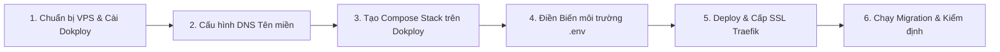

# Quy Trình Từng Bước Triển Khai Trên Dokploy

Tài liệu này là cẩm nang hướng dẫn thao tác chi tiết (SOP) dành cho đội ngũ kỹ thuật khi thực hiện đưa dự án **QNU AI Platform** lên máy chủ thông qua giao diện quản trị **Dokploy**.

---

## 📋 Tóm Tắt Quy Trình 6 Bước



---

## Bước 1: Chuẩn Bị Máy Chủ VPS & Cài Đặt Dokploy

1. **Khởi tạo máy chủ**: Thuê hoặc cấp phát máy chủ VPS (hệ điều hành **Ubuntu 22.04 LTS** hoặc **24.04 LTS**).
2. **Cài đặt Dokploy**: Đăng nhập SSH vào máy chủ bằng tài khoản `root` và chạy lệnh cài đặt chính thức tự động:
   ```bash
   curl -sSL https://dokploy.com/install.sh | sh
   ```
3. **Cấu hình tường lửa cơ bản**: Chỉ mở các cổng cần thiết cho web và SSH:
   ```bash
   sudo ufw allow 22/tcp    # SSH
   sudo ufw allow 80/tcp    # HTTP (Let's Encrypt challenge)
   sudo ufw allow 443/tcp   # HTTPS (Traefik SSL)
   sudo ufw allow 3000/tcp  # Giao diện Dokploy Dashboard
   sudo ufw enable
   ```
4. **Đăng nhập Dokploy**: Mở trình duyệt truy cập `http://<IP_VPS>:3000`, tạo tài khoản Quản trị viên (Admin) cho lần đầu truy cập.

---

## Bước 2: Cấu Hình Bản Ghi DNS Tên Miền

Trước khi khởi tạo dịch vụ, cần cấu hình các bản ghi tên miền trỏ về IP của máy chủ để Traefik có thể tự động cấp chứng chỉ SSL:
- **Bản ghi chính cho Backend API**:
  - Tên (Host): `api.ai.qnu.edu.vn` (hoặc tên miền trường cấp)
  - Loại (Type): `A`
  - Giá trị (Value): `<IP_VPS_CUA_BAN>`
- *(Tùy chọn)* **Bản ghi cho MinIO Web Console**:
  - Tên (Host): `storage-console.ai.qnu.edu.vn`
  - Loại (Type): `A`
  - Giá trị (Value): `<IP_VPS_CUA_BAN>`

---

## Bước 3: Tạo Dự Án & Compose Stack Trên Dokploy Dashboard

1. Trên thanh điều hướng Dokploy, bấm chọn **Projects** $\rightarrow$ bấm **Create Project**.
2. Đặt tên dự án: `QNU-AI-Platform`.
3. Trong trang chi tiết dự án, bấm **Create Service** $\rightarrow$ chọn mục **Compose**.
4. Cấu hình nguồn triển khai (Deployment Source):
   - **Tùy chọn 1 (Khuyên dùng - Kết nối Git Repository)**:
     - Chọn nhà cung cấp: GitHub hoặc GitLab.
     - Chọn Repository chứa mã nguồn dự án.
     - Chọn Branch: `main` (hoặc branch release tương ứng).
     - Điền đường dẫn tệp Compose: `docker-compose.yml`.
   - **Tùy chọn 2 (Trực tiếp - Raw Compose File)**:
     - Chọn tab **Raw**, copy toàn bộ nội dung file `docker-compose.yml` gốc của dự án và dán vào trình soạn thảo trên giao diện Dokploy.

---

## Bước 4: Thiết Lập Biến Môi Trường (Environment Variables)

Chuyển sang tab **Environment** của Compose Service trên Dokploy, dán các biến môi trường sau và điền thông số thực tế của bạn:

```dotenv
# ==========================================
# CẤU HÌNH TÊN MIỀN & GIAO DIỆN
# ==========================================
DOMAIN_BACKEND=api.ai.qnu.edu.vn
ALLOWED_ORIGINS=["https://ai.qnu.edu.vn","https://api.ai.qnu.edu.vn"]

# ==========================================
# CSDL POSTGRESQL 16 NỘI BỘ
# ==========================================
POSTGRES_USER=qnu
POSTGRES_PASSWORD=MatKhauCSDLCucKyAnToan_2026!
POSTGRES_DB=qnu_ai_platform

# ==========================================
# KHO LƯU TRỮ MINIO (S3 OBJECT STORAGE)
# ==========================================
S3_ACCESS_KEY=qnu_minio_admin
S3_SECRET_KEY=MinioSecretKey_BaoMat_2026!
S3_BUCKET=qnu-ai-documents
STORAGE_DRIVER=s3

# ==========================================
# KHÓA API MÔ HÌNH LLM
# ==========================================
OPENAI_API_KEY=sk-proj-xxxxxxxxxxxxxxxxxxxxxxxx
DEFAULT_LLM_MODEL=gpt-4o-mini
GEMINI_API_KEY=AIzaSyxxxxxxxxxxxxxxxxxxxxxxxx

# ==========================================
# BẢO MẬT & XÁC THỰC NỘI BỘ
# ==========================================
# Tạo bằng lệnh: openssl rand -hex 32
SECRET_KEY=chuoi_hex_ngau_nhien_64_ky_tu_dung_sinh_jwt
INTERNAL_API_KEY=chuoi_secret_key_noi_bo_he_thong
DEV_AUTH_ENABLED=false
LOG_LEVEL=INFO
```

Sau khi dán xong, bấm **Save** để lưu lại cấu hình.

---

## Bước 5: Bấm Triển Khai (Deploy) & Xác Minh SSL

1. Bấm nút **Deploy** ở góc phải màn hình Dokploy.
2. Theo dõi tab **Deployments** và **Logs**:
   - Dokploy sẽ tự động tải các hình ảnh Docker chính thức (`postgres:16-alpine`, `qdrant/qdrant`, `redis:7-alpine`, `minio/minio`, `gotenberg/gotenberg`).
   - Dokploy tự động build Dockerfile cho `backend` và `worker`.
   - Traefik sẽ tự động liên hệ với Let's Encrypt để cấp chứng chỉ HTTPS (SSL) cho tên miền `api.ai.qnu.edu.vn`.
3. Khi toàn bộ các container chuyển sang màu xanh lá cây (**Running / Healthy**), quá trình đóng gói hạ tầng đã thành công.

---

## Bước 6: Khởi Tạo CSDL (Alembic Migrations) & Kiểm Tra Nghiệm Thu

### 6.1. Chạy Migrations CSDL
Để khởi tạo các bảng CSDL (assistants, documents, chunks, facts, modelops logs, eval runs), mở tab **Terminal** của container `qnu_backend` trên Dokploy (hoặc SSH vào server VPS) và thực thi lệnh:
```bash
docker exec -it qnu_backend uv run alembic upgrade head
```

### 6.2. Kiểm tra Nghiệm thu (Smoke Test)
1. **Kiểm tra tài liệu Swagger API**:
   - Mở trình duyệt truy cập: `https://api.ai.qnu.edu.vn/docs`
   - Kiểm tra giao diện Swagger hiển thị đủ 8 nhóm endpoints.
2. **Kiểm tra Health Probes**:
   - `https://api.ai.qnu.edu.vn/health/live` $\rightarrow$ Trả về `{"status": "alive"}`.
   - `https://api.ai.qnu.edu.vn/health/ready` $\rightarrow$ Trả về trạng thái sẵn sàng của Database và Redis.
3. **Thử nghiệm tương tác RAG**:
   - Gửi thử một câu hỏi đến endpoint `/platform/v1alpha1/assistants/admissions/chat` để xác nhận mô hình phản hồi và ghi nhận chi phí vào `llm_usage_logs`.

---

## 🔄 7. Quy Trình Cập Nhật Khi Có Bản Code Mới (Day-2 Operations)

Khi team phát triển có các tính năng mới hoặc bản vá lỗi được merge vào nhánh `main`:
1. Nếu đã kết nối Git Webhook: Dokploy sẽ **tự động phát hiện commit mới và deploy lại**.
2. Nếu deploy thủ công: Thành viên chỉ cần đăng nhập Dokploy Dashboard $\rightarrow$ bấm nút **Redeploy**.
3. **Lưu ý**: Dữ liệu CSDL, Vector và tệp tài liệu trong các Named Volumes (`qnu_postgres_data`, `qnu_qdrant_data`, `qnu_minio_data`) được giữ nguyên vẹn 100%, không bị ảnh hưởng khi container được build lại.
