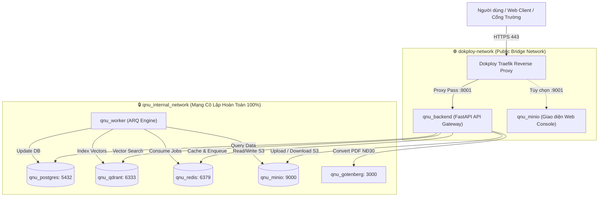

# Cẩm Nang Triển Khai Hệ Thống — QNU AI Platform

> **Dành cho**: Đội ngũ phát triển (Dev Team), Kỹ sư vận hành (DevOps/SRE) và Quản trị viên hệ thống.  
> **Mục tiêu**: Giúp toàn bộ thành viên trong team nắm bắt nhanh chóng, đầy đủ và chuẩn xác về **bối cảnh công nghệ hạ tầng** và **quy trình đưa ứng dụng lên môi trường Production** bằng giải pháp PaaS **Dokploy**.

---

## 🧭 1. Mục Lục Tài Liệu Triển Khai

Thư mục này được tổ chức thành các chuyên đề rõ ràng để team tiện tra cứu và phối hợp:

1. [**`01_cong_nghe_ha_tang.md`**](./01_cong_nghe_ha_tang.md): Bóc tách chi tiết từng công nghệ trong Stack triển khai, vai trò, cổng kết nối và lý do lựa chọn.
2. [**`02_quy_trinh_trien_khai_dokploy.md`**](./02_quy_trinh_trien_khai_dokploy.md): Hướng dẫn từng bước thao tác thực tế trên giao diện Dokploy Dashboard từ lúc chuẩn bị VPS đến khi chạy thực tế.
3. [**`03_an_toan_du_lieu_va_van_hanh.md`**](./03_an_toan_du_lieu_va_van_hanh.md): Cơ chế lưu trữ bền vững (Persistent Volumes), sao lưu dữ liệu, giám sát sức khỏe (Health Probes) và xử lý sự cố.

---

## 🛠️ 2. Bảng Tổng Hợp Công Nghệ Triển Khai

Hệ thống được thiết kế theo mô hình **Multi-Container Microservices** trên nền Docker, được điều phối tập trung bởi **Dokploy**:

| Lớp Hạ Tầng | Công Nghệ Sử Dụng | Phiên Bản | Vai Trò & Nhiệm Vụ Trong Hệ Thống |
| :--- | :--- | :--- | :--- |
| **PaaS Orchestration** | **Dokploy** | Latest | Nền tảng điều phối ứng dụng (tương tự Coolify/Heroku nhưng mã nguồn mở, self-hosted trên VPS của trường), quản lý vòng đời container, build Git tự động và giám sát logs. |
| **Reverse Proxy & SSL**| **Traefik Proxy** | v3.x *(tích hợp trong Dokploy)* | Cổng giao tiếp mạng L7 ra ngoài Internet; tự động định tuyến tên miền (`api.ai.qnu.edu.vn`), tự động cấp và gia hạn chứng chỉ **SSL Let's Encrypt**, hỗ trợ đệm stream cho RAG. |
| **API Application** | **FastAPI / Uvicorn** | Python 3.12-slim | Khối xử lý trung tâm (Core Backend), 100% Asynchronous I/O, đóng gói với trình quản lý gói siêu tốc **UV**, chạy bằng tài khoản không có quyền root (`qnu`). |
| **Background Worker** | **ARQ Worker** | Python 3.12-slim | Tiến trình nền bất đồng bộ xử lý các tác vụ nặng: bóc tách OCR tài liệu scan, cắt chunk Điều/Khoản, nhúng vector và tạo file Word/Excel. |
| **Relational Database**| **PostgreSQL** | 16-alpine | CSDL quan hệ chính thống; lưu trữ thông tin Trợ lý, phân quyền, bảng sự thật số liệu (**Facts Layer**) và bộ tìm kiếm văn bản tiếng Việt (**FTS**). |
| **Vector Database** | **Qdrant** | v1.11.0 | Cơ sở dữ liệu vector chuyên dụng; lưu trữ các vector nhúng 1024 chiều từ mô hình `BAAI/bge-m3`, phục vụ tìm kiếm ngữ nghĩa siêu tốc với Cosine distance. |
| **Cache & Job Broker** | **Redis** | 7-alpine | Đảm nhiệm 2 vai trò: Bộ nhớ đệm ngữ nghĩa (**Semantic Cache**) giảm tải cho LLM và hàng đợi thông điệp bất đồng bộ cho ARQ Worker. |
| **Object Storage** | **MinIO** | RELEASE 2024+ | Kho lưu trữ đối tượng chuẩn **S3 API**; lưu trữ file tài liệu gốc tải lên (PDF tuyển sinh, Word quy chế) và lưu trữ thành phẩm văn bản xuất ra theo Nghị định 30. |
| **Document Engine** | **Gotenberg** | 8.x | Động cơ headless (LibreOffice + Chromium) hỗ trợ chuyển đổi văn bản hành chính sang định dạng PDF chuẩn thể thức quốc gia. |

---

## 🏛️ 3. Sơ Đồ Phân Tầng Mạng & Bảo Mật Triển Khai

Hệ thống áp dụng nguyên tắc **Zero Public Database Exposure** (Tuyệt đối không để lộ bất kỳ cổng cơ sở dữ liệu nào ra mạng Internet):

---

## 💡 4. Tại Sao Lựa Chọn Mô Hình Này? (Góc Nhìn Kiến Trúc)

1. **Tại sao dùng Dokploy thay vì Docker Compose chay trên VPS?**
   - **Tự động hóa SSL**: Dokploy tích hợp sẵn Traefik, chỉ cần điền tên miền là tự có HTTPS Let's Encrypt mà không cần cấu hình Certbot thủ công.
   - **Giao diện trực quan cho Team**: Mọi thành viên trong team đều có thể vào web dashboard để xem log thời gian thực, khởi động lại service, hoặc cập nhật biến môi trường mà không cần cấp quyền SSH trực tiếp vào server.
   - **CI/CD mượt mà**: Hỗ trợ Webhook hoặc theo dõi nhánh `main` của Git, khi dev push code mới là hệ thống tự động rebuild và deploy không gián đoạn (Zero-Downtime).
2. **Tại sao tách biệt `qnu_backend` và `qnu_worker`?**
   - Các tác vụ như đọc file PDF scan 50 trang, chạy OCR hay nhúng vector hàng nghìn chunk tốn nhiều CPU và thời gian (vài chục giây đến vài phút).
   - Việc tách sang `qnu_worker` giúp `qnu_backend` luôn phản hồi nhanh các request từ người dùng (dưới 100ms) mà không bao giờ bị nghẽn (blocking).
3. **Tại sao dùng MinIO thay vì lưu file cục bộ trên ổ cứng?**
   - Chuẩn hóa theo giao thức S3 (Amazon S3 compatible), giúp hệ thống có thể dễ dàng chuyển đổi sang Cloud S3 (AWS, Cloudflare R2, Viettel Cloud) bất kỳ lúc nào mà không cần sửa một dòng mã nguồn nào.
